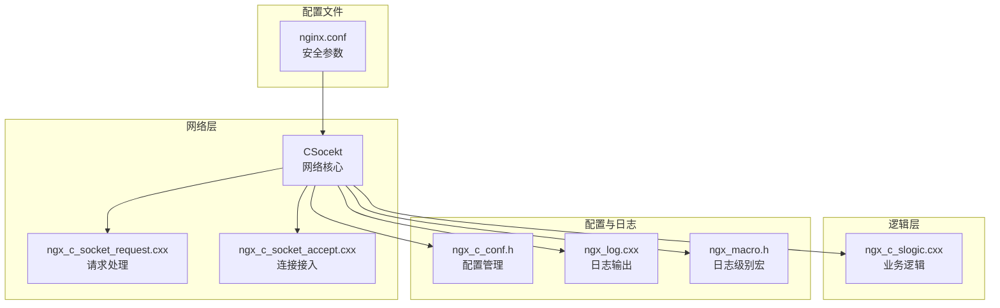
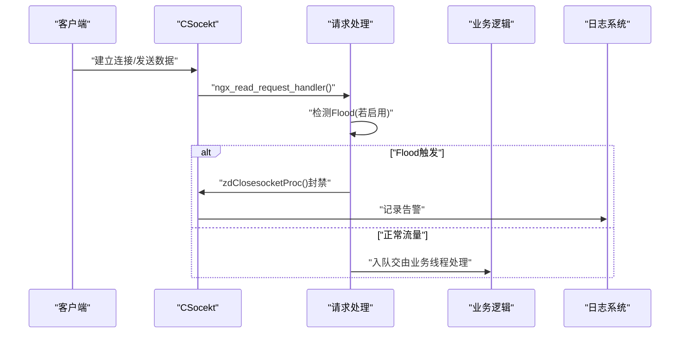
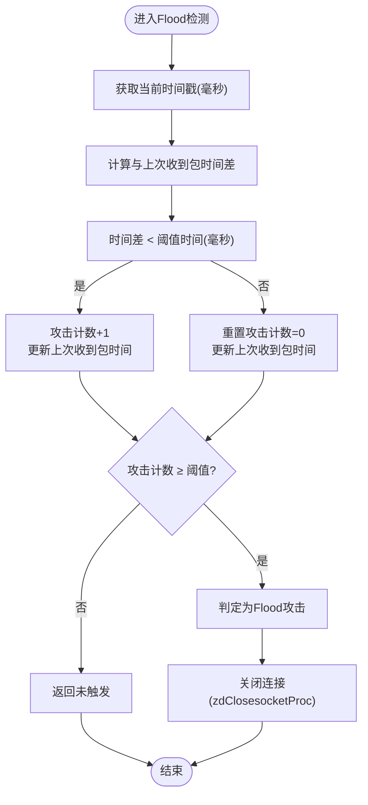
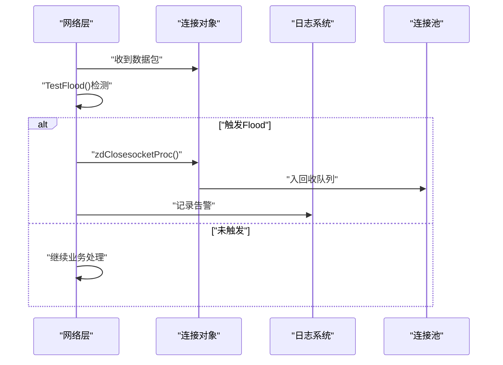
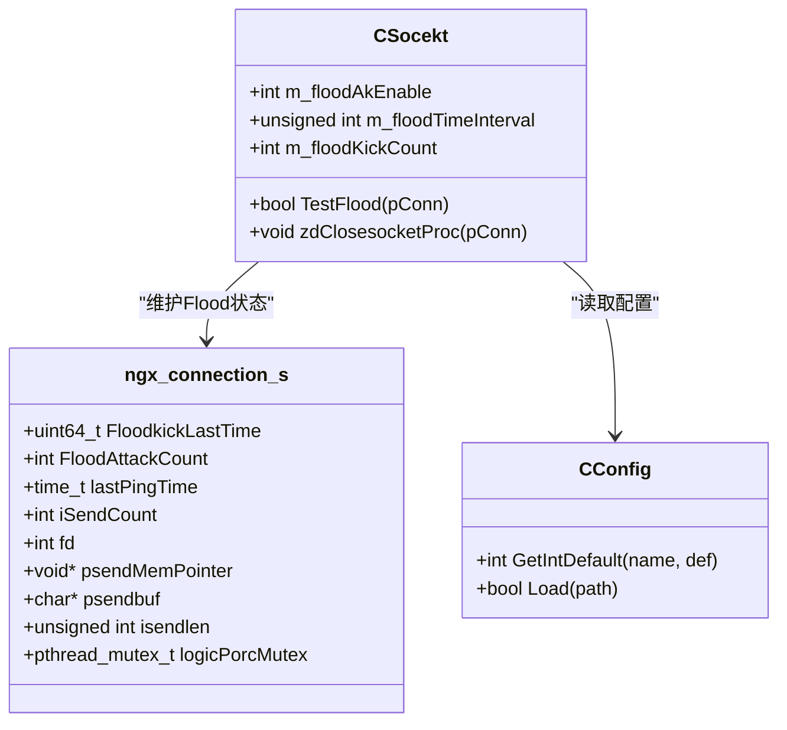
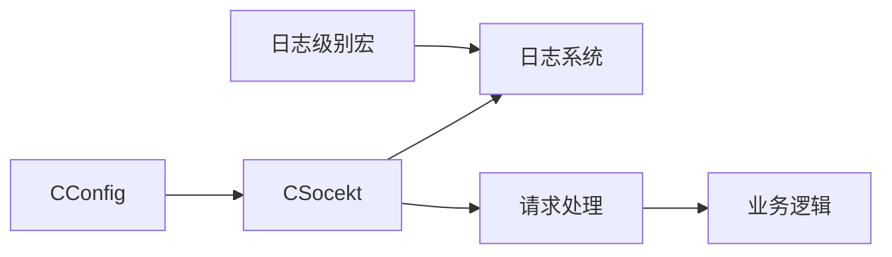

# 安全防护机制

<cite>
**本文档引用的文件**
- [ngx_c_socket.h](file://include/ngx_c_socket.h)
- [ngx_c_socket.cxx](file://net/ngx_c_socket.cxx)
- [ngx_c_socket_accept.cxx](file://net/ngx_c_socket_accept.cxx)
- [ngx_c_socket_request.cxx](file://net/ngx_c_socket_request.cxx)
- [ngx_c_slogic.cxx](file://logic/ngx_c_slogic.cxx)
- [ngx_c_conf.h](file://include/ngx_c_conf.h)
- [ngx_macro.h](file://include/ngx_macro.h)
- [ngx_log.cxx](file://app/ngx_log.cxx)
- [nginx.conf](file://nginx.conf)
</cite>

## 目录
1. [简介](#简介)
2. [项目结构](#项目结构)
3. [核心组件](#核心组件)
4. [架构概览](#架构概览)
5. [详细组件分析](#详细组件分析)
6. [依赖关系分析](#依赖关系分析)
7. [性能考量](#性能考量)
8. [故障排查指南](#故障排查指南)
9. [结论](#结论)
10. [附录](#附录)

## 简介
本文件面向安全防护机制，重点阐述Flood攻击检测的实现原理、算法细节与配置参数，涵盖攻击频率统计、阈值判断、自动封禁等核心功能。文档同时提供安全事件处理流程（攻击检测、告警生成、连接封禁）、配置参数调优方法、安全策略配置、攻击特征识别与防护效果评估，帮助读者全面理解并有效部署该安全防护体系。

## 项目结构
该项目采用分层架构：
- 网络层：负责监听、连接管理、事件循环、数据收发与Flood检测
- 逻辑层：负责业务处理（心跳、点云数据等）
- 配置与日志：集中管理配置加载与日志输出
- 进程与线程：多进程+多线程模型，配合epoll事件驱动

**图表来源**
- [ngx_c_socket.cxx](file://net/ngx_c_socket.cxx#L1-L120)
- [ngx_c_socket_request.cxx](file://net/ngx_c_socket_request.cxx#L1-L120)
- [ngx_c_socket_accept.cxx](file://net/ngx_c_socket_accept.cxx#L1-L120)
- [ngx_c_slogic.cxx](file://logic/ngx_c_slogic.cxx#L1-L120)
- [ngx_c_conf.h](file://include/ngx_c_conf.h#L1-L56)
- [ngx_log.cxx](file://app/ngx_log.cxx#L1-L120)
- [ngx_macro.h](file://include/ngx_macro.h#L1-L40)
- [nginx.conf](file://nginx.conf#L1-L63)

**章节来源**
- [ngx_c_socket.cxx](file://net/ngx_c_socket.cxx#L1-L120)
- [ngx_c_socket_request.cxx](file://net/ngx_c_socket_request.cxx#L1-L120)
- [ngx_c_socket_accept.cxx](file://net/ngx_c_socket_accept.cxx#L1-L120)
- [ngx_c_slogic.cxx](file://logic/ngx_c_slogic.cxx#L1-L120)
- [ngx_c_conf.h](file://include/ngx_c_conf.h#L1-L56)
- [ngx_macro.h](file://include/ngx_macro.h#L1-L40)
- [ngx_log.cxx](file://app/ngx_log.cxx#L1-L120)
- [nginx.conf](file://nginx.conf#L1-L63)

## 核心组件
- Flood攻击检测模块：基于时间窗口内的包到达频率进行统计与阈值判断，触发自动封禁
- 配置参数模块：集中读取与应用安全相关参数
- 日志与告警模块：统一日志输出与错误级别管理
- 连接管理与事件循环：epoll事件驱动，配合Flood检测在数据接收阶段实施拦截

**章节来源**
- [ngx_c_socket.h](file://include/ngx_c_socket.h#L83-L91)
- [ngx_c_socket.cxx](file://net/ngx_c_socket.cxx#L227-L244)
- [ngx_log.cxx](file://app/ngx_log.cxx#L33-L120)
- [ngx_macro.h](file://include/ngx_macro.h#L18-L27)

## 架构概览
Flood检测贯穿连接接入、数据接收、包处理与封禁流程，形成闭环防护。

**图表来源**
- [ngx_c_socket_request.cxx](file://net/ngx_c_socket_request.cxx#L25-L114)
- [ngx_c_socket.cxx](file://net/ngx_c_socket.cxx#L480-L509)
- [ngx_c_socket.cxx](file://net/ngx_c_socket.cxx#L460-L477)
- [ngx_log.cxx](file://app/ngx_log.cxx#L33-L120)

## 详细组件分析

### Flood攻击检测算法与实现
Flood检测采用滑动时间窗口统计法：
- 统计维度：单位时间窗口内收到的数据包数量
- 时间窗口：由配置参数决定（默认100毫秒）
- 阈值：累计达到阈值（默认10次）即判定为攻击
- 动作：触发封禁，立即关闭连接

**图表来源**
- [ngx_c_socket.cxx](file://net/ngx_c_socket.cxx#L480-L509)

**章节来源**
- [ngx_c_socket.cxx](file://net/ngx_c_socket.cxx#L480-L509)

### 配置参数详解与调优
- Sock_FloodAttackKickEnable：是否启用Flood检测（1启用，0禁用）
- Sock_FloodTimeInterval：时间窗口大小（毫秒，默认100）
- Sock_FloodKickCounter：阈值（默认10）

调优建议：
- 降低时间窗口可提升检测灵敏度，但易误判；增大窗口可减少误判，但检测延迟增加
- 阈值应结合业务流量峰值与网络抖动调整，避免对正常用户造成影响
- 建议在生产环境先以较低阈值进行压力测试，逐步优化

**章节来源**
- [ngx_c_socket.cxx](file://net/ngx_c_socket.cxx#L227-L244)
- [nginx.conf](file://nginx.conf#L52-L61)

### 安全事件处理流程
- 攻击检测：在数据接收阶段调用Flood检测函数
- 告警生成：通过日志系统输出告警信息
- 连接封禁：调用关闭连接函数，释放资源并回收

**图表来源**
- [ngx_c_socket_request.cxx](file://net/ngx_c_socket_request.cxx#L64-L114)
- [ngx_c_socket.cxx](file://net/ngx_c_socket.cxx#L460-L477)
- [ngx_log.cxx](file://app/ngx_log.cxx#L33-L120)

**章节来源**
- [ngx_c_socket_request.cxx](file://net/ngx_c_socket_request.cxx#L64-L114)
- [ngx_c_socket.cxx](file://net/ngx_c_socket.cxx#L460-L477)
- [ngx_log.cxx](file://app/ngx_log.cxx#L33-L120)

### 数据结构与类关系
Flood检测涉及的关键数据结构与类关系如下：

**图表来源**
- [ngx_c_socket.h](file://include/ngx_c_socket.h#L83-L91)
- [ngx_c_socket.h](file://include/ngx_c_socket.h#L247-L257)
- [ngx_c_socket.cxx](file://net/ngx_c_socket.cxx#L227-L244)
- [ngx_c_conf.h](file://include/ngx_c_conf.h#L45-L53)

**章节来源**
- [ngx_c_socket.h](file://include/ngx_c_socket.h#L83-L91)
- [ngx_c_socket.h](file://include/ngx_c_socket.h#L247-L257)
- [ngx_c_socket.cxx](file://net/ngx_c_socket.cxx#L227-L244)
- [ngx_c_conf.h](file://include/ngx_c_conf.h#L45-L53)

### 代码实现模式与监控方法
- 实现模式：在数据接收阶段嵌入Flood检测，一旦触发即刻封禁，避免恶意流量进入业务处理队列
- 监控方法：通过日志系统输出告警，结合连接池与队列统计信息进行综合监控

**章节来源**
- [ngx_c_socket_request.cxx](file://net/ngx_c_socket_request.cxx#L64-L114)
- [ngx_log.cxx](file://app/ngx_log.cxx#L33-L120)
- [ngx_c_socket.cxx](file://net/ngx_c_socket.cxx#L512-L537)

### 安全策略配置与评估
- 安全策略配置：通过配置文件集中管理Flood检测开关、时间窗口与阈值
- 攻击特征识别：高频短周期数据包、异常包体长度、异常消息码等
- 防护效果评估：通过日志告警量、封禁连接数、业务队列压力与系统资源占用等指标进行评估

**章节来源**
- [nginx.conf](file://nginx.conf#L52-L61)
- [ngx_log.cxx](file://app/ngx_log.cxx#L33-L120)
- [ngx_c_socket.cxx](file://net/ngx_c_socket.cxx#L512-L537)

## 依赖关系分析
- 网络层依赖配置模块读取参数，依赖日志模块输出告警
- 请求处理模块在数据接收阶段调用Flood检测函数
- 业务逻辑模块与Flood检测解耦，仅通过队列传递正常流量

**图表来源**
- [ngx_c_conf.h](file://include/ngx_c_conf.h#L45-L53)
- [ngx_macro.h](file://include/ngx_macro.h#L18-L27)
- [ngx_log.cxx](file://app/ngx_log.cxx#L33-L120)
- [ngx_c_socket.cxx](file://net/ngx_c_socket.cxx#L227-L244)
- [ngx_c_socket_request.cxx](file://net/ngx_c_socket_request.cxx#L64-L114)
- [ngx_c_slogic.cxx](file://logic/ngx_c_slogic.cxx#L76-L129)

**章节来源**
- [ngx_c_conf.h](file://include/ngx_c_conf.h#L45-L53)
- [ngx_macro.h](file://include/ngx_macro.h#L18-L27)
- [ngx_log.cxx](file://app/ngx_log.cxx#L33-L120)
- [ngx_c_socket.cxx](file://net/ngx_c_socket.cxx#L227-L244)
- [ngx_c_socket_request.cxx](file://net/ngx_c_socket_request.cxx#L64-L114)
- [ngx_c_slogic.cxx](file://logic/ngx_c_slogic.cxx#L76-L129)

## 性能考量
- 检测开销：Flood检测为轻量级时间戳与计数器操作，对性能影响极小
- 误判风险：时间窗口与阈值需结合业务流量进行调优，避免对正常用户造成影响
- 资源回收：封禁连接后及时回收，避免连接池膨胀

[本节为通用指导，无需特定文件引用]

## 故障排查指南
- 日志级别：通过日志级别宏控制输出等级，便于定位问题
- 告警定位：关注Flood封禁相关日志，结合连接池与队列统计信息分析
- 参数校验：确认配置文件中Flood相关参数是否正确加载

**章节来源**
- [ngx_macro.h](file://include/ngx_macro.h#L18-L27)
- [ngx_log.cxx](file://app/ngx_log.cxx#L33-L120)
- [ngx_c_socket.cxx](file://net/ngx_c_socket.cxx#L227-L244)

## 结论
本安全防护机制通过在数据接收阶段嵌入Flood检测，实现了对高频短周期攻击的有效识别与即时封禁。通过合理配置时间窗口与阈值，可在保证检测灵敏度的同时降低误判风险。建议在生产环境中结合业务流量特征进行压力测试与参数调优，并通过日志与监控指标持续评估防护效果。

[本节为总结性内容，无需特定文件引用]

## 附录
- 配置文件示例路径：[nginx.conf](file://nginx.conf#L52-L61)
- 关键实现文件路径：
  - [ngx_c_socket.cxx](file://net/ngx_c_socket.cxx#L227-L244)
  - [ngx_c_socket_request.cxx](file://net/ngx_c_socket_request.cxx#L64-L114)
  - [ngx_c_socket.h](file://include/ngx_c_socket.h#L83-L91)

[本节为补充信息，无需特定文件引用]