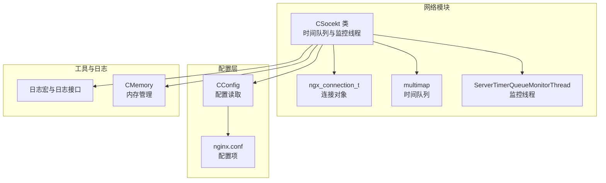
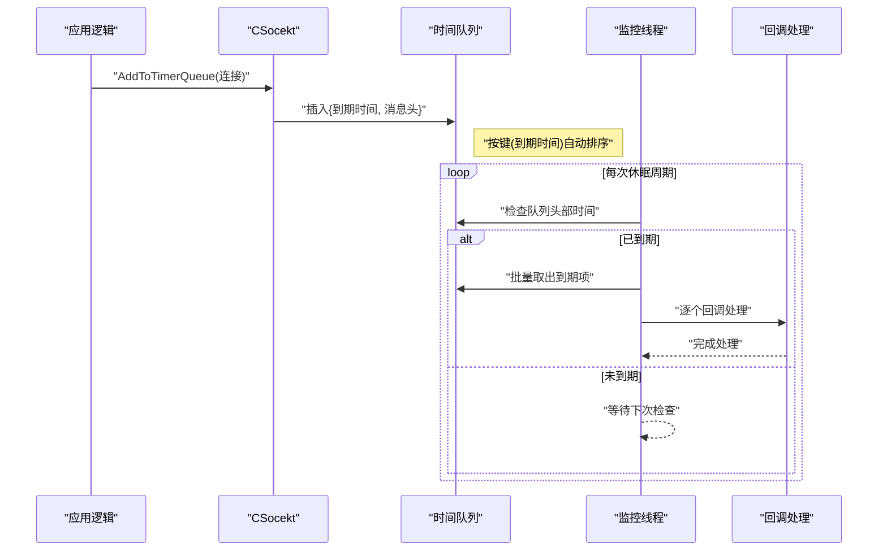
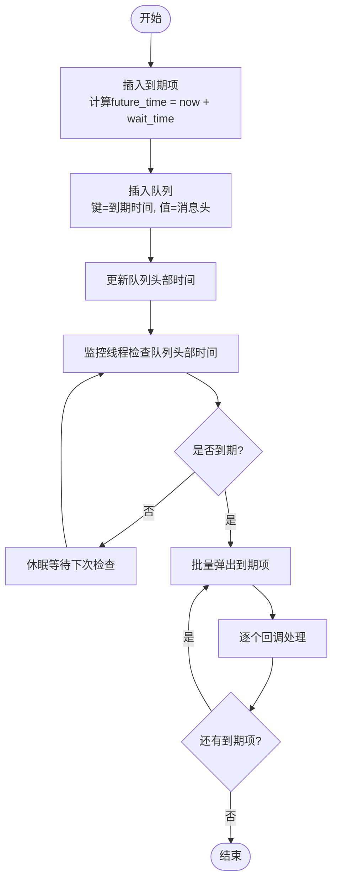
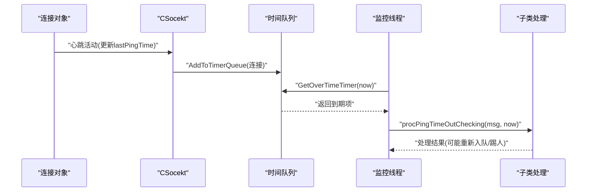
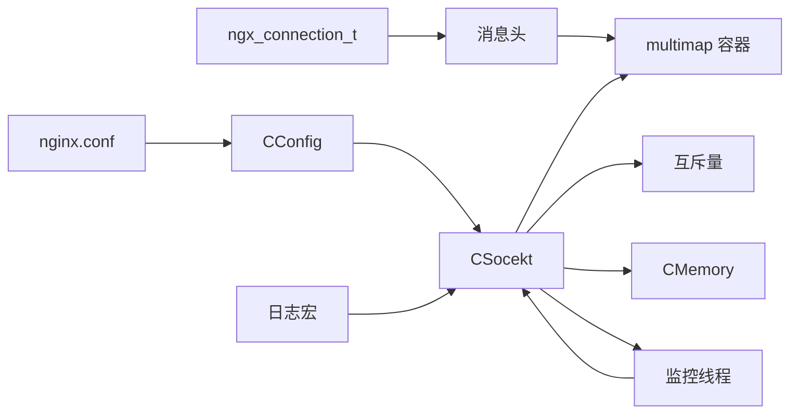

# 时间队列管理

<cite>
**本文引用的文件**
- [ngx_c_socket_time.cxx](file://net/ngx_c_socket_time.cxx)
- [ngx_c_socket.h](file://include/ngx_c_socket.h)
- [ngx_c_socket.cxx](file://net/ngx_c_socket.cxx)
- [ngx_c_socket_conn.cxx](file://net/ngx_c_socket_conn.cxx)
- [ngx_c_conf.h](file://include/ngx_c_conf.h)
- [nginx.conf](file://nginx.conf)
- [ngx_macro.h](file://include/ngx_macro.h)
</cite>

## 目录
1. [简介](#简介)
2. [项目结构](#项目结构)
3. [核心组件](#核心组件)
4. [架构总览](#架构总览)
5. [详细组件分析](#详细组件分析)
6. [依赖分析](#依赖分析)
7. [性能考量](#性能考量)
8. [故障排查指南](#故障排查指南)
9. [结论](#结论)
10. [附录](#附录)

## 简介
本技术文档围绕时间队列管理系统展开，重点阐述定时器队列的设计原理与实现细节，包括时间队列的数据结构、插入算法、删除机制与周期性清理流程。文档还解释定时任务的管理机制，涵盖心跳检测、连接超时、定期清理等调度与执行方式，并给出性能优化策略（如时间轮与最小堆思路对比）、时间精度控制、性能监控与故障排查方法。文中所有技术细节均基于仓库现有代码进行分析与总结。

## 项目结构
时间队列管理位于网络模块中，核心类为 CSocekt，时间队列采用基于时间键的有序容器组织，配合独立的监控线程按固定周期扫描到期任务。配置项通过配置文件与配置类加载，影响心跳检测周期、超时踢人策略等行为。

图表来源
- [ngx_c_socket.h](file://include/ngx_c_socket.h#L103-L255)
- [ngx_c_socket_time.cxx](file://net/ngx_c_socket_time.cxx#L24-L193)
- [ngx_c_socket.cxx](file://net/ngx_c_socket.cxx#L227-L244)
- [ngx_c_conf.h](file://include/ngx_c_conf.h#L8-L53)
- [nginx.conf](file://nginx.conf#L40-L62)
- [ngx_macro.h](file://include/ngx_macro.h#L18-L31)

章节来源
- [ngx_c_socket.h](file://include/ngx_c_socket.h#L103-L255)
- [ngx_c_socket_time.cxx](file://net/ngx_c_socket_time.cxx#L24-L193)
- [ngx_c_socket.cxx](file://net/ngx_c_socket.cxx#L227-L244)
- [ngx_c_conf.h](file://include/ngx_c_conf.h#L8-L53)
- [nginx.conf](file://nginx.conf#L40-L62)
- [ngx_macro.h](file://include/ngx_macro.h#L18-L31)

## 核心组件
- CSocekt：网络与时间队列管理的核心类，负责时间队列的插入、删除、扫描与清理，以及心跳检测线程的创建与调度。
- ngx_connection_t：连接对象，包含心跳时间戳等字段，作为时间队列中消息头的关联对象。
- 时间队列：基于时间键的有序容器，存储到期时间与消息头指针，支持快速获取最早到期项。
- 监控线程：周期性扫描时间队列，批量取出到期项并交由回调处理，支持重复定时任务与一次性任务两种模式。
- 配置系统：通过配置文件与配置类加载心跳检测周期、超时踢人策略等参数。

章节来源
- [ngx_c_socket.h](file://include/ngx_c_socket.h#L103-L255)
- [ngx_c_socket_time.cxx](file://net/ngx_c_socket_time.cxx#L24-L193)
- [ngx_c_socket_conn.cxx](file://net/ngx_c_socket_conn.cxx#L37-L55)
- [ngx_c_socket.cxx](file://net/ngx_c_socket.cxx#L227-L244)
- [ngx_c_conf.h](file://include/ngx_c_conf.h#L8-L53)
- [nginx.conf](file://nginx.conf#L40-L62)

## 架构总览
时间队列管理采用“事件驱动 + 周期扫描”的混合架构：
- 事件驱动：连接建立或活跃时，将“到期时间=当前时间+等待时间”插入时间队列。
- 周期扫描：监控线程以固定休眠间隔检查队列头部时间，批量取出到期项并处理。
- 回调处理：默认仅释放消息头内存，子类可覆盖以实现具体的心跳检测与超时处理逻辑。

图表来源
- [ngx_c_socket_time.cxx](file://net/ngx_c_socket_time.cxx#L24-L193)
- [ngx_c_socket.h](file://include/ngx_c_socket.h#L164-L179)

章节来源
- [ngx_c_socket_time.cxx](file://net/ngx_c_socket_time.cxx#L24-L193)
- [ngx_c_socket.h](file://include/ngx_c_socket.h#L164-L179)

## 详细组件分析

### 时间队列数据结构与操作
- 数据结构：基于时间键的有序容器，键为到期时间，值为消息头指针，插入时按键排序，便于 O(1) 获取最早到期项。
- 插入算法：计算未来到期时间，分配消息头，写入连接与序列号，插入队列并更新“队列头部时间”。
- 删除机制：支持按连接删除与清空队列两种方式；批量删除时遍历容器，匹配后释放消息头并移除项。
- 扫描与批量处理：监控线程先粗略判断队列是否为空，再以互斥保护下批量取出所有到期项，最后统一回调处理。

图表来源
- [ngx_c_socket_time.cxx](file://net/ngx_c_socket_time.cxx#L24-L101)
- [ngx_c_socket_time.cxx](file://net/ngx_c_socket_time.cxx#L149-L193)

章节来源
- [ngx_c_socket_time.cxx](file://net/ngx_c_socket_time.cxx#L24-L101)
- [ngx_c_socket_time.cxx](file://net/ngx_c_socket_time.cxx#L149-L193)

### 定时任务管理机制
- 心跳检测：连接对象维护上次心跳时间戳；当时间队列项到期时，监控线程取出并回调处理，子类可在此处实现心跳超时判断与处理。
- 连接超时：可通过配置项控制是否在超时时直接踢人，或仅记录并重新入队以持续检测。
- 定期清理：监控线程以固定休眠间隔运行，避免空转造成的系统损耗；同时提供清空队列与按连接删除接口，便于优雅停机或异常恢复。

图表来源
- [ngx_c_socket_conn.cxx](file://net/ngx_c_socket_conn.cxx#L37-L55)
- [ngx_c_socket_time.cxx](file://net/ngx_c_socket_time.cxx#L67-L101)
- [ngx_c_socket_time.cxx](file://net/ngx_c_socket_time.cxx#L196-L200)

章节来源
- [ngx_c_socket_conn.cxx](file://net/ngx_c_socket_conn.cxx#L37-L55)
- [ngx_c_socket_time.cxx](file://net/ngx_c_socket_time.cxx#L67-L101)
- [ngx_c_socket_time.cxx](file://net/ngx_c_socket_time.cxx#L196-L200)

### 配置参数与使用模式
- 关键配置项：
  - Sock_WaitTimeEnable：是否开启踢人时钟
  - Sock_MaxWaitTime：心跳检测周期（秒）
  - Sock_TimeOutKick：达到最大等待时间是否直接踢人
- 使用模式：
  - 启用心跳检测：在连接建立或活跃时调用插入接口，将“当前时间+周期”作为到期时间入队。
  - 重复定时：若未启用直接踢人策略，回调中会重新计算到期时间并入队，形成周期性检测。
  - 一次性任务：若启用直接踢人策略，回调中不再重新入队，到期即处理并释放。

章节来源
- [ngx_c_socket.cxx](file://net/ngx_c_socket.cxx#L227-L244)
- [nginx.conf](file://nginx.conf#L45-L50)

### 性能优化策略
- 时间轮算法思路：将时间划分为若干槽位，到期时间对槽位取模，按槽位轮转推进；适合高并发、大量定时任务场景，可将插入与扫描降为 O(1)。
- 最小堆实现思路：以最小堆维护到期时间，堆顶为最早到期项；插入与弹出均为 O(log N)，适合任务量波动较大场景。
- 当前实现权衡：基于有序容器的实现，插入与取最早项为 O(1)+O(log N) 级别，满足中低并发场景；若需更高吞吐，可替换为时间轮或最小堆。

（本节为通用优化建议，不直接对应具体代码）

## 依赖分析
- 组件耦合：
  - CSocekt 依赖时间队列容器、互斥量与内存管理器。
  - 监控线程依赖 CSocekt 的队列接口与回调函数。
  - 连接对象通过消息头与时间队列关联，心跳时间戳用于业务侧判断。
- 外部依赖：
  - 配置系统：CConfig 从配置文件读取参数。
  - 日志系统：通过日志宏与日志接口输出运行状态与错误信息。

图表来源
- [ngx_c_socket.h](file://include/ngx_c_socket.h#L103-L255)
- [ngx_c_socket_time.cxx](file://net/ngx_c_socket_time.cxx#L24-L193)
- [ngx_c_socket.cxx](file://net/ngx_c_socket.cxx#L227-L244)
- [ngx_c_conf.h](file://include/ngx_c_conf.h#L8-L53)
- [nginx.conf](file://nginx.conf#L40-L62)
- [ngx_macro.h](file://include/ngx_macro.h#L18-L31)

章节来源
- [ngx_c_socket.h](file://include/ngx_c_socket.h#L103-L255)
- [ngx_c_socket_time.cxx](file://net/ngx_c_socket_time.cxx#L24-L193)
- [ngx_c_socket.cxx](file://net/ngx_c_socket.cxx#L227-L244)
- [ngx_c_conf.h](file://include/ngx_c_conf.h#L8-L53)
- [nginx.conf](file://nginx.conf#L40-L62)
- [ngx_macro.h](file://include/ngx_macro.h#L18-L31)

## 性能考量
- 时间精度控制：
  - 插入与扫描基于秒级时间戳，适合心跳检测与连接超时等中等精度需求。
  - 若需更高精度，可在消息头中引入纳秒级字段，并在容器键中组合使用。
- 监控线程休眠：
  - 当前实现以固定休眠间隔轮询，避免忙等；可根据任务密度调整休眠时长。
- 批量处理：
  - 监控线程在互斥保护下批量取出到期项，减少锁竞争与上下文切换。
- 内存管理：
  - 消息头通过统一内存池分配与释放，降低碎片化与分配开销。

章节来源
- [ngx_c_socket_time.cxx](file://net/ngx_c_socket_time.cxx#L149-L193)
- [ngx_c_socket_time.cxx](file://net/ngx_c_socket_time.cxx#L24-L39)

## 故障排查指南
- 常见问题与定位：
  - 心跳未触发：检查配置项是否启用心跳检测与周期设置是否合理。
  - 队列异常增长：查看监控线程是否正常运行，确认回调处理逻辑是否正确入队或释放。
  - 资源泄漏：确认按连接删除与清空队列接口是否在连接回收时调用。
- 日志与监控：
  - 使用日志宏输出运行状态与错误码，关注互斥锁加解锁失败的日志。
  - 定期打印时间队列大小与在线人数，及时发现异常波动。
- 排查步骤：
  - 确认配置项加载正确（Sock_WaitTimeEnable、Sock_MaxWaitTime、Sock_TimeOutKick）。
  - 检查监控线程创建与运行状态。
  - 观察回调处理是否按预期重新入队或直接释放。

章节来源
- [ngx_c_socket.cxx](file://net/ngx_c_socket.cxx#L519-L538)
- [ngx_c_socket_time.cxx](file://net/ngx_c_socket_time.cxx#L171-L178)
- [ngx_macro.h](file://include/ngx_macro.h#L18-L31)

## 结论
时间队列管理通过“事件驱动 + 周期扫描”的方式实现了心跳检测与连接超时等定时任务的可靠调度。当前实现以有序容器组织时间队列，结合监控线程的批量处理，满足中低并发场景的需求。对于更高吞吐与更细粒度时间控制的场景，可考虑引入时间轮或最小堆等数据结构进行优化。通过合理的配置与完善的日志监控，系统具备良好的可观测性与可维护性。

## 附录
- 配置项说明（节选）：
  - Sock_WaitTimeEnable：是否开启踢人时钟
  - Sock_MaxWaitTime：心跳检测周期（秒）
  - Sock_TimeOutKick：达到最大等待时间是否直接踢人
- 相关接口路径：
  - 插入：[AddToTimerQueue](file://net/ngx_c_socket_time.cxx#L24-L39)
  - 获取最早时间：[GetEarliestTime](file://net/ngx_c_socket_time.cxx#L42-L47)
  - 移除最早项：[RemoveFirstTimer](file://net/ngx_c_socket_time.cxx#L50-L63)
  - 获取到期项：[GetOverTimeTimer](file://net/ngx_c_socket_time.cxx#L67-L101)
  - 按连接删除：[DeleteFromTimerQueue](file://net/ngx_c_socket_time.cxx#L104-L130)
  - 清空队列：[clearAllFromTimerQueue](file://net/ngx_c_socket_time.cxx#L133-L146)
  - 监控线程：[ServerTimerQueueMonitorThread](file://net/ngx_c_socket_time.cxx#L149-L193)
  - 回调处理：[procPingTimeOutChecking](file://net/ngx_c_socket_time.cxx#L196-L200)
  - 配置读取：[ReadConf](file://net/ngx_c_socket.cxx#L227-L244)