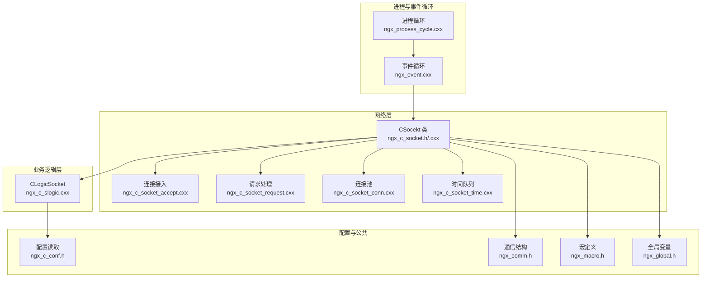
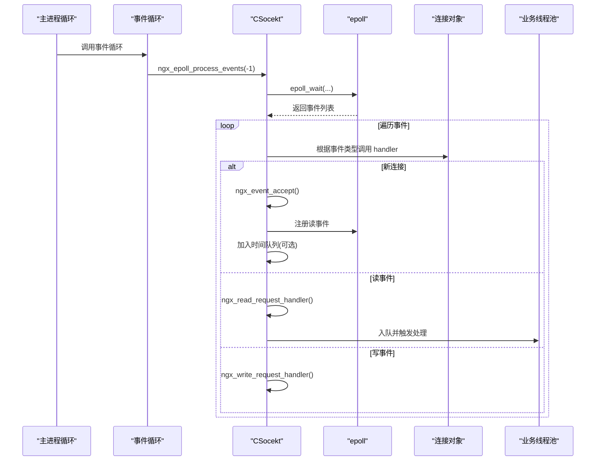
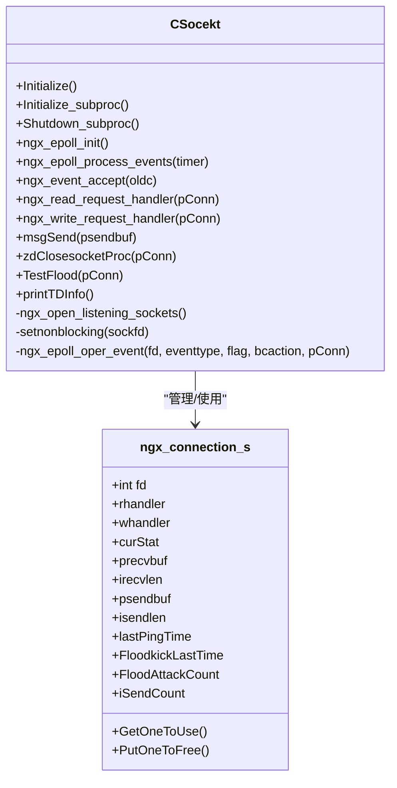
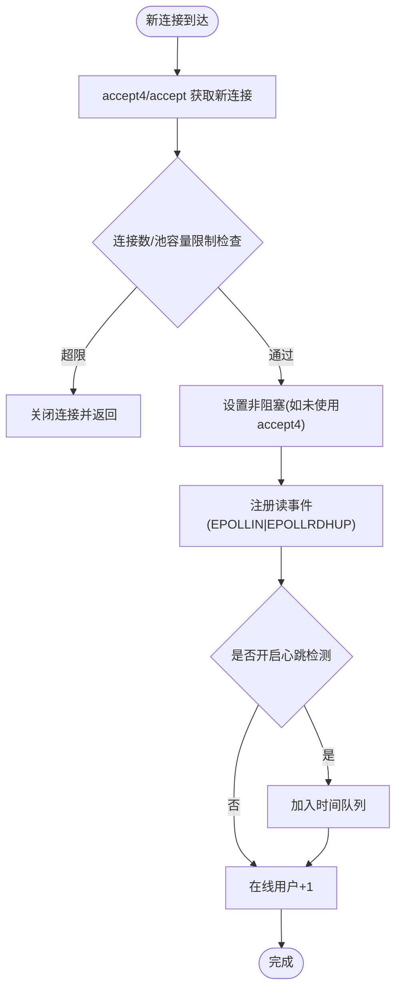
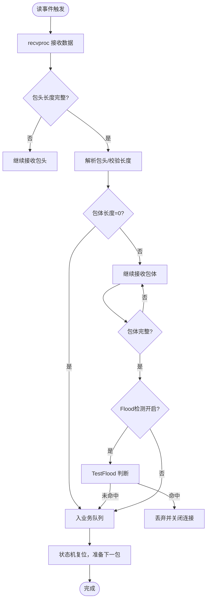
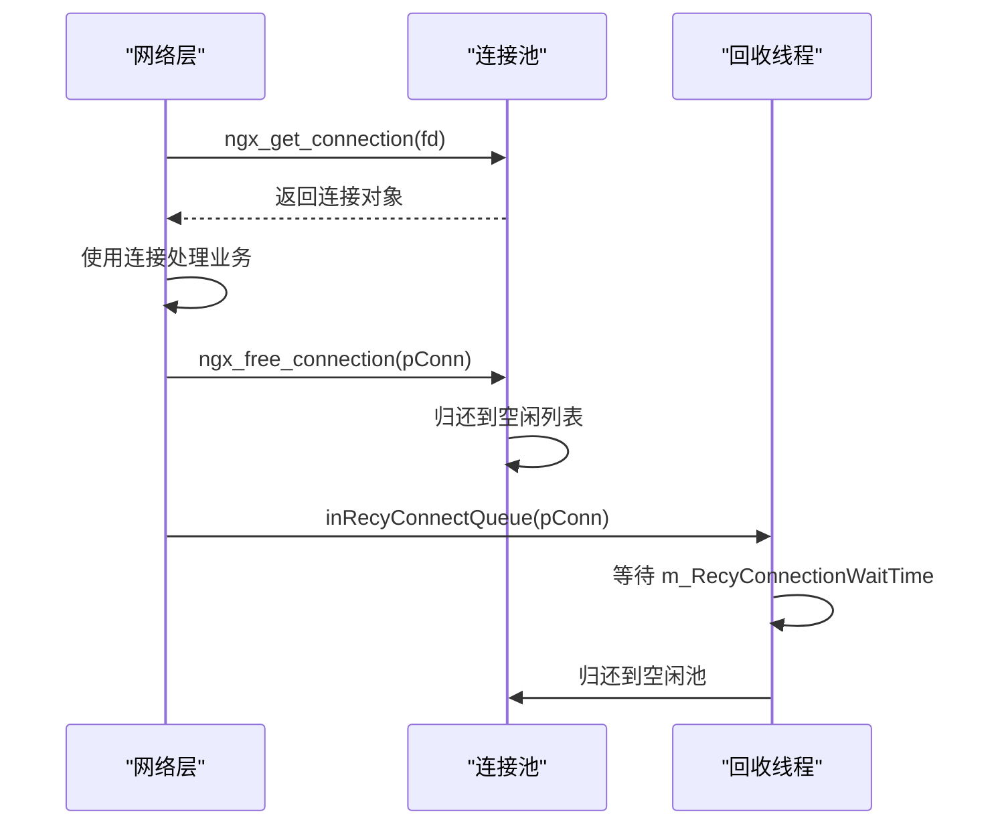
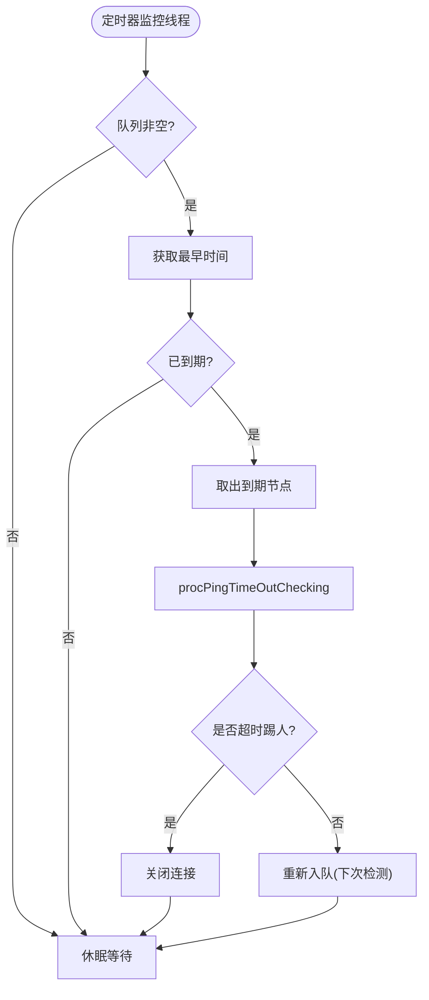
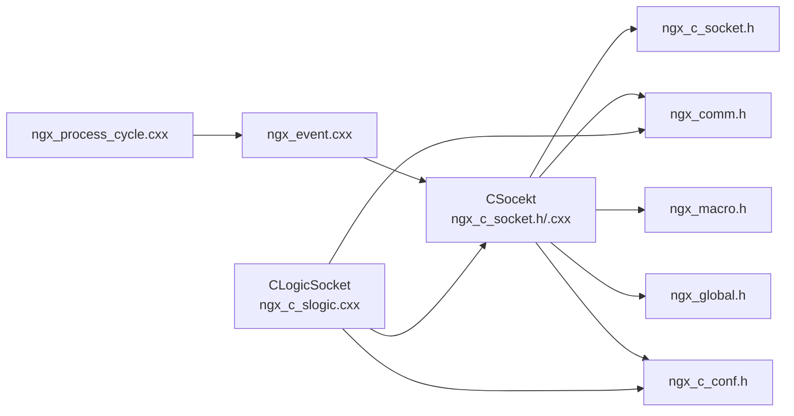

# 网络通信模块

<cite>
**本文引用的文件**
- [net/ngx_c_socket.cxx](file://net/ngx_c_socket.cxx)
- [net/ngx_c_socket_accept.cxx](file://net/ngx_c_socket_accept.cxx)
- [net/ngx_c_socket_conn.cxx](file://net/ngx_c_socket_conn.cxx)
- [net/ngx_c_socket_time.cxx](file://net/ngx_c_socket_time.cxx)
- [net/ngx_c_socket_request.cxx](file://net/ngx_c_socket_request.cxx)
- [proc/ngx_event.cxx](file://proc/ngx_event.cxx)
- [proc/ngx_process_cycle.cxx](file://proc/ngx_process_cycle.cxx)
- [include/ngx_c_socket.h](file://include/ngx_c_socket.h)
- [include/ngx_comm.h](file://include/ngx_comm.h)
- [include/ngx_global.h](file://include/ngx_global.h)
- [include/ngx_macro.h](file://include/ngx_macro.h)
- [include/ngx_c_conf.h](file://include/ngx_c_conf.h)
- [logic/ngx_c_slogic.cxx](file://logic/ngx_c_slogic.cxx)
</cite>

## 目录
1. [简介](#简介)
2. [项目结构](#项目结构)
3. [核心组件](#核心组件)
4. [架构总览](#架构总览)
5. [详细组件分析](#详细组件分析)
6. [依赖关系分析](#依赖关系分析)
7. [性能考量](#性能考量)
8. [故障排查指南](#故障排查指南)
9. [结论](#结论)
10. [附录](#附录)

## 简介
本技术文档围绕基于 epoll 的事件驱动网络处理框架展开，系统性阐述 Socket 基础框架、连接管理机制、时间队列管理、安全防护（Flood 攻击检测）、TCP 连接建立与维护、数据包接收与发送、连接池管理策略，以及与业务逻辑层的接口设计与高并发性能优化。文档提供代码级架构图与流程图，帮助读者快速理解并落地实现。

## 项目结构
网络通信模块位于仓库的 net 与 include 目录，配合 proc 进程循环、logic 业务逻辑层与全局配置、宏定义等共同组成完整的事件驱动网络框架。

图表来源
- [proc/ngx_process_cycle.cxx](file://proc/ngx_process_cycle.cxx#L360-L545)
- [proc/ngx_event.cxx](file://proc/ngx_event.cxx#L14-L22)
- [include/ngx_c_socket.h](file://include/ngx_c_socket.h#L103-L255)
- [net/ngx_c_socket_accept.cxx](file://net/ngx_c_socket_accept.cxx#L22-L180)
- [net/ngx_c_socket_request.cxx](file://net/ngx_c_socket_request.cxx#L25-L114)
- [net/ngx_c_socket_conn.cxx](file://net/ngx_c_socket_conn.cxx#L77-L156)
- [net/ngx_c_socket_time.cxx](file://net/ngx_c_socket_time.cxx#L24-L101)
- [logic/ngx_c_slogic.cxx](file://logic/ngx_c_slogic.cxx#L68-L129)
- [include/ngx_c_conf.h](file://include/ngx_c_conf.h#L8-L53)
- [include/ngx_comm.h](file://include/ngx_comm.h#L19-L31)
- [include/ngx_macro.h](file://include/ngx_macro.h#L18-L31)
- [include/ngx_global.h](file://include/ngx_global.h#L28-L46)

章节来源
- [proc/ngx_process_cycle.cxx](file://proc/ngx_process_cycle.cxx#L360-L545)
- [proc/ngx_event.cxx](file://proc/ngx_event.cxx#L14-L22)
- [include/ngx_c_socket.h](file://include/ngx_c_socket.h#L103-L255)

## 核心组件
- CSocekt：网络事件核心类，负责 epoll 初始化、事件处理、连接接入、请求处理、发送队列、连接池、时间队列、Flood 攻击检测、线程管理等。
- ngx_connection_s：连接对象，封装 fd、收发缓冲、状态机、心跳、Flood 统计、发送计数等。
- CLogicSocket：业务逻辑层，继承自 CSocekt，实现消息路由、CRC 校验、心跳处理、点云接收与查询返回等。
- 事件循环：ngx_process_events_and_timers 调用 CSocekt::ngx_epoll_process_events，形成事件驱动主循环。
- 连接池：集中管理连接对象，支持空闲连接复用与延迟回收。
- 时间队列：基于 multimap 的定时器，支持心跳超时检测与踢人策略。
- 安全防护：Flood 攻击检测，基于时间间隔与计数阈值判定。

章节来源
- [include/ngx_c_socket.h](file://include/ngx_c_socket.h#L103-L255)
- [logic/ngx_c_slogic.cxx](file://logic/ngx_c_slogic.cxx#L68-L129)

## 架构总览
事件驱动的网络处理流程：
- 进程循环启动后，进入事件循环，调用 CSocekt::ngx_epoll_process_events。
- epoll_wait 返回事件后，根据事件类型调用对应 handler（接入、读、写）。
- 接入：ngx_event_accept 获取新连接，设置非阻塞、注册读事件、加入时间队列（可选）。
- 读：ngx_read_request_handler 逐步解析包头与包体，完成 CRC 校验与 Flood 检测，入业务线程池队列。
- 写：ngx_write_request_handler 发送剩余数据，必要时移除 EPOLLOUT 事件。
- 发送：msgSend 将业务返回包入发送队列，ServerSendQueueThread 负责实际发送。
- 时间：ServerTimerQueueMonitorThread 定期扫描时间队列，触发心跳超时处理。
- 连接回收：ServerRecyConnectionThread 延迟回收连接，避免并发释放问题。

图表来源
- [proc/ngx_event.cxx](file://proc/ngx_event.cxx#L14-L22)
- [net/ngx_c_socket.cxx](file://net/ngx_c_socket.cxx#L757-L800)
- [net/ngx_c_socket_accept.cxx](file://net/ngx_c_socket_accept.cxx#L22-L180)
- [net/ngx_c_socket_request.cxx](file://net/ngx_c_socket_request.cxx#L25-L114)

## 详细组件分析

### CSocekt 类与 epoll 事件框架
- 初始化与子进程初始化：读取配置、打开监听端口、初始化互斥量与信号量、创建发送、移动、回收、时间监控线程。
- epoll 初始化：创建 epoll 实例，初始化连接池，为监听 socket 注册读事件。
- 事件处理：epoll_wait 返回后遍历事件，根据连接对象的 rhandler/wandler 分派处理。
- 发送队列：msgSend 将待发送包入队，ServerSendQueueThread 负责发送；发送线程通过信号量协调。
- 关闭与回收：zdClosesocketProc 关闭 fd、从时间队列移除、入回收队列；ServerRecyConnectionThread 延迟回收。
- Flood 攻击检测：TestFlood 基于时间间隔与计数阈值判断，触发时关闭连接。
- 统计与日志：printTDInfo 定期打印在线用户、队列大小、丢弃包数等。

图表来源
- [include/ngx_c_socket.h](file://include/ngx_c_socket.h#L103-L255)
- [net/ngx_c_socket.cxx](file://net/ngx_c_socket.cxx#L58-L210)

章节来源
- [net/ngx_c_socket.cxx](file://net/ngx_c_socket.cxx#L58-L210)
- [include/ngx_c_socket.h](file://include/ngx_c_socket.h#L103-L255)

### 连接接入与新连接处理
- ngx_event_accept：使用 accept4/accept 获取新连接，设置非阻塞，注册读事件，加入时间队列（可选），维护在线用户计数。
- 恶意连接防护：当短时间内连接池容量异常扩大且空闲连接极少时，拒绝新连接，防止资源耗尽。
- 事件标志：EPOLLIN|EPOLLRDHUP，支持边缘触发模式可增加 EPOLLET。

图表来源
- [net/ngx_c_socket_accept.cxx](file://net/ngx_c_socket_accept.cxx#L22-L180)

章节来源
- [net/ngx_c_socket_accept.cxx](file://net/ngx_c_socket_accept.cxx#L22-L180)

### 请求处理与包解析
- ngx_read_request_handler：按状态机逐步解析包头与包体，支持包头不完整与包体不完整分片接收。
- ngx_wait_request_handler_proc_p1：包头解析，校验长度，分配内存，填充消息头与包头，进入包体接收阶段。
- ngx_wait_request_handler_proc_plast：包体完整后入业务线程池队列；若开启 Flood 检测且命中则丢弃。
- recvproc/sendproc：封装 recv/send，处理 EAGAIN/EINTR 等返回码，区分错误与正常情况。
- ngx_write_request_handler：发送剩余数据，必要时移除 EPOLLOUT 事件，释放发送内存，通知发送线程继续。

图表来源
- [net/ngx_c_socket_request.cxx](file://net/ngx_c_socket_request.cxx#L25-L114)
- [net/ngx_c_socket_request.cxx](file://net/ngx_c_socket_request.cxx#L159-L233)

章节来源
- [net/ngx_c_socket_request.cxx](file://net/ngx_c_socket_request.cxx#L25-L114)
- [net/ngx_c_socket_request.cxx](file://net/ngx_c_socket_request.cxx#L159-L233)
- [net/ngx_c_socket_request.cxx](file://net/ngx_c_socket_request.cxx#L235-L332)

### 连接池与延迟回收
- initconnection：按 worker_connections 初始化连接池，分配内存并构造连接对象，分别维护总连接与空闲连接列表。
- ngx_get_connection/ngx_free_connection：从空闲池取用或归还连接，维护计数。
- inRecyConnectQueue：将需要回收的连接入待回收队列，ServerRecyConnectionThread 延迟回收，避免并发释放。
- 回收策略：基于等待时间 m_RecyConnectionWaitTime，结合 iThrowsendCount 等条件判断是否可回收。

图表来源
- [net/ngx_c_socket_conn.cxx](file://net/ngx_c_socket_conn.cxx#L77-L156)
- [net/ngx_c_socket_conn.cxx](file://net/ngx_c_socket_conn.cxx#L161-L278)

章节来源
- [net/ngx_c_socket_conn.cxx](file://net/ngx_c_socket_conn.cxx#L77-L156)
- [net/ngx_c_socket_conn.cxx](file://net/ngx_c_socket_conn.cxx#L161-L278)

### 时间队列与心跳超时
- AddToTimerQueue：将连接加入时间队列，键为未来时间点，值为消息头（含连接指针与序列号）。
- GetOverTimeTimer：获取已到期节点，必要时重新入队（周期性检测）。
- ServerTimerQueueMonitorThread：定期扫描，取出到期节点，调用 procPingTimeOutChecking，按配置决定直接踢人或仅刷新下次检测时间。
- CLogicSocket::procPingTimeOutChecking：若开启超时踢人则关闭连接，否则刷新下次检测时间。

图表来源
- [net/ngx_c_socket_time.cxx](file://net/ngx_c_socket_time.cxx#L149-L203)
- [net/ngx_c_socket_time.cxx](file://net/ngx_c_socket_time.cxx#L24-L101)
- [logic/ngx_c_slogic.cxx](file://logic/ngx_c_slogic.cxx#L131-L156)

章节来源
- [net/ngx_c_socket_time.cxx](file://net/ngx_c_socket_time.cxx#L149-L203)
- [net/ngx_c_socket_time.cxx](file://net/ngx_c_socket_time.cxx#L24-L101)
- [logic/ngx_c_slogic.cxx](file://logic/ngx_c_slogic.cxx#L131-L156)

### 安全防护：Flood 攻击检测
- TestFlood：以毫秒为单位记录最近一次收到包的时间与累计计数，若时间间隔小于阈值且累计次数超过阈值则判定为攻击。
- ngx_read_request_handler：在包头与包体接收完成后进行 Flood 检测，命中则直接关闭连接。
- 配置项：Sock_FloodAttackKickEnable、Sock_FloodTimeInterval、Sock_FloodKickCounter。

章节来源
- [net/ngx_c_socket.cxx](file://net/ngx_c_socket.cxx#L479-L509)
- [net/ngx_c_socket_request.cxx](file://net/ngx_c_socket_request.cxx#L106-L113)

### 与业务逻辑层的接口设计
- CLogicSocket 继承 CSocekt，重写 threadRecvProcFunc 与 procPingTimeOutChecking，实现消息路由、CRC 校验、心跳处理、点云接收与查询返回。
- 消息路由：statusHandler 数组按消息码分发到具体处理函数（如心跳、点云接收、查询返回）。
- CRC 校验：对包体进行 CRC32 计算并与包头中记录的 CRC 对比，错误包丢弃。
- 心跳处理：更新 lastPingTime，返回心跳包；超时检测由时间队列触发。

章节来源
- [logic/ngx_c_slogic.cxx](file://logic/ngx_c_slogic.cxx#L68-L129)
- [logic/ngx_c_slogic.cxx](file://logic/ngx_c_slogic.cxx#L176-L189)
- [logic/ngx_c_slogic.cxx](file://logic/ngx_c_slogic.cxx#L190-L243)
- [logic/ngx_c_slogic.cxx](file://logic/ngx_c_slogic.cxx#L275-L340)

## 依赖关系分析
- CSocekt 依赖：
  - include/ngx_c_socket.h：连接结构、事件处理函数指针、配置项、线程结构。
  - include/ngx_comm.h：包头结构、状态码定义。
  - include/ngx_macro.h：日志级别、进程类型等宏。
  - include/ngx_global.h：全局变量、线程池、fdToConn 映射。
  - include/ngx_c_conf.h：配置读取。
- 事件循环依赖：
  - proc/ngx_event.cxx：调用 CSocekt::ngx_epoll_process_events。
  - proc/ngx_process_cycle.cxx：主进程循环与信号处理。
- 业务逻辑依赖：
  - logic/ngx_c_slogic.cxx：消息路由、心跳、点云处理、数据库查询。

图表来源
- [include/ngx_c_socket.h](file://include/ngx_c_socket.h#L103-L255)
- [include/ngx_comm.h](file://include/ngx_comm.h#L19-L31)
- [include/ngx_macro.h](file://include/ngx_macro.h#L18-L31)
- [include/ngx_global.h](file://include/ngx_global.h#L28-L46)
- [include/ngx_c_conf.h](file://include/ngx_c_conf.h#L8-L53)
- [proc/ngx_event.cxx](file://proc/ngx_event.cxx#L14-L22)
- [proc/ngx_process_cycle.cxx](file://proc/ngx_process_cycle.cxx#L360-L545)
- [logic/ngx_c_slogic.cxx](file://logic/ngx_c_slogic.cxx#L68-L129)

章节来源
- [include/ngx_c_socket.h](file://include/ngx_c_socket.h#L103-L255)
- [proc/ngx_event.cxx](file://proc/ngx_event.cxx#L14-L22)
- [proc/ngx_process_cycle.cxx](file://proc/ngx_process_cycle.cxx#L360-L545)
- [logic/ngx_c_slogic.cxx](file://logic/ngx_c_slogic.cxx#L68-L129)

## 性能考量
- 非阻塞 I/O 与 epoll：所有 socket 注册为非阻塞，epoll_wait 返回后按事件类型处理，避免阻塞等待。
- 连接池与延迟回收：减少频繁分配/释放，降低内存碎片与系统调用开销；延迟回收避免并发释放带来的竞争。
- 发送队列与线程分离：msgSend 入队后由专用线程发送，避免业务线程被阻塞；信号量协调生产者/消费者。
- 时间队列：基于 multimap 的 O(log n) 插入与 O(1) 取最早，定期扫描，避免每事件都做超时检查。
- 队列容量与丢弃策略：发送队列过大时丢弃包并关闭连接，防止服务器被拖垮；接收队列过大时打印告警。
- 线程模型：多线程分工明确，接入线程、发送线程、回收线程、时间监控线程各司其职，提升吞吐。

[本节为通用性能讨论，不直接分析具体文件]

## 故障排查指南
- epoll_wait 返回错误：
  - EINTR：由信号导致，视为正常，记录日志后继续。
  - 其他错误：记录告警日志，返回非正常状态。
- 接收/发送错误：
  - recvproc：EAGAIN/EWOULDBLOCK 不当作错误，EINTR 记录日志；其他错误关闭连接。
  - sendproc：EAGAIN 表示内核缓冲区满，返回 -1；EINTR 记录日志；其他错误返回 -2。
- 连接异常：
  - 对端关闭或异常断开：recv 返回 0，调用 zdClosesocketProc 关闭并回收。
  - 连接池耗尽：ngx_event_accept 拒绝新连接，避免资源耗尽。
- Flood 攻击：
  - TestFlood 命中后直接关闭连接，防止恶意刷包。
- 队列异常：
  - 发送队列过大：丢弃包并统计丢弃数，必要时关闭连接。
  - 接收队列过大：打印告警，考虑限速或增加处理线程。

章节来源
- [net/ngx_c_socket_request.cxx](file://net/ngx_c_socket_request.cxx#L116-L154)
- [net/ngx_c_socket_request.cxx](file://net/ngx_c_socket_request.cxx#L240-L277)
- [net/ngx_c_socket_accept.cxx](file://net/ngx_c_socket_accept.cxx#L105-L122)
- [net/ngx_c_socket.cxx](file://net/ngx_c_socket.cxx#L414-L456)

## 结论
该网络通信模块以 epoll 为核心，结合连接池、时间队列、Flood 检测与多线程分离，构建了高并发、可扩展的事件驱动网络框架。通过清晰的事件分发、严格的错误处理与安全防护，能够在复杂业务场景下保持稳定与高性能。建议在生产环境中结合业务特点进一步优化队列阈值、线程数量与时间队列扫描策略。

[本节为总结性内容，不直接分析具体文件]

## 附录

### 网络配置参数说明
- worker_connections：epoll 最大连接项数，决定监听 socket 数量与连接池规模。
- ListenPortCount：监听端口数量。
- Sock_RecyConnectionWaitTime：连接延迟回收等待时间（秒）。
- Sock_WaitTimeEnable：是否开启心跳检测。
- Sock_MaxWaitTime：心跳检测周期（秒）。
- Sock_TimeOutKick：心跳超时是否直接踢人。
- Sock_FloodAttackKickEnable：Flood 攻击检测开关。
- Sock_FloodTimeInterval：Flood 检测时间间隔（毫秒）。
- Sock_FloodKickCounter：Flood 检测计数阈值。

章节来源
- [net/ngx_c_socket.cxx](file://net/ngx_c_socket.cxx#L227-L244)

### 调试技巧
- 日志级别：利用 ngx_macro.h 中的日志级别进行分级输出，便于定位问题。
- 统计信息：printTDInfo 定期打印在线用户、队列大小、丢弃包数，辅助性能分析。
- 队列监控：关注接收/发送队列长度，及时调整线程数或限速策略。
- 信号处理：主进程注册信号处理器，优雅关闭时等待子进程退出，避免僵尸进程。

章节来源
- [include/ngx_macro.h](file://include/ngx_macro.h#L18-L31)
- [net/ngx_c_socket.cxx](file://net/ngx_c_socket.cxx#L512-L537)
- [proc/ngx_process_cycle.cxx](file://proc/ngx_process_cycle.cxx#L649-L714)