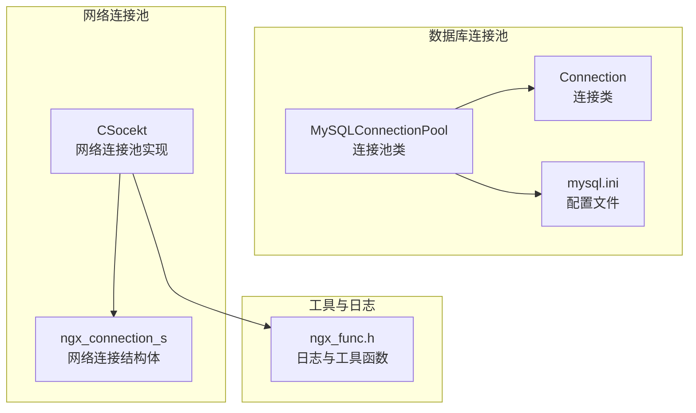
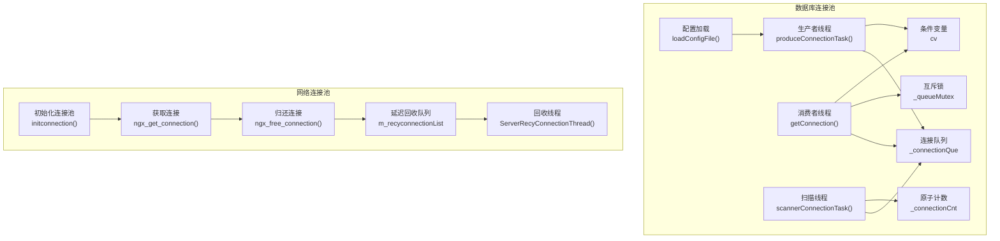
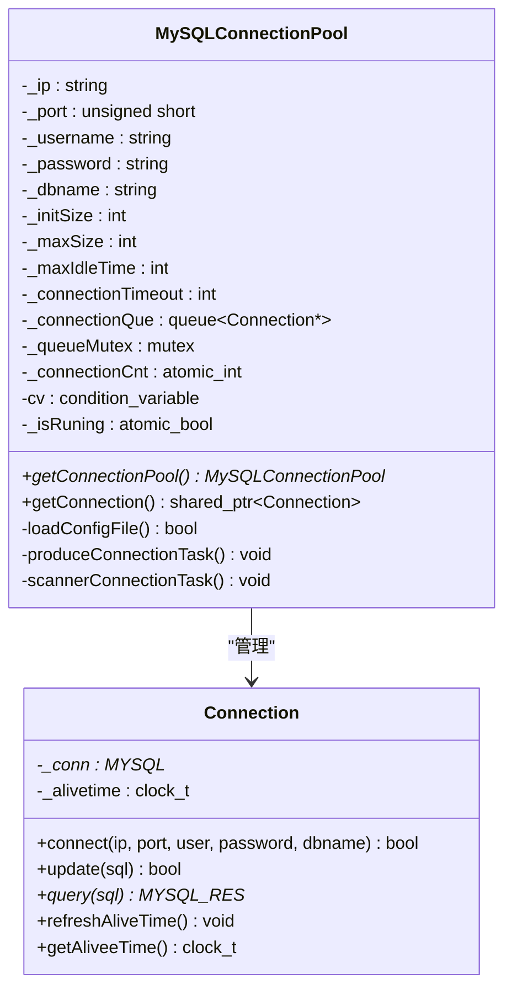
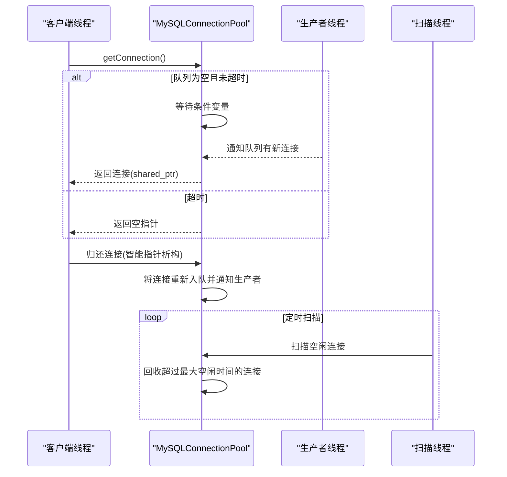
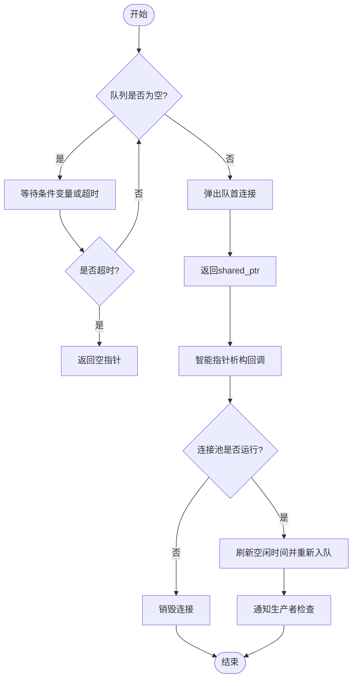
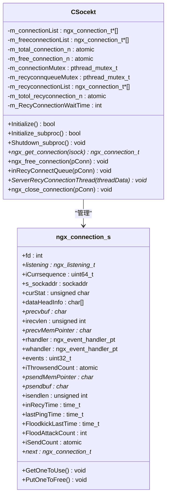
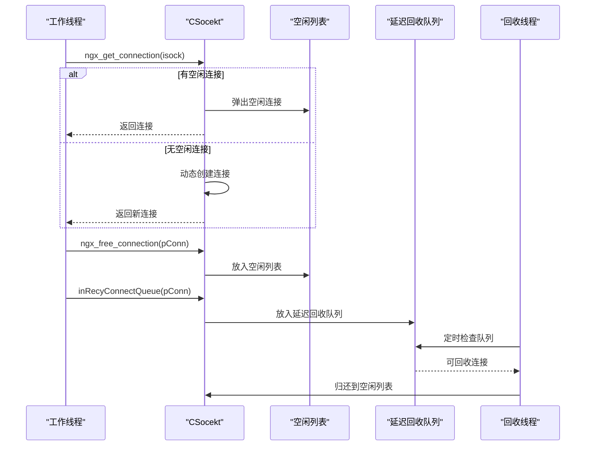
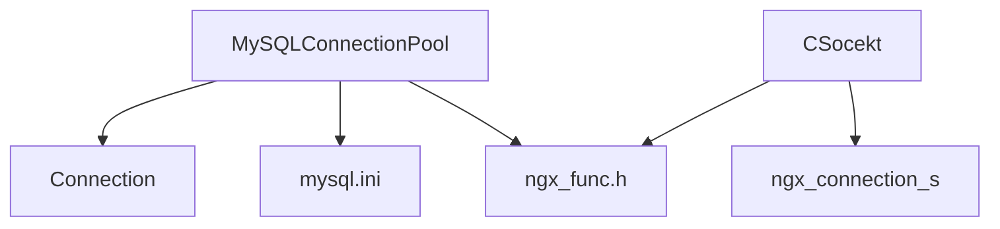

# 连接管理机制

<cite>
**本文档引用的文件**
- [ngx_mysql_connection.h](file://include/ngx_mysql_connection.h)
- [ngx_mysql_connection_pool.h](file://include/ngx_mysql_connection_pool.h)
- [ngx_mysql_connection.cxx](file://persist/ngx_mysql_connection.cxx)
- [ngx_mysql_connection_pool.cxx](file://persist/ngx_mysql_connection_pool.cxx)
- [mysql.ini](file://persist/mysql.ini)
- [ngx_c_socket.h](file://include/ngx_c_socket.h)
- [ngx_c_socket_conn.cxx](file://net/ngx_c_socket_conn.cxx)
- [ngx_func.h](file://include/ngx_func.h)
</cite>

## 目录
1. [引言](#引言)
2. [项目结构](#项目结构)
3. [核心组件](#核心组件)
4. [架构概览](#架构概览)
5. [详细组件分析](#详细组件分析)
6. [依赖关系分析](#依赖关系分析)
7. [性能考量](#性能考量)
8. [故障排查指南](#故障排查指南)
9. [结论](#结论)

## 引言
本文件深入解析该代码库中的连接管理机制，涵盖数据库连接池与网络连接池两大体系。重点阐述连接对象的创建、分配、回收等生命周期管理，连接状态管理（空闲、活跃、待回收），内存管理策略（动态扩展与收缩），以及并发访问控制与性能监控机制。同时提供实现模式示例与最佳实践建议，帮助读者在实际工程中高效、安全地使用连接管理。

## 项目结构
该项目采用分层组织方式，连接管理相关的核心代码分布在以下模块：
- 数据库连接池：位于 persist 目录，包含连接类与连接池类的头文件与实现文件，以及配置文件。
- 网络连接池：位于 net 与 include 目录，包含网络连接结构体定义与连接池实现。
- 工具与日志：位于 include 目录，提供日志输出与通用工具函数。

**图表来源**
- [ngx_mysql_connection.h](file://include/ngx_mysql_connection.h#L9-L35)
- [ngx_mysql_connection_pool.h](file://include/ngx_mysql_connection_pool.h#L14-L55)
- [ngx_c_socket.h](file://include/ngx_c_socket.h#L38-L91)
- [ngx_c_socket_conn.cxx](file://net/ngx_c_socket_conn.cxx#L112-L156)
- [mysql.ini](file://persist/mysql.ini#L1-L13)

**章节来源**
- [ngx_mysql_connection.h](file://include/ngx_mysql_connection.h#L1-L35)
- [ngx_mysql_connection_pool.h](file://include/ngx_mysql_connection_pool.h#L1-L55)
- [ngx_c_socket.h](file://include/ngx_c_socket.h#L1-L258)
- [ngx_c_socket_conn.cxx](file://net/ngx_c_socket_conn.cxx#L1-L290)
- [mysql.ini](file://persist/mysql.ini#L1-L13)

## 核心组件
本节概述两类连接管理组件及其职责：
- 数据库连接池：提供线程安全的连接获取、超时处理、动态扩展与回收机制，支持配置化参数。
- 网络连接池：提供TCP连接对象的分配、回收与延迟回收队列，配合事件驱动模型实现高并发网络处理。

**章节来源**
- [ngx_mysql_connection_pool.h](file://include/ngx_mysql_connection_pool.h#L14-L55)
- [ngx_c_socket.h](file://include/ngx_c_socket.h#L103-L258)

## 架构概览
数据库连接池采用生产者-消费者模型，结合条件变量与互斥锁实现线程间协作；网络连接池采用静态连接池与延迟回收队列相结合的方式，提升系统稳定性与资源利用率。

**图表来源**
- [ngx_mysql_connection_pool.cxx](file://persist/ngx_mysql_connection_pool.cxx#L12-L74)
- [ngx_mysql_connection_pool.cxx](file://persist/ngx_mysql_connection_pool.cxx#L173-L203)
- [ngx_mysql_connection_pool.cxx](file://persist/ngx_mysql_connection_pool.cxx#L208-L255)
- [ngx_mysql_connection_pool.cxx](file://persist/ngx_mysql_connection_pool.cxx#L281-L311)
- [ngx_c_socket_conn.cxx](file://net/ngx_c_socket_conn.cxx#L112-L156)
- [ngx_c_socket_conn.cxx](file://net/ngx_c_socket_conn.cxx#L141-L190)
- [ngx_c_socket_conn.cxx](file://net/ngx_c_socket_conn.cxx#L193-L278)

## 详细组件分析

### 数据库连接池（MySQLConnectionPool）
该组件提供单例模式的连接池，支持配置化参数与线程安全的连接获取与回收。

#### 类关系图

**图表来源**
- [ngx_mysql_connection.h](file://include/ngx_mysql_connection.h#L9-L35)
- [ngx_mysql_connection_pool.h](file://include/ngx_mysql_connection_pool.h#L14-L55)

#### 生命周期管理
- 创建：构造函数加载配置并创建初始连接，加入队列。
- 分配：getConnection() 使用条件变量与互斥锁实现线程安全获取，支持超时。
- 回收：通过智能指针的析构回调将连接归还队列或销毁。
- 销毁：析构函数设置停止标志并等待队列清空。

**图表来源**
- [ngx_mysql_connection_pool.cxx](file://persist/ngx_mysql_connection_pool.cxx#L208-L255)
- [ngx_mysql_connection_pool.cxx](file://persist/ngx_mysql_connection_pool.cxx#L173-L203)
- [ngx_mysql_connection_pool.cxx](file://persist/ngx_mysql_connection_pool.cxx#L281-L311)

#### 状态管理
- 空闲连接：在队列中等待被获取。
- 活跃连接：由客户端持有，通过智能指针生命周期自动归还。
- 待回收连接：扫描线程识别并回收超出最大空闲时间的连接。

**图表来源**
- [ngx_mysql_connection_pool.cxx](file://persist/ngx_mysql_connection_pool.cxx#L208-L255)

#### 内存管理策略
- 动态扩展：当队列为空且连接数小于最大值时，生产者线程创建新连接。
- 动态收缩：扫描线程定期回收超过最大空闲时间的空闲连接，保留初始连接数量。
- 原子计数：使用原子整型记录连接总数，避免竞态条件。

**章节来源**
- [ngx_mysql_connection_pool.cxx](file://persist/ngx_mysql_connection_pool.cxx#L77-L162)
- [ngx_mysql_connection_pool.cxx](file://persist/ngx_mysql_connection_pool.cxx#L173-L203)
- [ngx_mysql_connection_pool.cxx](file://persist/ngx_mysql_connection_pool.cxx#L281-L311)

#### 并发访问控制
- 互斥锁：保护连接队列与状态变更。
- 条件变量：协调生产者与消费者线程，支持超时等待。
- 原子变量：保证连接计数与运行状态的原子性。

**章节来源**
- [ngx_mysql_connection_pool.h](file://include/ngx_mysql_connection_pool.h#L49-L53)
- [ngx_mysql_connection_pool.cxx](file://persist/ngx_mysql_connection_pool.cxx#L208-L255)

#### 性能监控机制
- 日志输出：通过日志函数记录连接获取超时等事件，便于监控与排障。
- 配置参数：最大空闲时间与连接超时时间可调，适应不同场景。

**章节来源**
- [ngx_mysql_connection_pool.cxx](file://persist/ngx_mysql_connection_pool.cxx#L219-L222)
- [ngx_func.h](file://include/ngx_func.h#L12-L28)

### 网络连接池（CSocekt）
该组件提供TCP连接对象的静态池化管理，支持延迟回收队列以提升系统稳定性。

#### 类关系图

**图表来源**
- [ngx_c_socket.h](file://include/ngx_c_socket.h#L38-L91)
- [ngx_c_socket.h](file://include/ngx_c_socket.h#L103-L258)

#### 生命周期管理
- 创建：初始化连接池时分配固定数量的连接对象。
- 分配：从空闲列表中获取，若无空闲则动态创建。
- 回收：归还到空闲列表；延迟回收队列中的连接按设定时间统一回收。
- 销毁：程序退出时清理所有连接对象。

**图表来源**
- [ngx_c_socket_conn.cxx](file://net/ngx_c_socket_conn.cxx#L112-L156)
- [ngx_c_socket_conn.cxx](file://net/ngx_c_socket_conn.cxx#L141-L190)
- [ngx_c_socket_conn.cxx](file://net/ngx_c_socket_conn.cxx#L193-L278)

#### 状态管理
- 空闲连接：在空闲列表中等待被分配。
- 活跃连接：正在被工作线程使用。
- 待回收连接：已结束使用但尚未释放，等待回收线程处理。

**章节来源**
- [ngx_c_socket_conn.cxx](file://net/ngx_c_socket_conn.cxx#L141-L190)

#### 内存管理策略
- 静态池化：初始化时创建固定数量的连接对象，减少频繁分配开销。
- 延迟回收：通过延迟回收队列避免立即释放导致的抖动，提升系统稳定性。
- 显式释放：析构函数中显式调用析构并释放内存，确保资源正确回收。

**章节来源**
- [ngx_c_socket_conn.cxx](file://net/ngx_c_socket_conn.cxx#L96-L109)
- [ngx_c_socket_conn.cxx](file://net/ngx_c_socket_conn.cxx#L193-L278)

#### 并发访问控制
- 互斥锁：保护空闲列表与回收队列的并发访问。
- 原子计数：保证连接总数与空闲数的原子性更新。
- 线程分离：回收线程与生产者线程分离运行，降低耦合度。

**章节来源**
- [ngx_c_socket.h](file://include/ngx_c_socket.h#L210-L219)
- [ngx_c_socket_conn.cxx](file://net/ngx_c_socket_conn.cxx#L193-L278)

#### 性能监控机制
- 在线用户统计：原子计数跟踪当前在线用户数。
- 发送队列监控：原子计数与互斥量保护发送队列大小。
- 心跳与超时检测：通过时间戳与定时器队列实现连接健康监控。

**章节来源**
- [ngx_c_socket.h](file://include/ngx_c_socket.h#L245-L246)
- [ngx_c_socket.h](file://include/ngx_c_socket.h#L230-L235)
- [ngx_c_socket.h](file://include/ngx_c_socket.h#L164-L169)

## 依赖关系分析
数据库连接池与网络连接池分别独立运行，但均遵循类似的并发控制与资源管理原则。两者通过各自的配置文件与日志系统进行参数化与可观测性支持。

**图表来源**
- [ngx_mysql_connection_pool.h](file://include/ngx_mysql_connection_pool.h#L11-L11)
- [ngx_c_socket.h](file://include/ngx_c_socket.h#L103-L103)
- [mysql.ini](file://persist/mysql.ini#L1-L13)

**章节来源**
- [ngx_mysql_connection_pool.h](file://include/ngx_mysql_connection_pool.h#L1-L11)
- [ngx_c_socket.h](file://include/ngx_c_socket.h#L103-L103)

## 性能考量
- 数据库连接池
  - 动态扩展：在队列为空时创建新连接，避免阻塞；但需控制最大连接数以防止资源耗尽。
  - 空闲回收：定期扫描并回收超时空闲连接，平衡内存占用与创建成本。
  - 超时控制：获取连接支持超时，避免长时间阻塞影响响应。
- 网络连接池
  - 静态池化：初始化固定数量连接，减少动态分配开销。
  - 延迟回收：通过延迟队列平滑资源释放，降低抖动。
  - 并发控制：互斥锁与原子变量保证高并发下的数据一致性。

[本节为通用性能讨论，无需特定文件分析]

## 故障排查指南
- 数据库连接池
  - 获取连接超时：检查连接池配置与当前连接数，确认生产者线程是否正常运行。
  - 连接泄漏：确认智能指针析构回调是否正确执行，避免连接未归还。
  - 资源回收：检查扫描线程是否按配置周期运行，确保超时连接被及时回收。
- 网络连接池
  - 连接池耗尽：检查空闲列表与活跃连接数，评估是否需要扩大池容量。
  - 延迟回收异常：确认回收线程是否正常运行，检查延迟时间配置。
  - 资源释放：验证析构函数是否正确释放所有连接对象。

**章节来源**
- [ngx_mysql_connection_pool.cxx](file://persist/ngx_mysql_connection_pool.cxx#L219-L222)
- [ngx_c_socket_conn.cxx](file://net/ngx_c_socket_conn.cxx#L193-L278)

## 结论
该代码库提供了完整的连接管理方案：数据库连接池通过生产者-消费者模型与条件变量实现高效的连接调度与回收；网络连接池通过静态池化与延迟回收队列提升系统稳定性。两者均采用严格的并发控制与资源管理策略，结合配置化参数与日志监控，能够满足高并发场景下的连接管理需求。建议在实际部署中根据业务负载调整配置参数，并持续监控连接池状态以优化性能。