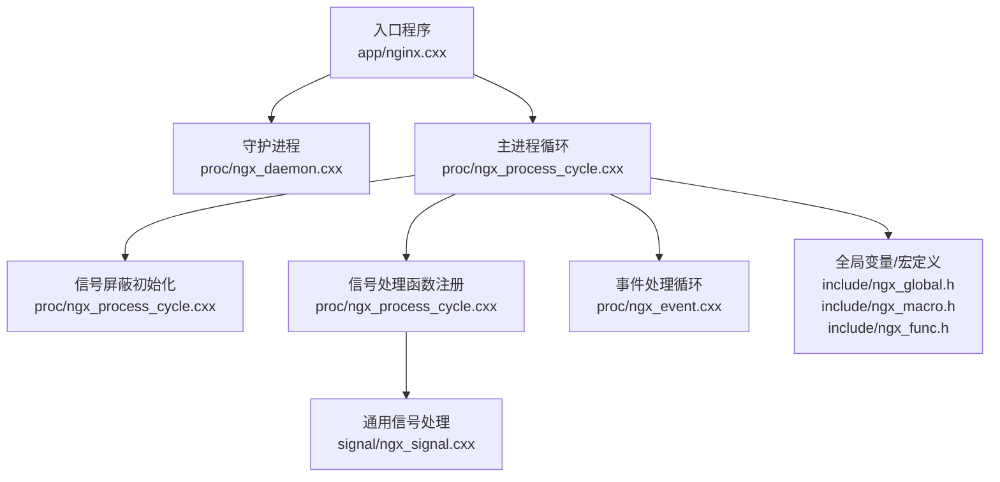
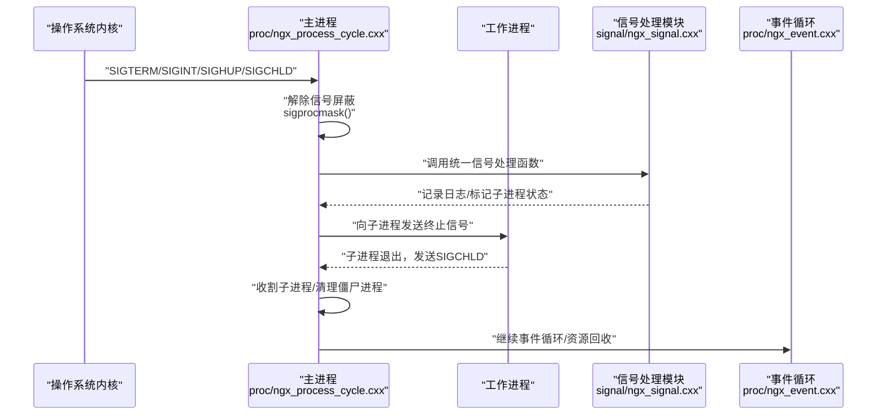
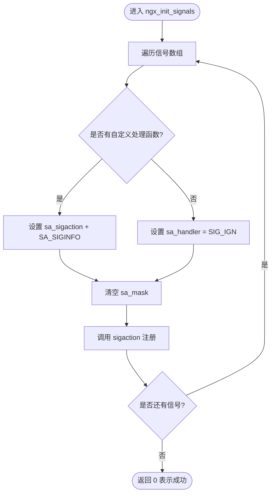
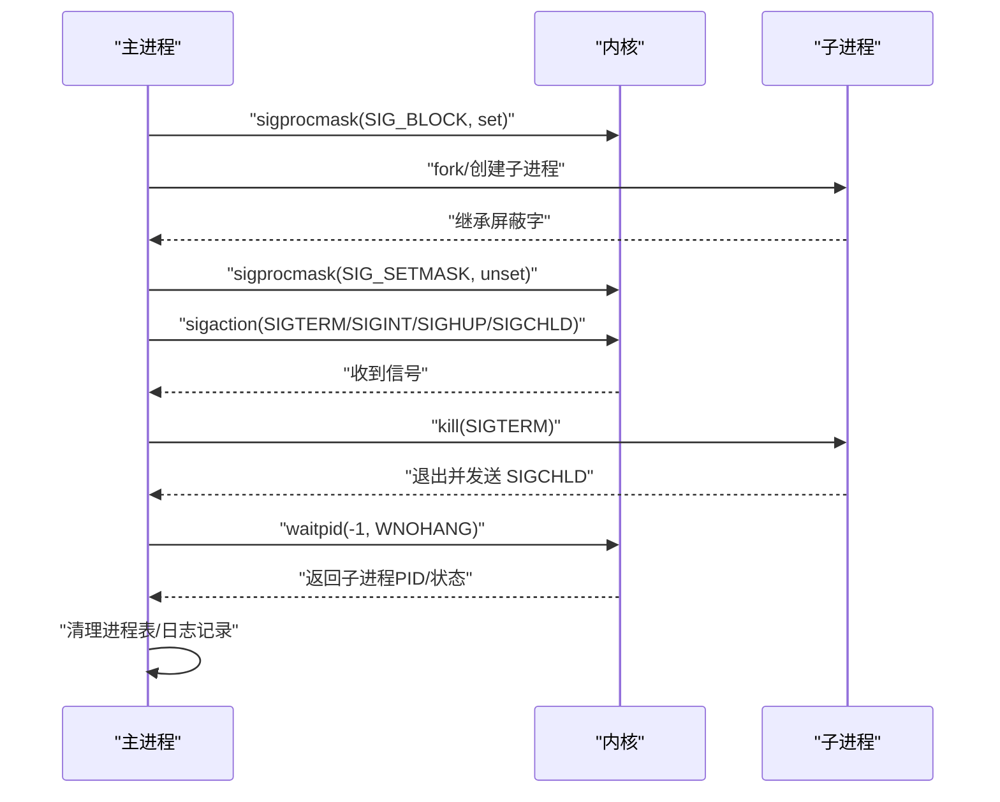
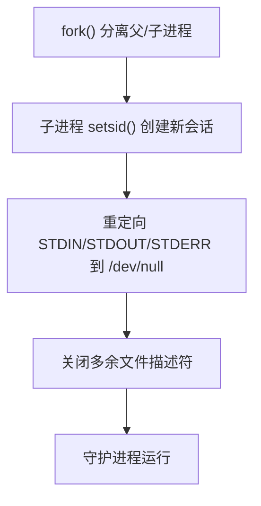
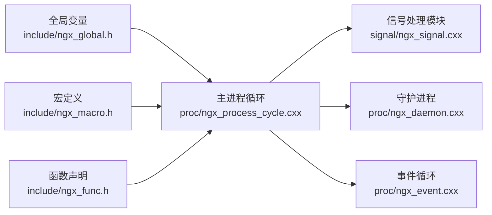

# 信号处理机制

<cite>
**本文引用的文件列表**
- [signal/ngx_signal.cxx](file://signal/ngx_signal.cxx)
- [proc/ngx_process_cycle.cxx](file://proc/ngx_process_cycle.cxx)
- [proc/ngx_daemon.cxx](file://proc/ngx_daemon.cxx)
- [proc/ngx_event.cxx](file://proc/ngx_event.cxx)
- [app/nginx.cxx](file://app/nginx.cxx)
- [include/ngx_global.h](file://include/ngx_global.h)
- [include/ngx_macro.h](file://include/ngx_macro.h)
- [include/ngx_func.h](file://include/ngx_func.h)
</cite>

## 目录
1. [引言](#引言)
2. [项目结构](#项目结构)
3. [核心组件](#核心组件)
4. [架构总览](#架构总览)
5. [详细组件分析](#详细组件分析)
6. [依赖关系分析](#依赖关系分析)
7. [性能考量](#性能考量)
8. [故障排查指南](#故障排查指南)
9. [结论](#结论)
10. [附录](#附录)

## 引言
本文件围绕信号处理机制展开，系统阐述信号注册、信号处理函数编写规范、信号屏蔽与信号集管理、异步信号安全注意事项，并结合本项目的多进程模型（Master-Worker）给出实践指导。重点覆盖 SIGTERM（优雅关闭）、SIGQUIT（强制关闭）、SIGHUP（配置重载）、SIGINT（中断信号）等在进程管理中的作用与实现要点。

## 项目结构
本项目采用多进程架构，主控进程负责进程生命周期管理与信号处理，工作进程负责具体业务处理。信号处理涉及如下模块：
- 信号注册与处理：signal/ngx_signal.cxx
- 主进程信号屏蔽与注册：proc/ngx_process_cycle.cxx
- 守护进程与会话脱离：proc/ngx_daemon.cxx
- 事件循环与定时器：proc/ngx_event.cxx
- 入口与全局变量：app/nginx.cxx、include/ngx_global.h、include/ngx_macro.h、include/ngx_func.h

**图表来源**
- [app/nginx.cxx](file://app/nginx.cxx#L44-L122)
- [proc/ngx_daemon.cxx](file://proc/ngx_daemon.cxx#L15-L125)
- [proc/ngx_process_cycle.cxx](file://proc/ngx_process_cycle.cxx#L124-L208)
- [proc/ngx_event.cxx](file://proc/ngx_event.cxx#L14-L22)
- [signal/ngx_signal.cxx](file://signal/ngx_signal.cxx#L45-L87)
- [include/ngx_global.h](file://include/ngx_global.h#L37-L42)
- [include/ngx_macro.h](file://include/ngx_macro.h#L32-L36)
- [include/ngx_func.h](file://include/ngx_func.h#L21-L26)

**章节来源**
- [app/nginx.cxx](file://app/nginx.cxx#L44-L122)
- [proc/ngx_daemon.cxx](file://proc/ngx_daemon.cxx#L15-L125)
- [proc/ngx_process_cycle.cxx](file://proc/ngx_process_cycle.cxx#L124-L208)
- [proc/ngx_event.cxx](file://proc/ngx_event.cxx#L14-L22)
- [signal/ngx_signal.cxx](file://signal/ngx_signal.cxx#L45-L87)
- [include/ngx_global.h](file://include/ngx_global.h#L37-L42)
- [include/ngx_macro.h](file://include/ngx_macro.h#L32-L36)
- [include/ngx_func.h](file://include/ngx_func.h#L21-L26)

## 核心组件
- 信号注册与处理
  - 通过结构体数组集中声明待处理信号及其处理函数，使用 sigaction 注册，支持 SA_SIGINFO 以获取 siginfo_t 附加信息。
  - 提供统一的 ngx_signal_handler，区分 Master/Worker 进程分支处理。
- 主进程信号屏蔽与注册
  - 在创建子进程前阻塞多种信号，子进程继承屏蔽字；随后解除屏蔽并在主进程注册关键信号处理函数。
  - 使用 sigprocmask 设置信号屏蔽字，确保关键临界区不受信号打断。
- 守护进程与会话脱离
  - fork 后 setsid 创建新会话，脱离控制终端，避免终端断连引发的信号影响。
- 事件循环与定时器
  - 通过 epoll 驱动事件循环，配合日志统计与性能优化策略。

**章节来源**
- [signal/ngx_signal.cxx](file://signal/ngx_signal.cxx#L14-L87)
- [proc/ngx_process_cycle.cxx](file://proc/ngx_process_cycle.cxx#L124-L208)
- [proc/ngx_daemon.cxx](file://proc/ngx_daemon.cxx#L15-L125)
- [proc/ngx_event.cxx](file://proc/ngx_event.cxx#L14-L22)

## 架构总览
下图展示了信号处理在多进程模型中的流转与职责划分。

**图表来源**
- [proc/ngx_process_cycle.cxx](file://proc/ngx_process_cycle.cxx#L184-L208)
- [signal/ngx_signal.cxx](file://signal/ngx_signal.cxx#L91-L155)
- [proc/ngx_process_cycle.cxx](file://proc/ngx_process_cycle.cxx#L649-L714)
- [proc/ngx_event.cxx](file://proc/ngx_event.cxx#L14-L22)

## 详细组件分析

### 信号注册与处理（signal/ngx_signal.cxx）
- 信号结构体
  - 包含信号编号、信号名称与处理函数指针，便于集中管理与扩展。
- 注册流程
  - 遍历信号数组，为每个信号设置 sigaction，若 handler 非空则使用 SA_SIGINFO，否则忽略该信号。
  - sa_mask 初始化为空，表示不额外阻塞其他信号。
- 统一处理函数
  - 根据进程类型（Master/Worker）分派处理逻辑；记录日志并处理 SIGCHLD（标记子进程状态变化）。
  - 子进程状态变化时调用 ngx_process_get_status 清理僵尸进程。

**图表来源**
- [signal/ngx_signal.cxx](file://signal/ngx_signal.cxx#L45-L87)

**章节来源**
- [signal/ngx_signal.cxx](file://signal/ngx_signal.cxx#L14-L87)
- [signal/ngx_signal.cxx](file://signal/ngx_signal.cxx#L91-L155)

### 主进程信号屏蔽与注册（proc/ngx_process_cycle.cxx）
- 信号屏蔽初始化
  - 在创建子进程前，构造包含多种信号的信号集并调用 sigprocmask(SIG_BLOCK) 屏蔽这些信号，确保子进程继承屏蔽字。
- 注册信号处理函数
  - 解除屏蔽后，使用 sigaction 为 SIGCHLD、SIGTERM、SIGQUIT、SIGHUP、SIGINT 注册统一处理函数。
- 信号处理函数
  - SIGTERM/SIGQUIT/SIGINT：向所有子进程发送终止信号，等待子进程退出并清理僵尸进程。
  - SIGHUP：预留配置重载逻辑。
  - SIGCHLD：在主循环中处理，避免阻塞。

**图表来源**
- [proc/ngx_process_cycle.cxx](file://proc/ngx_process_cycle.cxx#L124-L208)
- [proc/ngx_process_cycle.cxx](file://proc/ngx_process_cycle.cxx#L649-L714)

**章节来源**
- [proc/ngx_process_cycle.cxx](file://proc/ngx_process_cycle.cxx#L124-L208)
- [proc/ngx_process_cycle.cxx](file://proc/ngx_process_cycle.cxx#L649-L714)

### 守护进程与会话脱离（proc/ngx_daemon.cxx）
- 通过 fork + setsid 创建新会话，进程成为会话首进程，脱离控制终端。
- 重定向标准输入/输出/错误到 /dev/null，避免守护进程与终端耦合。
- umask(0) 清除文件权限掩码，避免权限继承带来的不确定性。

**图表来源**
- [proc/ngx_daemon.cxx](file://proc/ngx_daemon.cxx#L15-L125)

**章节来源**
- [proc/ngx_daemon.cxx](file://proc/ngx_daemon.cxx#L15-L125)

### 事件循环与定时器（proc/ngx_event.cxx）
- 通过 epoll 驱动事件处理，周期性打印统计信息，便于观察运行状态。
- 与信号处理协同，确保在信号中断时仍能维持稳定运行。

**章节来源**
- [proc/ngx_event.cxx](file://proc/ngx_event.cxx#L14-L22)

### 入口与全局变量（app/nginx.cxx、include/ngx_global.h、include/ngx_macro.h、include/ngx_func.h）
- 入口程序初始化全局变量（进程类型、PID、父PID、日志、退出标志等），决定是否进入守护进程模式。
- 宏定义提供进程类型标记（Master/Worker）与日志级别等常量。
- 函数声明涵盖信号初始化、主进程循环、守护进程、事件处理等。

**章节来源**
- [app/nginx.cxx](file://app/nginx.cxx#L34-L73)
- [include/ngx_global.h](file://include/ngx_global.h#L37-L42)
- [include/ngx_macro.h](file://include/ngx_macro.h#L32-L36)
- [include/ngx_func.h](file://include/ngx_func.h#L21-L26)

## 依赖关系分析
- 模块耦合
  - 主进程信号处理依赖全局变量（进程类型、子进程数组）与日志系统。
  - 信号处理模块与主进程循环紧密协作，统一处理关键信号。
- 外部依赖
  - POSIX 信号 API（sigaction、sigprocmask、sigemptyset、sigaddset）。
  - 系统调用（waitpid、kill）用于子进程管理与清理。

**图表来源**
- [include/ngx_global.h](file://include/ngx_global.h#L37-L42)
- [include/ngx_macro.h](file://include/ngx_macro.h#L32-L36)
- [include/ngx_func.h](file://include/ngx_func.h#L21-L26)
- [proc/ngx_process_cycle.cxx](file://proc/ngx_process_cycle.cxx#L124-L208)
- [signal/ngx_signal.cxx](file://signal/ngx_signal.cxx#L91-L155)
- [proc/ngx_daemon.cxx](file://proc/ngx_daemon.cxx#L15-L125)
- [proc/ngx_event.cxx](file://proc/ngx_event.cxx#L14-L22)

**章节来源**
- [include/ngx_global.h](file://include/ngx_global.h#L37-L42)
- [include/ngx_macro.h](file://include/ngx_macro.h#L32-L36)
- [include/ngx_func.h](file://include/ngx_func.h#L21-L26)
- [proc/ngx_process_cycle.cxx](file://proc/ngx_process_cycle.cxx#L124-L208)
- [signal/ngx_signal.cxx](file://signal/ngx_signal.cxx#L91-L155)
- [proc/ngx_daemon.cxx](file://proc/ngx_daemon.cxx#L15-L125)
- [proc/ngx_event.cxx](file://proc/ngx_event.cxx#L14-L22)

## 性能考量
- 信号屏蔽时机
  - 在创建子进程前屏蔽多种信号，避免子进程在关键阶段被信号打断；创建完成后解除屏蔽，确保主进程能及时响应。
- 非阻塞收割子进程
  - 使用 WNOHANG 轮询收割子进程，避免阻塞主循环；在等待子进程退出时定期清理，降低僵尸进程风险。
- 日志与统计
  - 事件循环中打印统计信息，有助于定位性能瓶颈与异常。

**章节来源**
- [proc/ngx_process_cycle.cxx](file://proc/ngx_process_cycle.cxx#L124-L208)
- [proc/ngx_process_cycle.cxx](file://proc/ngx_process_cycle.cxx#L548-L577)
- [proc/ngx_event.cxx](file://proc/ngx_event.cxx#L14-L22)

## 故障排查指南
- 信号未生效
  - 检查是否在创建子进程前正确屏蔽信号，以及在主进程注册阶段是否解除屏蔽。
  - 确认 sigaction 返回值与错误日志。
- 子进程变为僵尸
  - 确保在主循环中调用收割函数，使用 WNOHANG 轮询；检查 waitpid 返回值与 errno。
- 优雅关闭失败
  - 检查主进程是否向子进程发送 SIGTERM，以及是否等待子进程退出并清理。
- 日志与诊断
  - 使用日志级别与错误码辅助定位问题；关注 SIGCHLD 处理与 waitpid 失败场景。

**章节来源**
- [proc/ngx_process_cycle.cxx](file://proc/ngx_process_cycle.cxx#L184-L208)
- [proc/ngx_process_cycle.cxx](file://proc/ngx_process_cycle.cxx#L548-L577)
- [proc/ngx_process_cycle.cxx](file://proc/ngx_process_cycle.cxx#L649-L714)

## 结论
本项目通过明确的信号注册与处理流程、严格的信号屏蔽与解除策略、以及完善的子进程收割机制，实现了可靠的多进程信号管理。SIGTERM/SIGQUIT/SIGHUP/SIGINT 在 Master-Worker 模型中承担了优雅关闭、强制关闭、配置重载与中断信号等职责，配合守护进程与事件循环，确保系统在复杂运行环境中保持稳定与可控。

## 附录

### 信号含义与处理方式
- SIGTERM（优雅关闭）
  - 含义：请求程序正常终止的信号；允许程序执行清理工作后优雅退出。
  - 处理：主进程向子进程发送终止信号，等待子进程退出并清理。
- SIGQUIT（强制关闭）
  - 含义：请求程序退出并生成核心转储文件；比 SIGTERM 更强制但仍可捕获。
  - 处理：与 SIGTERM 类似，但更强调强制性。
- SIGHUP（配置重载）
  - 含义：请求程序重新加载配置文件；常用于不终止程序的热重载。
  - 处理：预留实现，可在统一处理函数中扩展。
- SIGINT（中断信号）
  - 含义：请求程序中断当前执行；通常由 Ctrl+C 触发。
  - 处理：与 SIGTERM 类似，向子进程发送终止信号并等待退出。

**章节来源**
- [proc/ngx_process_cycle.cxx](file://proc/ngx_process_cycle.cxx#L274-L330)
- [proc/ngx_process_cycle.cxx](file://proc/ngx_process_cycle.cxx#L649-L714)

### 信号安全编程与最佳实践
- 使用 sigaction 替代 signal，确保可靠信号语义与 SA_SIGINFO 获取附加信息。
- 在关键临界区使用 sigprocmask 屏蔽信号，避免异步信号打断。
- 统一信号处理函数，区分 Master/Worker 进程分支，减少分支复杂度。
- 子进程退出后及时收割，避免僵尸进程占用系统资源。
- 在守护进程模式下脱离控制终端，避免终端断连引发的信号影响。

**章节来源**
- [signal/ngx_signal.cxx](file://signal/ngx_signal.cxx#L55-L87)
- [proc/ngx_process_cycle.cxx](file://proc/ngx_process_cycle.cxx#L124-L208)
- [proc/ngx_daemon.cxx](file://proc/ngx_daemon.cxx#L15-L125)