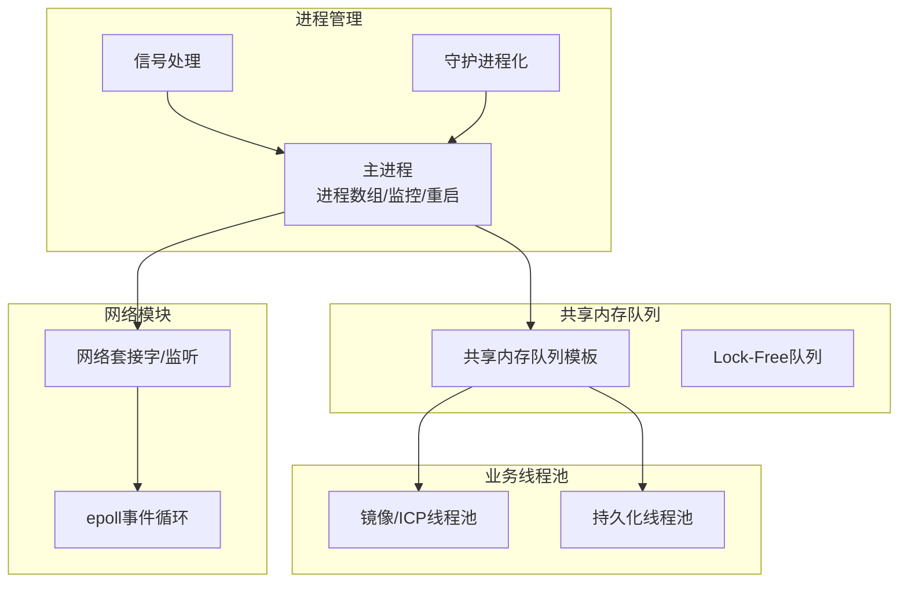
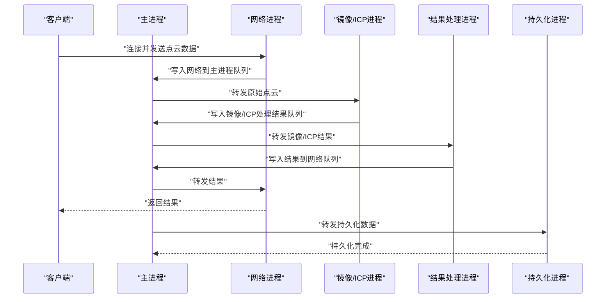
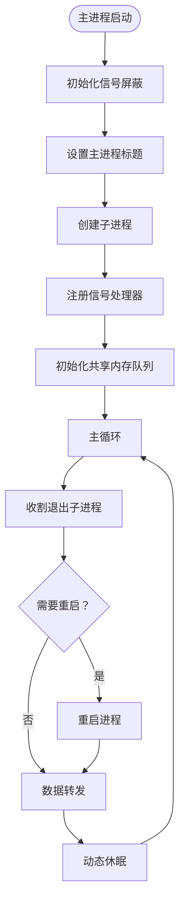
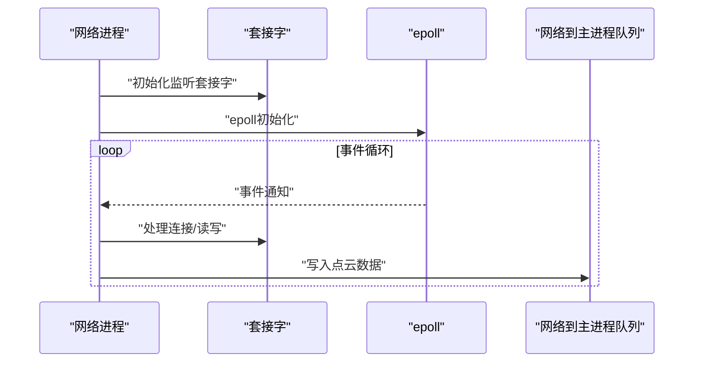
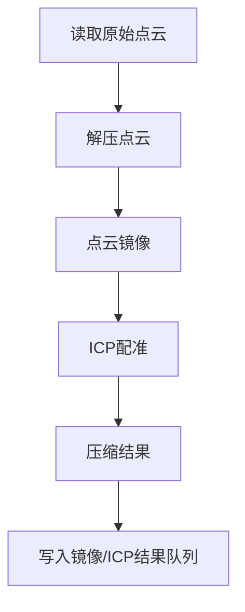
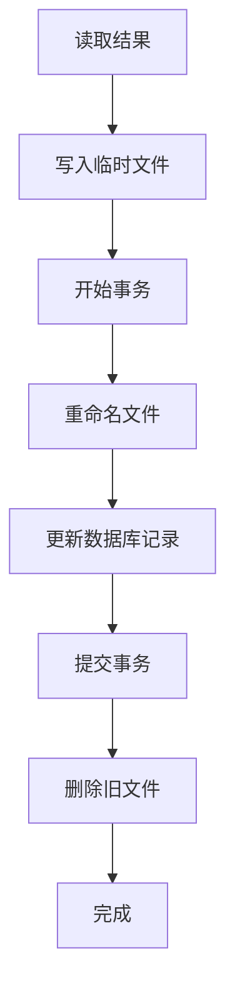
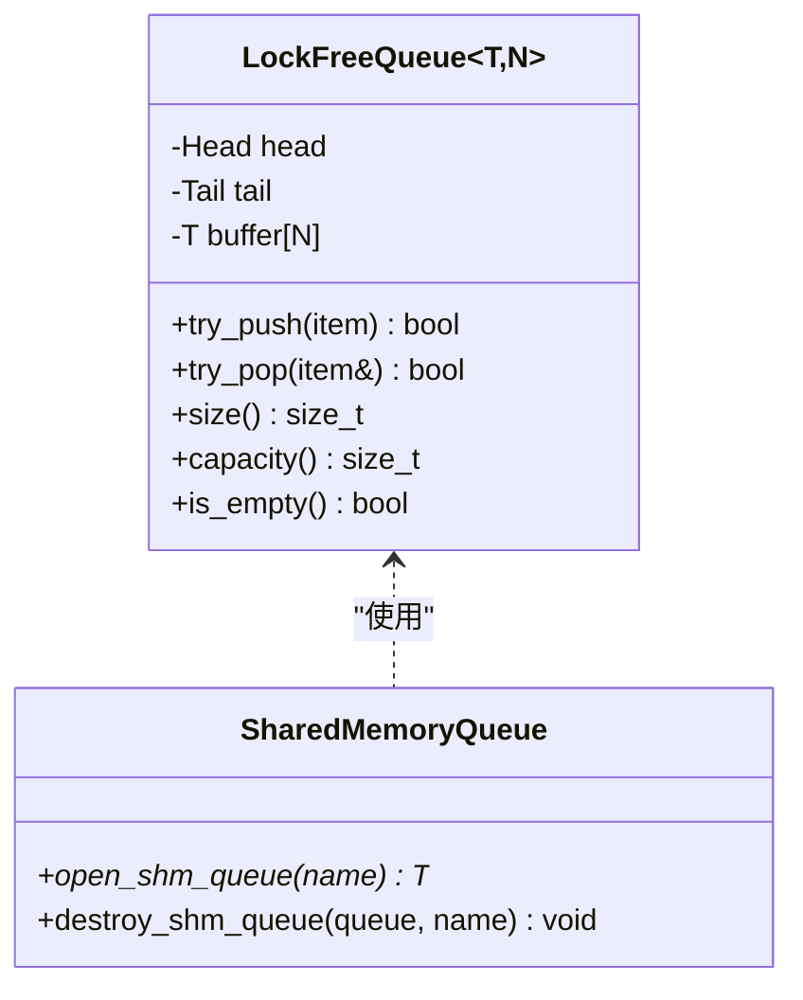
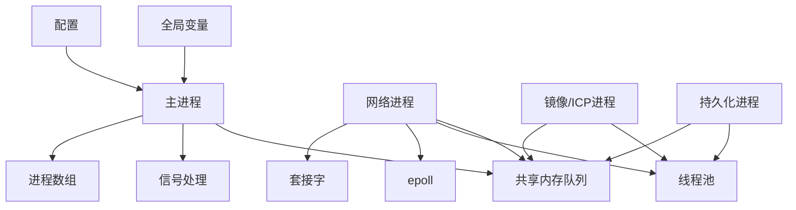

# 多进程架构设计

<cite>
**本文档引用的文件**
- [ngx_process_cycle.cxx](file://proc/ngx_process_cycle.cxx)
- [ngx_daemon.cxx](file://proc/ngx_daemon.cxx)
- [ngx_event.cxx](file://proc/ngx_event.cxx)
- [ngx_signal.cxx](file://signal/ngx_signal.cxx)
- [ngx_shared_memory.h](file://include/ngx_shared_memory.h)
- [ngx_lockFreeQueue.h](file://include/ngx_lockFreeQueue.h)
- [ngx_macro.h](file://include/ngx_macro.h)
- [ngx_global.h](file://include/ngx_global.h)
- [ngx_c_threadpool.h](file://include/ngx_c_threadpool.h)
- [ngx_c_conf.h](file://include/ngx_c_conf.h)
- [ngx_lockfree_mirrorICP_threadPool.cxx](file://misc/ngx_lockfree_mirrorICP_threadPool.cxx)
- [ngx_lockfree_persistPool.cxx](file://misc/ngx_lockfree_persistPool.cxx)
- [ngx_c_socket.cxx](file://net/ngx_c_socket.cxx)
- [nginx.conf](file://nginx.conf)
</cite>

## 目录
1. [引言](#引言)
2. [项目结构](#项目结构)
3. [核心组件](#核心组件)
4. [架构总览](#架构总览)
5. [详细组件分析](#详细组件分析)
6. [依赖关系分析](#依赖关系分析)
7. [性能考量](#性能考量)
8. [故障排查指南](#故障排查指南)
9. [结论](#结论)
10. [附录](#附录)

## 引言
本技术文档围绕多进程架构设计展开，重点阐述 master-worker 多进程模型的设计理念与实现原理，涵盖进程角色划分、进程间通信机制、进程生命周期管理与重启策略。系统以主进程（master process）为核心协调者，负责进程创建、监控与重启，以及跨进程共享内存队列的数据流转；工作进程（worker processes）承担具体业务处理，包括网络接收、镜像/ICP处理、结果计算、持久化等。

## 项目结构
该项目采用模块化组织，核心模块包括：
- 进程管理：主进程生命周期、子进程创建与监控、信号处理
- 网络模块：监听端口、事件驱动、连接管理
- 数据通道：共享内存队列（Lock-Free）
- 业务线程池：镜像/ICP处理、结果计算、持久化
- 配置与全局：配置解析、全局变量、进程类型标记

**图表来源**
- [ngx_process_cycle.cxx](file://proc/ngx_process_cycle.cxx#L360-L399)
- [ngx_daemon.cxx](file://proc/ngx_daemon.cxx#L15-L125)
- [ngx_event.cxx](file://proc/ngx_event.cxx#L14-L22)
- [ngx_c_socket.cxx](file://net/ngx_c_socket.cxx#L541-L587)
- [ngx_shared_memory.h](file://include/ngx_shared_memory.h#L87-L160)
- [ngx_lockFreeQueue.h](file://include/ngx_lockFreeQueue.h#L4-L150)
- [ngx_lockfree_mirrorICP_threadPool.cxx](file://misc/ngx_lockfree_mirrorICP_threadPool.cxx#L1-L94)
- [ngx_lockfree_persistPool.cxx](file://misc/ngx_lockfree_persistPool.cxx#L1-L158)

**章节来源**
- [ngx_process_cycle.cxx](file://proc/ngx_process_cycle.cxx#L360-L399)
- [ngx_daemon.cxx](file://proc/ngx_daemon.cxx#L15-L125)
- [ngx_c_socket.cxx](file://net/ngx_c_socket.cxx#L541-L587)
- [ngx_shared_memory.h](file://include/ngx_shared_memory.h#L87-L160)

## 核心组件
- 主进程（master process）
  - 负责：进程数组初始化、子进程创建、信号处理、收割退出子进程、重启策略、共享内存队列初始化、主循环调度与数据转发
  - 关键函数：主循环、队列负载监控、数据转发、收割子进程、信号处理
- 工作进程（worker processes）
  - 网络进程：负责监听端口、epoll事件循环、接收数据并写入共享内存队列
  - 镜像/ICP处理进程：从共享内存队列读取原始点云，执行镜像与ICP配准，写回共享内存队列
  - 结果处理进程：计算不对称度等指标，写回共享内存队列
  - 持久化进程：从共享内存队列读取结果，落盘与入库
- 共享内存队列（Lock-Free）
  - 以环形数组实现的无锁队列，避免传统锁的上下文切换开销，支持多生产者/多消费者
  - 模板化设计，支持不同数据结构（点云、镜像ICP结果、结果到网络等）
- 业务线程池
  - 镜像/ICP线程池：执行点云解压、镜像、ICP配准、压缩等计算密集型任务
  - 持久化线程池：执行文件落盘、数据库事务、旧文件清理等IO密集型任务
- 配置与全局
  - 配置解析：支持守护进程、监听端口、线程池规模等参数
  - 全局变量：进程类型、信号原子变量、日志、网络套接字、线程池等

**章节来源**
- [ngx_process_cycle.cxx](file://proc/ngx_process_cycle.cxx#L103-L121)
- [ngx_shared_memory.h](file://include/ngx_shared_memory.h#L24-L84)
- [ngx_lockFreeQueue.h](file://include/ngx_lockFreeQueue.h#L4-L150)
- [ngx_lockfree_mirrorICP_threadPool.cxx](file://misc/ngx_lockfree_mirrorICP_threadPool.cxx#L1-L94)
- [ngx_lockfree_persistPool.cxx](file://misc/ngx_lockfree_persistPool.cxx#L1-L158)
- [ngx_c_conf.h](file://include/ngx_c_conf.h#L8-L53)
- [ngx_macro.h](file://include/ngx_macro.h#L32-L36)

## 架构总览
系统采用 master-worker 多进程模型，主进程负责进程生命周期与数据调度，工作进程负责具体业务。进程间通过共享内存队列进行解耦，队列采用无锁设计，降低锁竞争与上下文切换开销。网络进程通过 epoll 事件驱动接收数据，随后将原始点云写入共享内存队列；后续处理进程按流水线顺序消费队列数据，最终将结果返回给网络进程并发送给客户端。

**图表来源**
- [ngx_process_cycle.cxx](file://proc/ngx_process_cycle.cxx#L395-L544)
- [ngx_c_socket.cxx](file://net/ngx_c_socket.cxx#L901-L927)
- [ngx_shared_memory.h](file://include/ngx_shared_memory.h#L12-L21)

## 详细组件分析

### 主进程生命周期与进程数组管理
- 进程数组定义：包含网络、镜像/ICP、结果、持久化四类进程，每类进程包含进程ID、状态、创建时间、重启标志、名称、创建函数指针与编号
- 进程创建：主进程启动时遍历进程数组，逐个调用创建函数，fork 子进程；子进程进入各自的工作循环
- 进程重启：主循环定期收割退出子进程，若非正常退出则标记重启；每隔固定时间检查并重启需要重启的进程
- 信号处理：注册 SIGCHLD/SIGTERM/SIGQUIT/SIGHUP 等信号；收到终止信号时向所有子进程发送终止信号并等待退出

**图表来源**
- [ngx_process_cycle.cxx](file://proc/ngx_process_cycle.cxx#L360-L544)

**章节来源**
- [ngx_process_cycle.cxx](file://proc/ngx_process_cycle.cxx#L103-L121)
- [ngx_process_cycle.cxx](file://proc/ngx_process_cycle.cxx#L495-L508)
- [ngx_process_cycle.cxx](file://proc/ngx_process_cycle.cxx#L548-L577)
- [ngx_process_cycle.cxx](file://proc/ngx_process_cycle.cxx#L649-L714)

### 网络进程（网络接收与事件驱动）
- 初始化：网络进程在子进程中初始化套接字、线程池、epoll；设置非阻塞、端口复用等
- 事件循环：通过 epoll_wait 等待事件，事件驱动处理连接接入、读写、定时器等
- 数据写入：将接收到的点云数据写入网络到主进程共享内存队列，供后续处理进程消费

**图表来源**
- [ngx_c_socket.cxx](file://net/ngx_c_socket.cxx#L901-L927)
- [ngx_c_socket.cxx](file://net/ngx_c_socket.cxx#L930-L963)
- [ngx_event.cxx](file://proc/ngx_event.cxx#L14-L22)

**章节来源**
- [ngx_c_socket.cxx](file://net/ngx_c_socket.cxx#L541-L587)
- [ngx_c_socket.cxx](file://net/ngx_c_socket.cxx#L901-L927)
- [ngx_event.cxx](file://proc/ngx_event.cxx#L14-L22)

### 镜像/ICP处理进程（点云镜像与配准）
- 输入队列：从主进程到镜像/ICP处理队列读取原始点云
- 处理流程：解压、镜像变换、ICP配准、压缩
- 输出队列：将处理结果写入镜像/ICP处理到主进程队列
- 线程池：使用无锁队列与线程池并行处理，提升吞吐

**图表来源**
- [ngx_lockfree_mirrorICP_threadPool.cxx](file://misc/ngx_lockfree_mirrorICP_threadPool.cxx#L35-L58)

**章节来源**
- [ngx_lockfree_mirrorICP_threadPool.cxx](file://misc/ngx_lockfree_mirrorICP_threadPool.cxx#L1-L94)

### 结果处理进程（不对称度计算）
- 输入队列：从镜像/ICP处理到主进程队列读取处理结果
- 处理流程：计算不对称度等指标
- 输出队列：将结果写入结果到网络队列，供网络进程返回客户端

**章节来源**
- [ngx_shared_memory.h](file://include/ngx_shared_memory.h#L45-L62)

### 持久化进程（文件落盘与数据库入库）
- 输入队列：从结果到网络队列读取结果
- 处理流程：生成临时文件、重命名为最终文件、数据库事务（开始/提交/回滚）、清理旧文件
- 线程池：使用无锁队列与线程池并行处理，保障IO性能

**图表来源**
- [ngx_lockfree_persistPool.cxx](file://misc/ngx_lockfree_persistPool.cxx#L52-L146)

**章节来源**
- [ngx_lockfree_persistPool.cxx](file://misc/ngx_lockfree_persistPool.cxx#L1-L158)

### 共享内存队列与无锁设计
- 队列实现：环形数组 + 原子指针 + 缓存行对齐，避免伪共享；提供 try_push/try_pop、size/capacity 等接口
- 模板化：支持不同数据结构（点云、镜像ICP结果、结果到网络等）
- 初始化：通过 open_shm_queue 创建/打开共享内存并进行内存映射，使用 placement new 初始化对象

**图表来源**
- [ngx_lockFreeQueue.h](file://include/ngx_lockFreeQueue.h#L4-L150)
- [ngx_shared_memory.h](file://include/ngx_shared_memory.h#L87-L160)

**章节来源**
- [ngx_lockFreeQueue.h](file://include/ngx_lockFreeQueue.h#L4-L150)
- [ngx_shared_memory.h](file://include/ngx_shared_memory.h#L87-L160)

### 信号处理与守护进程化
- 信号处理：主进程注册 SIGCHLD/SIGTERM/SIGQUIT/SIGHUP；SIGCHLD 标记收割，终止信号向子进程发送终止信号并等待退出
- 守护进程化：fork 子进程、setsid、重定向标准输入输出、umask 设置，实现后台运行

**章节来源**
- [ngx_process_cycle.cxx](file://proc/ngx_process_cycle.cxx#L180-L208)
- [ngx_process_cycle.cxx](file://proc/ngx_process_cycle.cxx#L649-L714)
- [ngx_daemon.cxx](file://proc/ngx_daemon.cxx#L15-L125)

## 依赖关系分析
- 主进程依赖：进程数组、信号处理、共享内存队列、主循环调度
- 网络进程依赖：套接字、epoll、线程池、共享内存队列
- 业务进程依赖：共享内存队列、线程池、第三方库（点云处理、数据库连接池）
- 配置与全局：配置解析、全局变量、进程类型标记

**图表来源**
- [ngx_process_cycle.cxx](file://proc/ngx_process_cycle.cxx#L360-L399)
- [ngx_c_socket.cxx](file://net/ngx_c_socket.cxx#L541-L587)
- [ngx_shared_memory.h](file://include/ngx_shared_memory.h#L87-L160)

**章节来源**
- [ngx_process_cycle.cxx](file://proc/ngx_process_cycle.cxx#L360-L399)
- [ngx_c_socket.cxx](file://net/ngx_c_socket.cxx#L541-L587)

## 性能考量
- 无锁队列：通过原子CAS与缓存行对齐降低锁竞争，提升多核并发性能
- 动态休眠与批处理：根据队列负载动态调整休眠时间与批处理大小，平衡吞吐与延迟
- 事件驱动：网络进程采用 epoll 事件驱动，避免忙轮询，降低CPU占用
- 线程池：业务线程池并行处理计算与IO密集任务，提升整体吞吐
- 共享内存：进程间通信通过共享内存，避免进程间拷贝与系统调用开销

**章节来源**
- [ngx_lockFreeQueue.h](file://include/ngx_lockFreeQueue.h#L4-L150)
- [ngx_process_cycle.cxx](file://proc/ngx_process_cycle.cxx#L522-L542)
- [ngx_c_socket.cxx](file://net/ngx_c_socket.cxx#L541-L587)
- [ngx_lockfree_mirrorICP_threadPool.cxx](file://misc/ngx_lockfree_mirrorICP_threadPool.cxx#L1-L94)
- [ngx_lockfree_persistPool.cxx](file://misc/ngx_lockfree_persistPool.cxx#L1-L158)

## 故障排查指南
- 子进程异常退出：主进程收割子进程并记录状态；非正常退出（非0退出码）将触发重启
- 队列过载：主进程监控队列长度，超过阈值时采取退避策略或跳过处理，避免雪崩
- 信号处理：确认 SIGCHLD/SIGTERM/SIGQUIT/SIGHUP 注册是否成功；终止信号会优雅关闭所有子进程
- 守护进程化：检查 fork/setsid/重定向等步骤是否成功，避免前台运行导致的交互问题
- 网络事件：epoll_wait 返回错误时检查 EINTR 等错误码，确保事件循环健壮性

**章节来源**
- [ngx_process_cycle.cxx](file://proc/ngx_process_cycle.cxx#L548-L577)
- [ngx_process_cycle.cxx](file://proc/ngx_process_cycle.cxx#L401-L464)
- [ngx_process_cycle.cxx](file://proc/ngx_process_cycle.cxx#L649-L714)
- [ngx_daemon.cxx](file://proc/ngx_daemon.cxx#L15-L125)
- [ngx_c_socket.cxx](file://net/ngx_c_socket.cxx#L757-L790)

## 结论
本多进程架构以主进程为中心，通过共享内存队列与无锁设计实现进程间高效解耦，结合事件驱动与线程池技术，兼顾高并发与低延迟。网络、镜像/ICP、结果与持久化四大进程各司其职，形成清晰的流水线处理链路。主进程负责生命周期管理与负载均衡，具备完善的信号处理与重启策略，确保系统稳定运行。

## 附录

### 进程配置参数
- 守护进程：是否以守护进程方式运行
- 监听端口：监听端口数量与具体端口
- 线程池规模：处理接收到的消息的线程池中线程数量
- 进程数量：工作进程数量（由配置项控制）

**章节来源**
- [nginx.conf](file://nginx.conf#L20-L41)

### 进程角色与职责
- 主进程：进程管理、信号处理、共享内存队列初始化、主循环调度
- 网络进程：监听端口、事件驱动、接收数据、写入共享内存队列
- 镜像/ICP处理进程：点云解压、镜像、ICP配准、压缩、写回队列
- 结果处理进程：计算指标、写回队列
- 持久化进程：文件落盘、数据库事务、清理旧文件

**章节来源**
- [ngx_process_cycle.cxx](file://proc/ngx_process_cycle.cxx#L103-L121)
- [ngx_c_socket.cxx](file://net/ngx_c_socket.cxx#L901-L927)
- [ngx_lockfree_mirrorICP_threadPool.cxx](file://misc/ngx_lockfree_mirrorICP_threadPool.cxx#L1-L94)
- [ngx_lockfree_persistPool.cxx](file://misc/ngx_lockfree_persistPool.cxx#L1-L158)