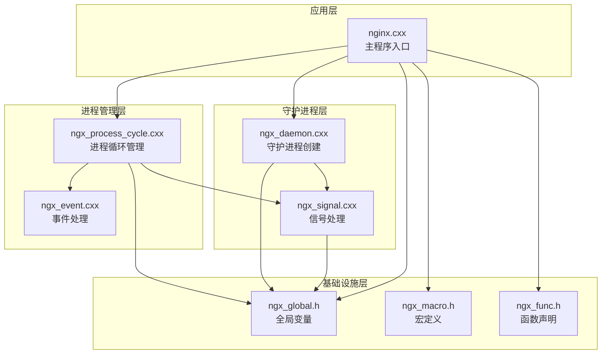
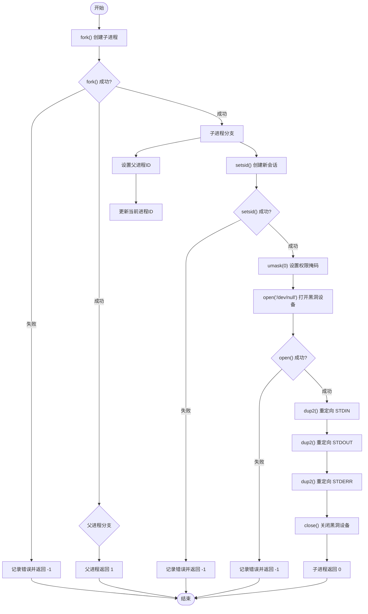
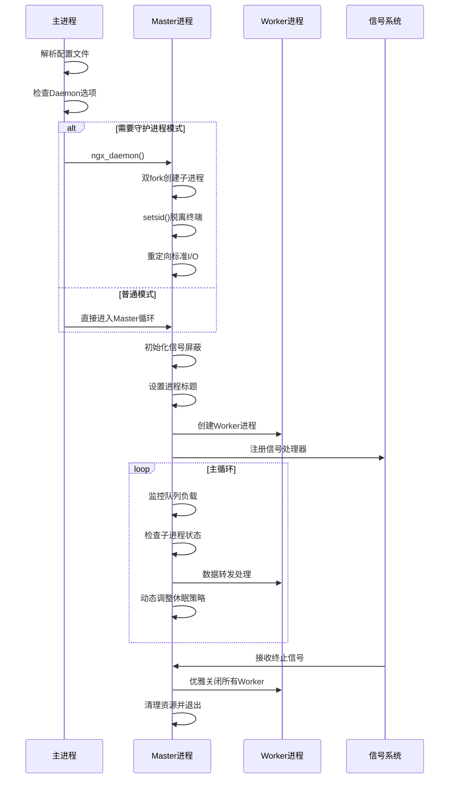
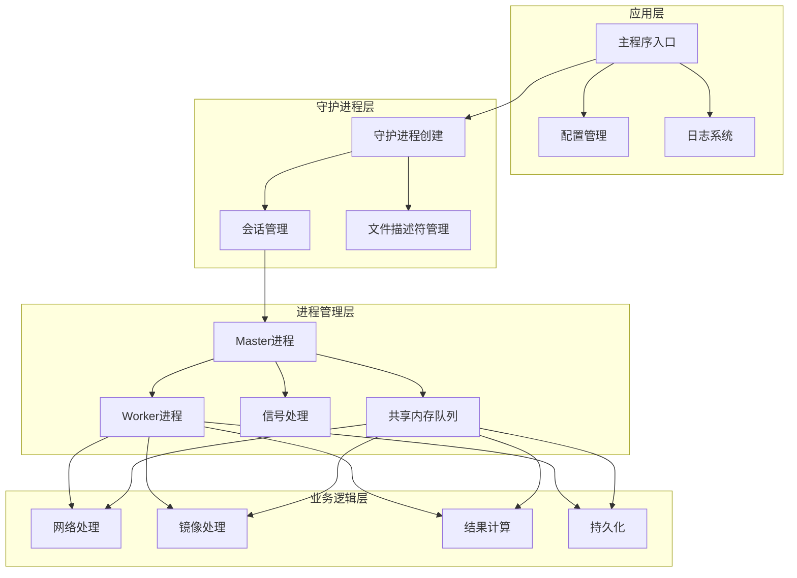
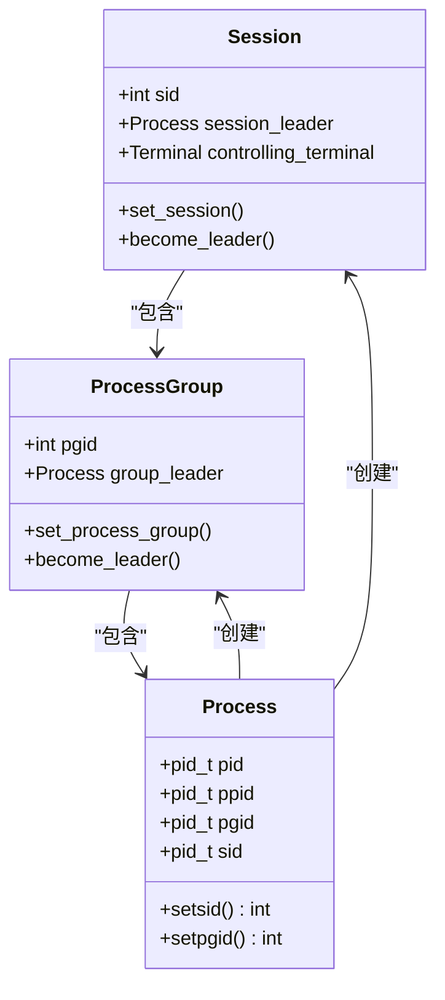
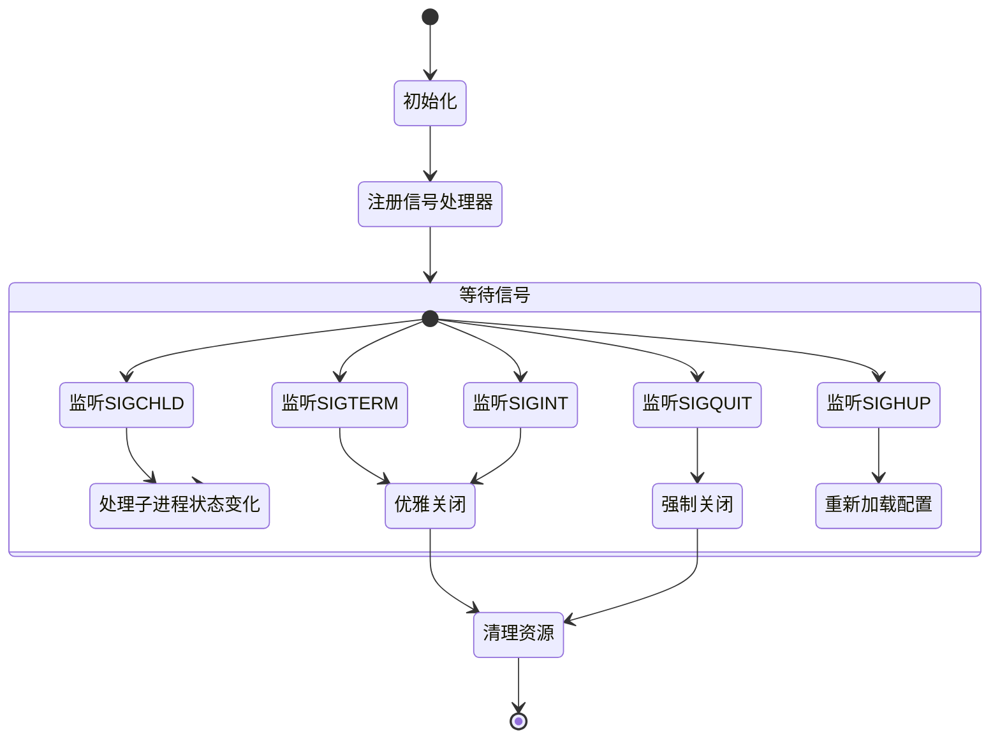
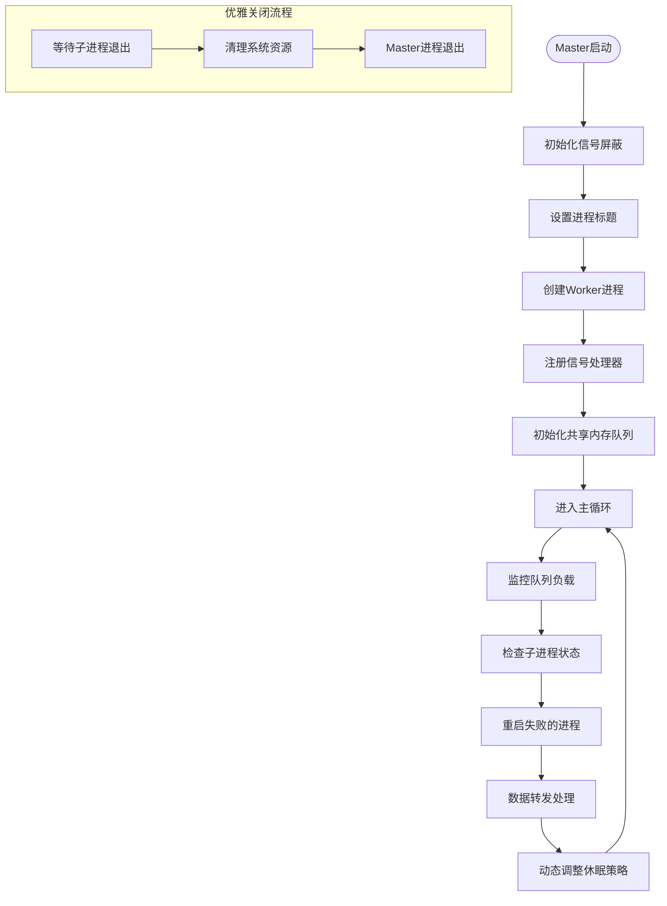
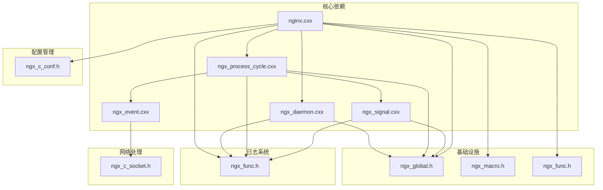

# 守护进程实现

<cite>
**本文档引用的文件**
- [ngx_daemon.cxx](file://proc/ngx_daemon.cxx)
- [nginx.cxx](file://app/nginx.cxx)
- [ngx_process_cycle.cxx](file://proc/ngx_process_cycle.cxx)
- [ngx_signal.cxx](file://signal/ngx_signal.cxx)
- [ngx_global.h](file://include/ngx_global.h)
- [ngx_macro.h](file://include/ngx_macro.h)
- [ngx_func.h](file://include/ngx_func.h)
- [ngx_event.cxx](file://proc/ngx_event.cxx)
</cite>

## 目录
1. [简介](#简介)
2. [项目结构](#项目结构)
3. [核心组件](#核心组件)
4. [架构概览](#架构概览)
5. [详细组件分析](#详细组件分析)
6. [依赖关系分析](#依赖关系分析)
7. [性能考虑](#性能考虑)
8. [故障排除指南](#故障排除指南)
9. [结论](#结论)

## 简介

本文档详细阐述了基于Nginx风格的守护进程实现技术。该实现遵循经典的双fork机制，实现了进程与控制终端的完全分离，建立了健壮的进程管理体系。系统采用Master-Worker多进程架构，通过信号机制实现进程生命周期管理和优雅关闭。

守护进程的核心价值在于提供稳定的后台服务，不受终端会话影响，能够在系统启动时自动运行，并在系统关闭时优雅退出。本文将深入解析守护进程的创建过程、双fork机制、进程会话管理、文件描述符重定向等关键技术实现。

## 项目结构

该项目采用模块化设计，守护进程相关的核心代码分布在以下模块中：



**图表来源**
- [nginx.cxx](file://app/nginx.cxx#L44-L122)
- [ngx_daemon.cxx](file://proc/ngx_daemon.cxx#L15-L125)
- [ngx_process_cycle.cxx](file://proc/ngx_process_cycle.cxx#L360-L399)

**章节来源**
- [nginx.cxx](file://app/nginx.cxx#L1-L197)
- [ngx_daemon.cxx](file://proc/ngx_daemon.cxx#L1-L170)

## 核心组件

### 守护进程创建器 (ngx_daemon)

守护进程创建器实现了标准的双fork模式，确保进程与控制终端完全分离：



**图表来源**
- [ngx_daemon.cxx](file://proc/ngx_daemon.cxx#L15-L125)

### Master-Worker进程管理器

系统采用Master-Worker架构，Master进程负责进程管理和信号处理，Worker进程负责具体业务逻辑：



**图表来源**
- [nginx.cxx](file://app/nginx.cxx#L98-L116)
- [ngx_process_cycle.cxx](file://proc/ngx_process_cycle.cxx#L360-L399)

**章节来源**
- [ngx_daemon.cxx](file://proc/ngx_daemon.cxx#L15-L125)
- [ngx_process_cycle.cxx](file://proc/ngx_process_cycle.cxx#L360-L399)

## 架构概览

系统采用分层架构设计，每层职责明确，耦合度低：



**图表来源**
- [nginx.cxx](file://app/nginx.cxx#L44-L122)
- [ngx_process_cycle.cxx](file://proc/ngx_process_cycle.cxx#L863-L899)

## 详细组件分析

### 双fork机制实现

双fork是创建守护进程的标准技术，有效防止进程重新获取控制终端：

#### 第一次fork
- 父进程立即返回，继续执行后续初始化逻辑
- 子进程继承父进程的资源，包括打开的文件描述符
- 子进程的父进程ID变为init进程，确保即使原父进程退出也不会影响子进程

#### 第二次fork
- 子进程调用`setsid()`创建新的会话
- 新会话成为会话首进程，不再与任何终端关联
- 进程组ID与进程ID相同，成为新进程组的组长

**章节来源**
- [ngx_daemon.cxx](file://proc/ngx_daemon.cxx#L17-L40)

### 会话创建与进程组管理

`setsid()`系统调用实现了关键的会话分离：



**图表来源**
- [ngx_daemon.cxx](file://proc/ngx_daemon.cxx#L42-L52)

### 文件描述符重定向

守护进程需要重定向标准输入输出错误到/dev/null，防止阻塞和资源占用：

| 文件描述符 | 重定向目标 | 目的 |
|------------|------------|------|
| STDIN_FILENO (0) | /dev/null | 防止读取终端输入 |
| STDOUT_FILENO (1) | /dev/null | 防止输出到终端 |
| STDERR_FILENO (2) | /dev/null | 防止错误输出到终端 |
| 自定义FD (>=3) | /dev/null | 防止文件描述符泄漏 |

**章节来源**
- [ngx_daemon.cxx](file://proc/ngx_daemon.cxx#L95-L124)

### 信号处理机制

系统实现了完善的信号处理框架，支持多种信号类型：



**图表来源**
- [ngx_process_cycle.cxx](file://proc/ngx_process_cycle.cxx#L179-L208)
- [ngx_signal.cxx](file://signal/ngx_signal.cxx#L45-L87)

**章节来源**
- [ngx_process_cycle.cxx](file://proc/ngx_process_cycle.cxx#L179-L208)
- [ngx_signal.cxx](file://signal/ngx_signal.cxx#L45-L87)

### 进程生命周期管理

Master进程负责管理所有Worker进程的生命周期：



**图表来源**
- [ngx_process_cycle.cxx](file://proc/ngx_process_cycle.cxx#L467-L545)

**章节来源**
- [ngx_process_cycle.cxx](file://proc/ngx_process_cycle.cxx#L360-L545)

## 依赖关系分析

系统各组件之间的依赖关系如下：



**图表来源**
- [nginx.cxx](file://app/nginx.cxx#L10-L18)
- [ngx_process_cycle.cxx](file://proc/ngx_process_cycle.cxx#L11-L20)

**章节来源**
- [nginx.cxx](file://app/nginx.cxx#L1-L197)
- [ngx_process_cycle.cxx](file://proc/ngx_process_cycle.cxx#L1-L100)

## 性能考虑

### 负载均衡策略

系统实现了智能的负载均衡机制，根据队列负载动态调整处理策略：

| 负载模式 | 队列阈值 | 批处理大小 | 重试次数 | 基础延迟 |
|----------|----------|------------|----------|----------|
| 正常模式 | 8-24 | 1 | 10 | 100μs |
| 高负载模式 | >24 | 3 | 5 | 50μs |
| 低负载模式 | <8 | 1 | 15 | 200μs |

### 动态退避算法

系统采用指数退避策略，避免过度竞争共享资源：

```
延迟时间 = 基础延迟 × 2^(重试次数/3)
```

这种设计确保了：
- 系统在高负载时能够快速响应
- 在低负载时节省系统资源
- 避免了传统指数退避的过快增长

**章节来源**
- [ngx_process_cycle.cxx](file://proc/ngx_process_cycle.cxx#L401-L464)
- [ngx_process_cycle.cxx](file://proc/ngx_process_cycle.cxx#L778-L785)

## 故障排除指南

### 常见问题诊断

#### 守护进程创建失败
**症状**: `ngx_daemon()中fork()失败!`
**原因分析**:
- 系统资源不足
- 进程数达到上限
- 内存不足

**解决方案**:
1. 检查系统资源使用情况
2. 增加系统限制
3. 优化内存使用

#### 会话创建失败
**症状**: `ngx_daemon()中setsid()失败!`
**原因分析**:
- 子进程已经是会话首进程
- 调用进程已经是进程组组长

**解决方案**:
1. 确保双fork机制正确执行
2. 检查fork返回值处理

#### 文件描述符重定向失败
**症状**: `ngx_daemon()中dup2(STDIN)失败!`
**原因分析**:
- /dev/null设备不存在
- 权限不足
- 文件描述符超出范围

**解决方案**:
1. 验证/dev/null设备可用性
2. 检查文件权限
3. 确保文件描述符范围正确

### 信号处理问题

#### 子进程状态变化处理
**问题**: 子进程退出后成为僵尸进程
**解决方案**:
1. 在SIGCHLD信号处理中调用`waitpid()`
2. 使用非阻塞模式避免阻塞主循环

#### 优雅关闭失败
**问题**: Master进程无法正常关闭
**解决方案**:
1. 确保所有Worker进程正确响应SIGTERM
2. 实现超时机制防止无限等待

**章节来源**
- [ngx_daemon.cxx](file://proc/ngx_daemon.cxx#L20-L40)
- [ngx_process_cycle.cxx](file://proc/ngx_process_cycle.cxx#L548-L577)
- [ngx_signal.cxx](file://signal/ngx_signal.cxx#L158-L214)

## 结论

该守护进程实现展现了成熟的Unix/Linux系统编程技术，通过双fork机制确保了进程与控制终端的完全分离。系统采用Master-Worker架构，结合信号处理和共享内存队列，实现了高性能的后台服务。

### 主要优势

1. **稳定性**: 双fork机制确保进程独立运行，不受终端影响
2. **可维护性**: 分层架构设计便于代码维护和功能扩展
3. **性能**: 智能负载均衡和动态退避算法优化系统性能
4. **可靠性**: 完善的信号处理和进程管理机制保证系统稳定运行

### 适用场景

- 需要长期运行的后台服务
- 网络服务程序
- 数据处理和分析系统
- 系统监控和日志收集服务

### 最佳实践建议

1. **资源管理**: 始终正确处理系统调用的返回值和错误码
2. **信号处理**: 实现完整的信号处理机制，支持优雅关闭
3. **日志记录**: 建立完善的日志系统，便于问题诊断
4. **配置管理**: 提供灵活的配置选项，支持运行时调整
5. **监控告警**: 实现运行时监控和异常告警机制

该实现为构建可靠的守护进程服务提供了完整的技术方案，适合在生产环境中部署和使用。