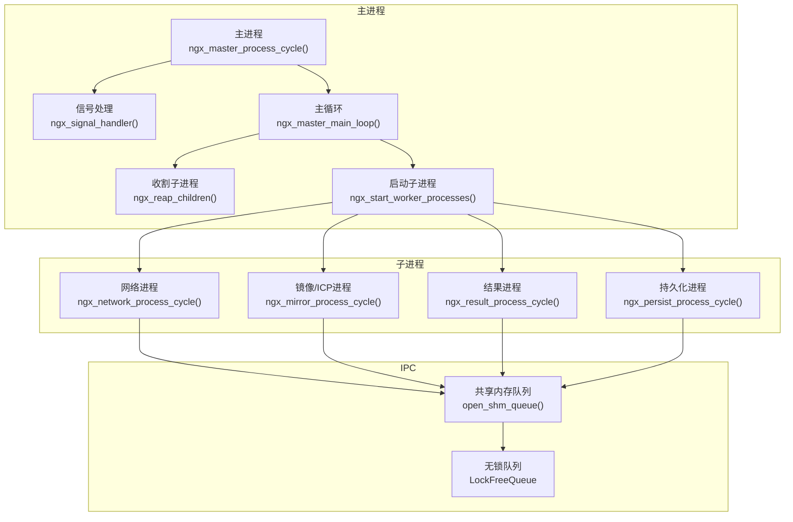
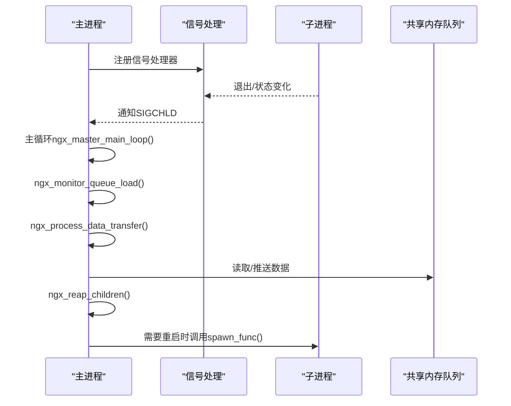
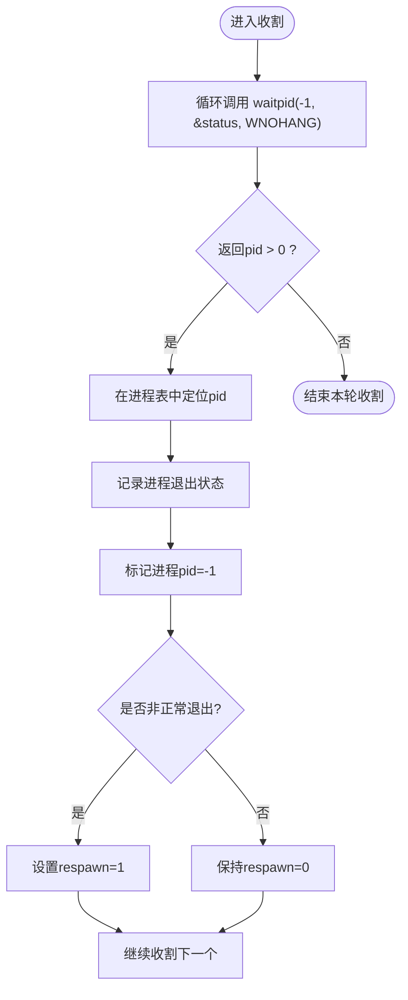
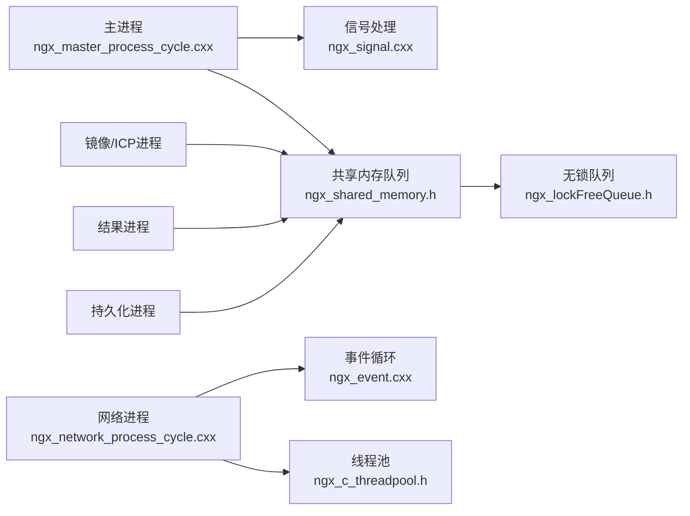

# 进程监控与管理

<cite>
**本文引用的文件**
- [proc/ngx_process_cycle.cxx](file://proc/ngx_process_cycle.cxx)
- [proc/ngx_daemon.cxx](file://proc/ngx_daemon.cxx)
- [proc/ngx_event.cxx](file://proc/ngx_event.cxx)
- [signal/ngx_signal.cxx](file://signal/ngx_signal.cxx)
- [include/ngx_shared_memory.h](file://include/ngx_shared_memory.h)
- [include/ngx_lockFreeQueue.h](file://include/ngx_lockFreeQueue.h)
- [include/ngx_c_threadpool.h](file://include/ngx_c_threadpool.h)
- [include/ngx_global.h](file://include/ngx_global.h)
- [include/ngx_macro.h](file://include/ngx_macro.h)
- [include/ngx_func.h](file://include/ngx_func.h)
- [net/ngx_c_socket.cxx](file://net/ngx_c_socket.cxx)
</cite>

## 目录
1. [简介](#简介)
2. [项目结构](#项目结构)
3. [核心组件](#核心组件)
4. [架构总览](#架构总览)
5. [详细组件分析](#详细组件分析)
6. [依赖关系分析](#依赖关系分析)
7. [性能考量](#性能考量)
8. [故障排查指南](#故障排查指南)
9. [结论](#结论)
10. [附录](#附录)

## 简介
本技术文档围绕进程监控与管理展开，聚焦于多进程架构下的进程状态监控、健康检查、异常检测、收割（reap）机制、僵尸进程处理、进程退出状态分析、进程重启与自动恢复策略、故障转移逻辑、性能指标与资源统计、以及进程间通信的监控与调试技巧。文档基于仓库中的进程管理、信号处理、共享内存队列与无锁队列、线程池、事件循环等模块，提供从架构到实现细节的系统化说明。

## 项目结构
该项目采用多进程架构，主进程负责管理与协调，子进程分别承担网络接收、镜像/ICP处理、结果计算、持久化等任务。进程间通过共享内存队列进行解耦通信，主进程在主循环中监控队列负载并进行数据转发、进程收割与重启。

图表来源
- [proc/ngx_process_cycle.cxx](file://proc/ngx_process_cycle.cxx#L360-L399)
- [signal/ngx_signal.cxx](file://signal/ngx_signal.cxx#L89-L155)
- [include/ngx_shared_memory.h](file://include/ngx_shared_memory.h#L87-L160)
- [include/ngx_lockFreeQueue.h](file://include/ngx_lockFreeQueue.h#L4-L150)

章节来源
- [proc/ngx_process_cycle.cxx](file://proc/ngx_process_cycle.cxx#L360-L399)
- [include/ngx_shared_memory.h](file://include/ngx_shared_memory.h#L87-L160)

## 核心组件
- 主进程与主循环：负责进程生命周期管理、队列负载监控、数据转发、进程收割与重启。
- 子进程族：网络进程、镜像/ICP进程、结果进程、持久化进程，各自独立运行并消费共享内存队列。
- 信号系统：统一注册与处理关键信号，确保优雅关闭与子进程状态变化的及时响应。
- 共享内存与无锁队列：提供跨进程的高性能数据通道，支持多阶段数据流转。
- 线程池与事件循环：子进程内部使用线程池与事件循环处理I/O与计算任务。

章节来源
- [proc/ngx_process_cycle.cxx](file://proc/ngx_process_cycle.cxx#L863-L870)
- [signal/ngx_signal.cxx](file://signal/ngx_signal.cxx#L44-L87)
- [include/ngx_shared_memory.h](file://include/ngx_shared_memory.h#L87-L160)
- [include/ngx_lockFreeQueue.h](file://include/ngx_lockFreeQueue.h#L4-L150)
- [include/ngx_c_threadpool.h](file://include/ngx_c_threadpool.h#L9-L66)

## 架构总览
系统采用“主进程 + 多子进程”的模式，主进程通过共享内存队列协调各子进程的任务流转。主循环周期性检查队列负载，动态调整处理策略与休眠时间；同时定期收割退出的子进程并按需重启。信号处理确保优雅关闭与子进程状态变化的感知。

图表来源
- [proc/ngx_process_cycle.cxx](file://proc/ngx_process_cycle.cxx#L467-L545)
- [signal/ngx_signal.cxx](file://signal/ngx_signal.cxx#L89-L155)

## 详细组件分析

### 主进程与主循环
- 初始化与标题设置：设置主进程标题、初始化信号屏蔽、注册信号处理器。
- 共享内存队列初始化：打开各阶段队列，建立跨进程通信通道。
- 主循环逻辑：
  - 队列负载监控：周期性统计各队列长度，动态切换负载均衡模式（正常/高负载/低负载）。
  - 进程收割与重启：定期调用收割函数，识别异常退出并标记重启；按需调用spawn_func重启。
  - 数据转发：基于负载模式调整批处理大小与退避策略，将数据在各阶段队列间转发。
  - 动态休眠：根据负载模式调整有活动/无活动时的休眠时间，平衡吞吐与能耗。

章节来源
- [proc/ngx_process_cycle.cxx](file://proc/ngx_process_cycle.cxx#L360-L399)
- [proc/ngx_process_cycle.cxx](file://proc/ngx_process_cycle.cxx#L401-L464)
- [proc/ngx_process_cycle.cxx](file://proc/ngx_process_cycle.cxx#L467-L545)
- [proc/ngx_process_cycle.cxx](file://proc/ngx_process_cycle.cxx#L717-L860)

### 收割（Reap）机制与僵尸进程处理
- 使用 waitpid(-1, &status, WNOHANG) 非阻塞收割任意子进程。
- 识别退出状态：通过 WIFEXITED(status) 与 WEXITSTATUS(status) 判断是否正常退出；非正常退出则标记 respawn。
- 避免僵尸进程：每次收割后释放子进程状态，确保内核回收其资源。
- 错误处理：对 waitpid 返回 -1 且 errno != ECHILD 的情况进行日志记录。

图表来源
- [proc/ngx_process_cycle.cxx](file://proc/ngx_process_cycle.cxx#L547-L577)

章节来源
- [proc/ngx_process_cycle.cxx](file://proc/ngx_process_cycle.cxx#L547-L577)

### 信号处理与优雅关闭
- 信号注册：在主进程创建后再解除屏蔽，注册 SIGCHLD、SIGTERM、SIGQUIT、SIGHUP、SIGINT 等信号。
- SIGCHLD：主循环中处理，实际收割在主循环周期内执行。
- SIGTERM/SIGQUIT/SIGINT：终止所有子进程，等待其退出并收割，确保资源释放与进程表不溢出。
- 信号处理函数：统一入口，记录来源与动作，必要时调用收割函数。

章节来源
- [proc/ngx_process_cycle.cxx](file://proc/ngx_process_cycle.cxx#L178-L208)
- [proc/ngx_process_cycle.cxx](file://proc/ngx_process_cycle.cxx#L648-L714)
- [signal/ngx_signal.cxx](file://signal/ngx_signal.cxx#L44-L87)
- [signal/ngx_signal.cxx](file://signal/ngx_signal.cxx#L89-L155)

### 子进程创建与生命周期
- 子进程数组：定义网络、镜像/ICP、结果、持久化四类进程及其spawn函数与编号。
- 启动：主进程调用 spawn_func 逐一创建子进程，记录创建时间。
- 子进程循环：网络进程初始化线程池与epoll，事件驱动处理I/O；其他进程初始化各自处理池并循环等待。

章节来源
- [proc/ngx_process_cycle.cxx](file://proc/ngx_process_cycle.cxx#L92-L109)
- [proc/ngx_process_cycle.cxx](file://proc/ngx_process_cycle.cxx#L863-L870)
- [proc/ngx_process_cycle.cxx](file://proc/ngx_process_cycle.cxx#L901-L927)
- [proc/ngx_process_cycle.cxx](file://proc/ngx_process_cycle.cxx#L965-L1000)
- [proc/ngx_process_cycle.cxx](file://proc/ngx_process_cycle.cxx#L1011-L1042)
- [proc/ngx_process_cycle.cxx](file://proc/ngx_process_cycle.cxx#L1054-L1085)

### 共享内存与无锁队列
- 共享内存队列：通过 open_shm_queue 模板函数创建/打开共享内存，mmap 映射，placement new 初始化对象。
- 队列类型：定义网络到主、主到镜像/ICP、镜像/ICP到主、主到结果、结果到主、主到持久化、返回主、返回网络等队列类型。
- 无锁队列：LockFreeQueue<T,N> 使用原子指针与缓存行对齐，支持 try_push/try_pop、size/capacity 查询，避免伪共享与ABA问题。

章节来源
- [include/ngx_shared_memory.h](file://include/ngx_shared_memory.h#L87-L160)
- [include/ngx_shared_memory.h](file://include/ngx_shared_memory.h#L12-L85)
- [include/ngx_lockFreeQueue.h](file://include/ngx_lockFreeQueue.h#L4-L150)

### 数据转发与负载均衡
- 负载监控：周期性统计各队列长度，计算平均负载并切换负载模式。
- 批处理与退避：根据负载模式调整批处理大小与最大重试次数，使用指数退避策略（带平滑系数）等待目标队列可用。
- 转发阶段：网络→镜像/ICP→结果→持久化→网络，每个阶段均进行过载保护与回退。

章节来源
- [proc/ngx_process_cycle.cxx](file://proc/ngx_process_cycle.cxx#L401-L464)
- [proc/ngx_process_cycle.cxx](file://proc/ngx_process_cycle.cxx#L717-L860)

### 进程重启策略与自动恢复
- 标记重启：收割时若子进程非正常退出，标记 respawn=1。
- 周期检查：主循环按固定间隔检查 respawn 并调用 spawn_func 重启。
- 重启时机：避免频繁重启，结合负载模式与队列状态进行智能调度。

章节来源
- [proc/ngx_process_cycle.cxx](file://proc/ngx_process_cycle.cxx#L495-L508)
- [proc/ngx_process_cycle.cxx](file://proc/ngx_process_cycle.cxx#L561-L564)

### 故障转移逻辑
- 队列过载保护：当目标队列超过高阈值时，将数据项回退到上游队列并跳过本次处理，避免雪崩。
- 动态退避：在目标队列繁忙时采用指数退避策略，降低竞争与拥塞。
- 负载模式切换：根据平均队列长度在正常/高负载/低负载模式间切换，动态调整批处理与休眠时间。

章节来源
- [proc/ngx_process_cycle.cxx](file://proc/ngx_process_cycle.cxx#L758-L762)
- [proc/ngx_process_cycle.cxx](file://proc/ngx_process_cycle.cxx#L766-L770)
- [proc/ngx_process_cycle.cxx](file://proc/ngx_process_cycle.cxx#L436-L443)

### 进程间通信监控与调试
- 队列状态监控：周期性记录各队列长度与平均负载，便于观察瓶颈与异常。
- 日志记录：在关键路径输出统计信息与状态变化，辅助定位问题。
- 事件循环：网络进程通过 epoll_wait 驱动事件处理，避免忙轮询，降低CPU占用。

章节来源
- [proc/ngx_process_cycle.cxx](file://proc/ngx_process_cycle.cxx#L452-L457)
- [proc/ngx_event.cxx](file://proc/ngx_event.cxx#L14-L22)
- [net/ngx_c_socket.cxx](file://net/ngx_c_socket.cxx#L519-L537)

## 依赖关系分析
- 主进程依赖信号模块进行优雅关闭与子进程状态感知；依赖共享内存与无锁队列实现跨进程通信；依赖线程池与事件循环支撑子进程内部处理。
- 子进程依赖共享内存队列进行上下游数据流转；网络进程依赖epoll事件循环；其他进程依赖各自处理池。

图表来源
- [proc/ngx_process_cycle.cxx](file://proc/ngx_process_cycle.cxx#L360-L399)
- [signal/ngx_signal.cxx](file://signal/ngx_signal.cxx#L44-L87)
- [include/ngx_shared_memory.h](file://include/ngx_shared_memory.h#L87-L160)
- [include/ngx_lockFreeQueue.h](file://include/ngx_lockFreeQueue.h#L4-L150)
- [proc/ngx_event.cxx](file://proc/ngx_event.cxx#L14-L22)
- [include/ngx_c_threadpool.h](file://include/ngx_c_threadpool.h#L9-L66)

## 性能考量
- 无锁队列：通过原子指针与缓存行对齐避免伪共享，支持高并发读写；容量为 N-1，区分满/空。
- 动态批处理与退避：根据负载模式调整批处理大小与重试策略，降低竞争与抖动。
- 动态休眠：在高负载时缩短休眠，低负载时延长休眠，平衡吞吐与能耗。
- 事件驱动：网络进程使用 epoll_wait，无事件时阻塞等待，避免忙轮询。
- 资源释放：优雅关闭时等待子进程退出并收割，防止僵尸进程与进程表溢出。

## 故障排查指南
- 子进程频繁退出
  - 检查收割日志与退出状态，确认是否非正常退出（非0退出码或被信号终止）。
  - 关注 respawn 标记与主循环重启逻辑。
- 队列堆积
  - 观察队列监控日志与平均负载，定位瓶颈阶段。
  - 检查目标队列是否超过高阈值导致回退。
- 优雅关闭卡住
  - 确认 SIGTERM/SIGQUIT/SIGINT 是否正确下发并等待子进程退出。
  - 检查是否存在子进程未退出导致收割循环持续。
- 事件处理异常
  - 检查 epoll 初始化与事件循环调用，确认事件驱动是否正常。

章节来源
- [proc/ngx_process_cycle.cxx](file://proc/ngx_process_cycle.cxx#L547-L577)
- [proc/ngx_process_cycle.cxx](file://proc/ngx_process_cycle.cxx#L648-L714)
- [proc/ngx_event.cxx](file://proc/ngx_event.cxx#L14-L22)
- [net/ngx_c_socket.cxx](file://net/ngx_c_socket.cxx#L519-L537)

## 结论
该系统通过主进程统一调度、子进程分工协作、共享内存队列解耦、无锁队列高吞吐、信号优雅关闭与收割机制，构建了稳定高效的多进程监控与管理系统。通过队列负载监控与动态退避策略，系统在高负载与低负载场景下均能保持良好性能与稳定性；通过收割与重启策略，实现异常进程的自动恢复与故障转移。

## 附录
- 守护进程：通过 fork + setsid + 重定向标准I/O + umask 设置实现，脱离终端与控制终端。
- 进程类型：主进程与工作进程类型宏定义，便于在不同进程分支中采取差异化策略。

章节来源
- [proc/ngx_daemon.cxx](file://proc/ngx_daemon.cxx#L15-L125)
- [include/ngx_macro.h](file://include/ngx_macro.h#L32-L36)
- [include/ngx_func.h](file://include/ngx_func.h#L21-L26)