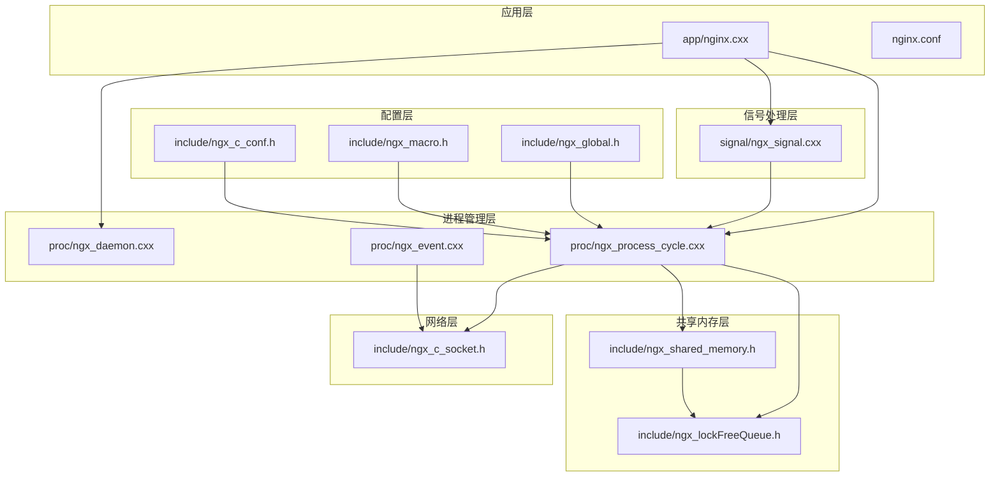
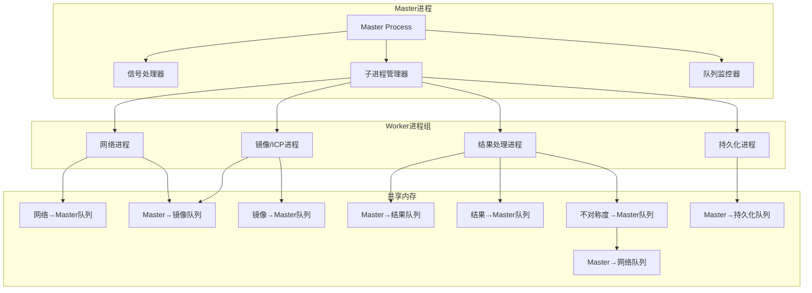
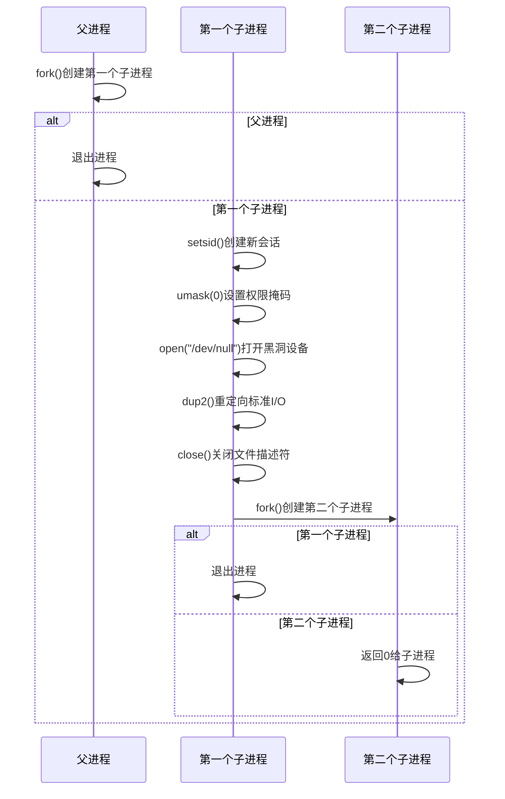
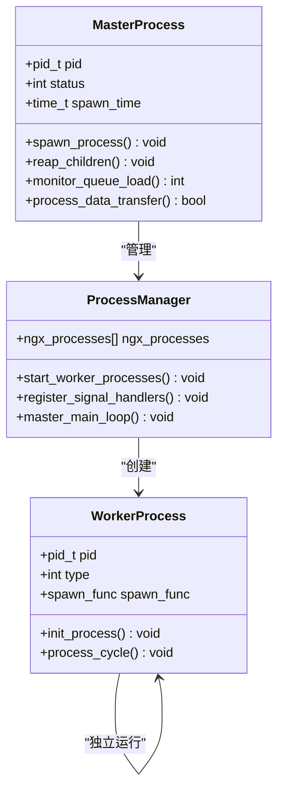
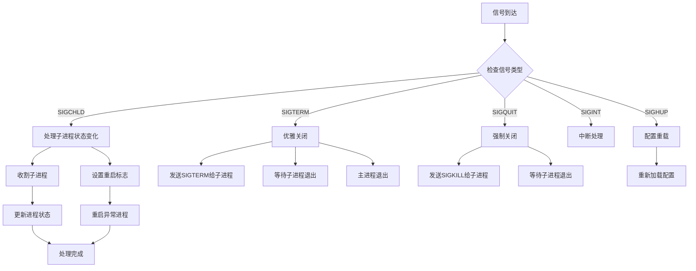
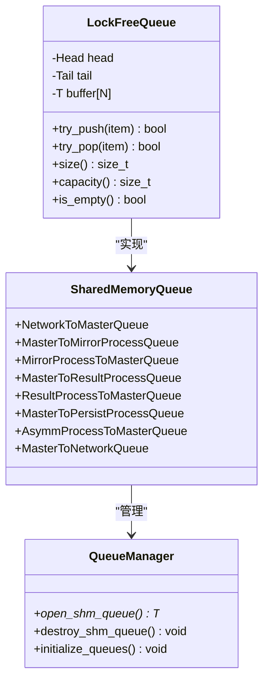
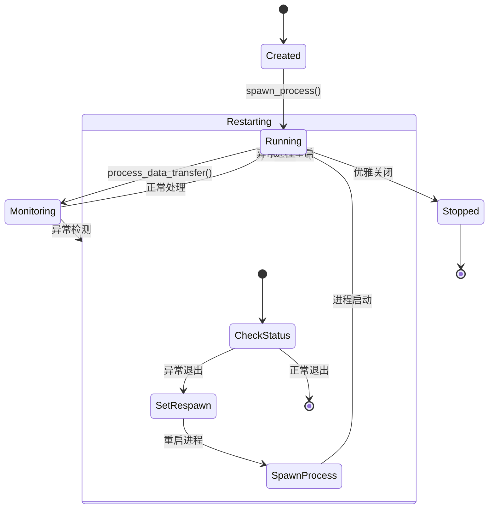
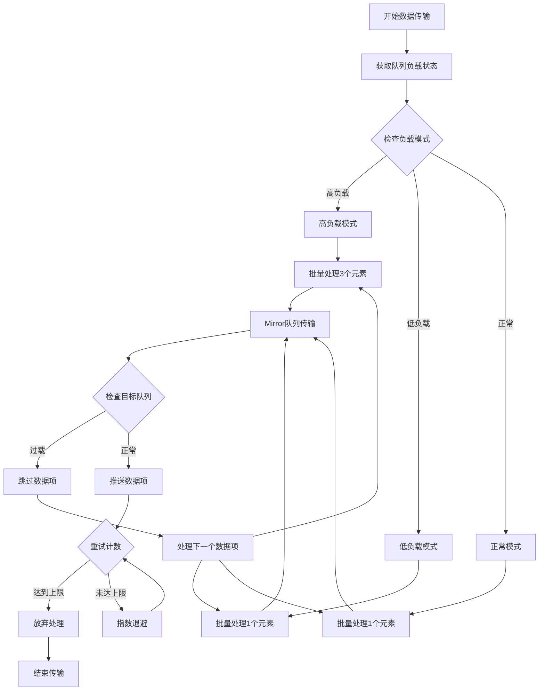
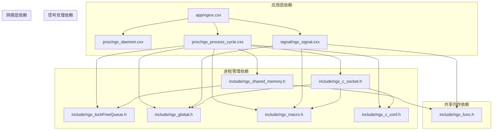

# 进程管理系统

<cite>
**本文档引用的文件**
- [app/nginx.cxx](file://app/nginx.cxx)
- [proc/ngx_daemon.cxx](file://proc/ngx_daemon.cxx)
- [proc/ngx_process_cycle.cxx](file://proc/ngx_process_cycle.cxx)
- [proc/ngx_event.cxx](file://proc/ngx_event.cxx)
- [signal/ngx_signal.cxx](file://signal/ngx_signal.cxx)
- [include/ngx_global.h](file://include/ngx_global.h)
- [include/ngx_macro.h](file://include/ngx_macro.h)
- [include/ngx_c_conf.h](file://include/ngx_c_conf.h)
- [include/ngx_shared_memory.h](file://include/ngx_shared_memory.h)
- [include/ngx_func.h](file://include/ngx_func.h)
- [include/ngx_c_socket.h](file://include/ngx_c_socket.h)
- [include/ngx_lockFreeQueue.h](file://include/ngx_lockFreeQueue.h)
- [nginx.conf](file://nginx.conf)
</cite>

## 目录
1. [简介](#简介)
2. [项目结构](#项目结构)
3. [核心组件](#核心组件)
4. [架构概览](#架构概览)
5. [详细组件分析](#详细组件分析)
6. [依赖关系分析](#依赖关系分析)
7. [性能考量](#性能考量)
8. [故障排查指南](#故障排查指南)
9. [结论](#结论)
10. [附录](#附录)

## 简介
本项目实现了一个基于多进程架构的进程管理系统，采用经典的 master-worker 模型，通过守护进程方式运行，结合共享内存队列实现进程间通信，提供进程生命周期管理、信号处理、异常重启策略、进程状态监控等功能。系统支持点云数据处理流水线，涵盖网络接收、镜像/ICP处理、不对称度计算、持久化等多个处理阶段。

## 项目结构
项目采用模块化组织，主要目录结构如下：
- app/: 应用入口和主程序逻辑
- proc/: 进程管理相关实现（守护进程、进程循环、事件处理）
- signal/: 信号处理模块
- include/: 头文件和公共定义
- net/: 网络通信相关
- logic/: 业务逻辑处理
- persist/: 数据持久化
- misc/: 辅助工具和线程池
- docker/: 容器化部署配置

**图表来源**
- [app/nginx.cxx](file://app/nginx.cxx#L44-L122)
- [proc/ngx_process_cycle.cxx](file://proc/ngx_process_cycle.cxx#L360-L399)
- [include/ngx_shared_memory.h](file://include/ngx_shared_memory.h#L87-L160)

**章节来源**
- [app/nginx.cxx](file://app/nginx.cxx#L1-L197)
- [nginx.conf](file://nginx.conf#L1-L63)

## 核心组件
系统由以下核心组件构成：

### 1. 进程管理核心
- **master进程**: 负责进程生命周期管理、信号处理、进程重启策略
- **worker进程**: 各自负责特定的处理模块（网络、镜像/ICP、结果处理、持久化）

### 2. 通信机制
- **共享内存队列**: 基于无锁队列实现进程间数据传输
- **信号机制**: 用于进程间通信和状态通知

### 3. 配置管理
- **配置文件**: 支持守护进程模式、进程数量、线程池配置等
- **运行时配置**: 支持动态调整进程参数

**章节来源**
- [proc/ngx_process_cycle.cxx](file://proc/ngx_process_cycle.cxx#L89-L121)
- [include/ngx_shared_memory.h](file://include/ngx_shared_memory.h#L12-L84)
- [nginx.conf](file://nginx.conf#L20-L30)

## 架构概览
系统采用 master-worker 多进程架构，通过共享内存实现进程间通信，支持负载均衡和动态调整。

**图表来源**
- [proc/ngx_process_cycle.cxx](file://proc/ngx_process_cycle.cxx#L103-L109)
- [include/ngx_shared_memory.h](file://include/ngx_shared_memory.h#L65-L84)

## 详细组件分析

### 守护进程实现
守护进程通过标准的两步fork模式实现，确保进程与控制终端分离。

**图表来源**
- [proc/ngx_daemon.cxx](file://proc/ngx_daemon.cxx#L15-L125)

守护进程的关键特性：
- **会话分离**: 通过 `setsid()` 创建新会话，脱离控制终端
- **文件描述符管理**: 标准输入输出错误重定向到 `/dev/null`
- **权限控制**: `umask(0)` 清除文件权限掩码
- **进程隔离**: 子进程继承父进程的资源，但形成独立的进程组

**章节来源**
- [proc/ngx_daemon.cxx](file://proc/ngx_daemon.cxx#L15-L170)

### master-worker 进程模型
master 进程负责整体协调，worker 进程各自处理特定任务。

**图表来源**
- [proc/ngx_process_cycle.cxx](file://proc/ngx_process_cycle.cxx#L92-L109)
- [proc/ngx_process_cycle.cxx](file://proc/ngx_process_cycle.cxx#L863-L870)

**章节来源**
- [proc/ngx_process_cycle.cxx](file://proc/ngx_process_cycle.cxx#L863-L1095)

### 信号处理机制
系统实现了完整的信号处理框架，支持多种信号类型和处理策略。

**图表来源**
- [proc/ngx_process_cycle.cxx](file://proc/ngx_process_cycle.cxx#L649-L714)
- [signal/ngx_signal.cxx](file://signal/ngx_signal.cxx#L89-L155)

信号处理的关键实现：
- **信号屏蔽**: 在关键操作期间屏蔽特定信号
- **统一处理**: 所有信号通过统一的处理函数分发
- **进程间通信**: 使用信号实现进程间状态同步
- **优雅关闭**: 支持 SIGTERM 和 SIGQUIT 的不同处理策略

**章节来源**
- [proc/ngx_process_cycle.cxx](file://proc/ngx_process_cycle.cxx#L178-L208)
- [signal/ngx_signal.cxx](file://signal/ngx_signal.cxx#L45-L87)

### 共享内存队列系统
系统使用无锁队列实现高效的进程间通信，避免传统锁的性能开销。

**图表来源**
- [include/ngx_lockFreeQueue.h](file://include/ngx_lockFreeQueue.h#L4-L150)
- [include/ngx_shared_memory.h](file://include/ngx_shared_memory.h#L87-L160)

无锁队列的核心特性：
- **缓存行对齐**: 避免伪共享问题，提升多核性能
- **CAS操作**: 使用 compare-and-swap 实现原子操作
- **环形缓冲**: 固定大小的环形数组，避免内存碎片
- **内存序**: 合理使用 memory_order 保证内存可见性

**章节来源**
- [include/ngx_lockFreeQueue.h](file://include/ngx_lockFreeQueue.h#L1-L430)
- [include/ngx_shared_memory.h](file://include/ngx_shared_memory.h#L87-L181)

### 进程生命周期管理
系统实现了完整的进程生命周期管理，包括创建、监控、重启等。

**图表来源**
- [proc/ngx_process_cycle.cxx](file://proc/ngx_process_cycle.cxx#L495-L508)
- [proc/ngx_process_cycle.cxx](file://proc/ngx_process_cycle.cxx#L548-L577)

进程管理的关键策略：
- **定期检查**: 每5秒检查一次子进程状态
- **异常重启**: 自动重启异常退出的进程
- **负载感知**: 根据队列负载动态调整处理策略
- **资源回收**: 及时回收僵尸进程，避免资源泄漏

**章节来源**
- [proc/ngx_process_cycle.cxx](file://proc/ngx_process_cycle.cxx#L467-L545)
- [proc/ngx_process_cycle.cxx](file://proc/ngx_process_cycle.cxx#L548-L577)

### 数据传输与负载均衡
系统实现了智能的数据传输和负载均衡机制，根据队列状态动态调整处理策略。

**图表来源**
- [proc/ngx_process_cycle.cxx](file://proc/ngx_process_cycle.cxx#L717-L860)

负载均衡的核心机制：
- **动态模式切换**: 基于队列平均负载动态调整模式
- **批量处理**: 根据负载模式调整批量大小
- **指数退避**: 遇到队列过载时采用指数退避策略
- **负载监控**: 每2秒监控一次队列状态

**章节来源**
- [proc/ngx_process_cycle.cxx](file://proc/ngx_process_cycle.cxx#L401-L464)
- [proc/ngx_process_cycle.cxx](file://proc/ngx_process_cycle.cxx#L717-L860)

## 依赖关系分析

**图表来源**
- [app/nginx.cxx](file://app/nginx.cxx#L1-L33)
- [proc/ngx_process_cycle.cxx](file://proc/ngx_process_cycle.cxx#L11-L20)

**章节来源**
- [app/nginx.cxx](file://app/nginx.cxx#L1-L43)
- [proc/ngx_process_cycle.cxx](file://proc/ngx_process_cycle.cxx#L1-L26)

## 性能考量
系统在多个方面进行了性能优化：

### 1. 内存管理优化
- **无锁队列**: 避免传统锁的性能开销，支持高并发场景
- **缓存行对齐**: 防止伪共享，提升多核处理器性能
- **内存池**: 预分配固定大小的内存块，减少动态分配开销

### 2. CPU利用率优化
- **事件驱动**: 基于 epoll 的事件驱动模型，避免忙等待
- **动态休眠**: 根据负载动态调整休眠时间
- **批量处理**: 减少系统调用次数，提升吞吐量

### 3. 网络性能优化
- **非阻塞I/O**: 所有socket设置为非阻塞模式
- **连接池**: 复用连接，减少连接建立开销
- **线程池**: 支持高并发的网络处理

### 4. 内存序优化
- **合理使用内存序**: 在保证正确性的前提下使用最轻量的内存序
- **原子操作**: 使用原子操作替代锁，提升并发性能

## 故障排查指南

### 常见问题及解决方案

#### 1. 进程异常退出
**症状**: 子进程频繁重启
**排查步骤**:
1. 检查日志文件中的错误信息
2. 使用 `ps aux | grep process_name` 查看进程状态
3. 检查队列是否过载导致处理异常

**解决方案**:
- 调整队列容量配置
- 检查进程资源使用情况
- 优化进程处理逻辑

#### 2. 队列阻塞
**症状**: 数据传输停滞，队列长度持续增长
**排查步骤**:
1. 检查队列监控日志
2. 分析负载均衡模式
3. 监控进程CPU使用率

**解决方案**:
- 增加相应处理进程数量
- 调整批量处理大小
- 优化数据序列化格式

#### 3. 内存泄漏
**症状**: 进程内存持续增长
**排查步骤**:
1. 使用 `top` 或 `htop` 监控内存使用
2. 检查共享内存队列状态
3. 分析进程堆栈信息

**解决方案**:
- 确保正确释放共享内存
- 检查无锁队列的内存管理
- 优化数据结构设计

#### 4. 信号处理异常
**症状**: 进程无法正常响应信号
**排查步骤**:
1. 检查信号屏蔽设置
2. 验证信号处理器注册
3. 分析信号处理日志

**解决方案**:
- 修复信号处理逻辑
- 调整信号屏蔽策略
- 增强信号处理的健壮性

**章节来源**
- [proc/ngx_process_cycle.cxx](file://proc/ngx_process_cycle.cxx#L548-L577)
- [signal/ngx_signal.cxx](file://signal/ngx_signal.cxx#L157-L215)

## 结论
本进程管理系统实现了高性能的多进程架构，通过守护进程、master-worker 模型、共享内存队列等技术，提供了可靠的进程管理能力。系统具有以下特点：

1. **高可靠性**: 完善的进程监控和异常重启机制
2. **高性能**: 无锁队列和事件驱动模型
3. **可扩展性**: 支持水平扩展和动态配置
4. **可观测性**: 详细的日志记录和状态监控

系统适用于需要高并发处理和可靠性的应用场景，特别是在点云数据处理等计算密集型任务中表现出色。

## 附录

### 配置参数说明

#### 基础配置
- **Daemon**: 是否以守护进程方式运行 (0/1)
- **WorkerProcesses**: worker进程数量
- **ProcMsgRecvWorkThreadCount**: 线程池线程数量

#### 网络配置
- **ListenPortCount**: 监听端口数量
- **ListenPort0**: 监听端口号
- **worker_connections**: 每个worker进程的最大连接数

#### 性能配置
- **Sock_RecyConnectionWaitTime**: 连接回收等待时间
- **Sock_WaitTimeEnable**: 是否启用心跳检测
- **Sock_MaxWaitTime**: 心跳超时时间
- **Sock_FloodAttackKickEnable**: 是否启用洪水攻击检测

### 代码示例路径

#### 守护进程创建
- [守护进程实现](file://proc/ngx_daemon.cxx#L15-L125)

#### 进程管理循环
- [master进程循环](file://proc/ngx_process_cycle.cxx#L467-L545)

#### 信号处理
- [信号处理器注册](file://proc/ngx_process_cycle.cxx#L178-L208)
- [信号处理函数](file://proc/ngx_process_cycle.cxx#L649-L714)

#### 共享内存队列
- [队列模板实现](file://include/ngx_shared_memory.h#L87-L160)
- [无锁队列实现](file://include/ngx_lockFreeQueue.h#L50-L127)

#### 应用入口
- [主程序入口](file://app/nginx.cxx#L44-L122)