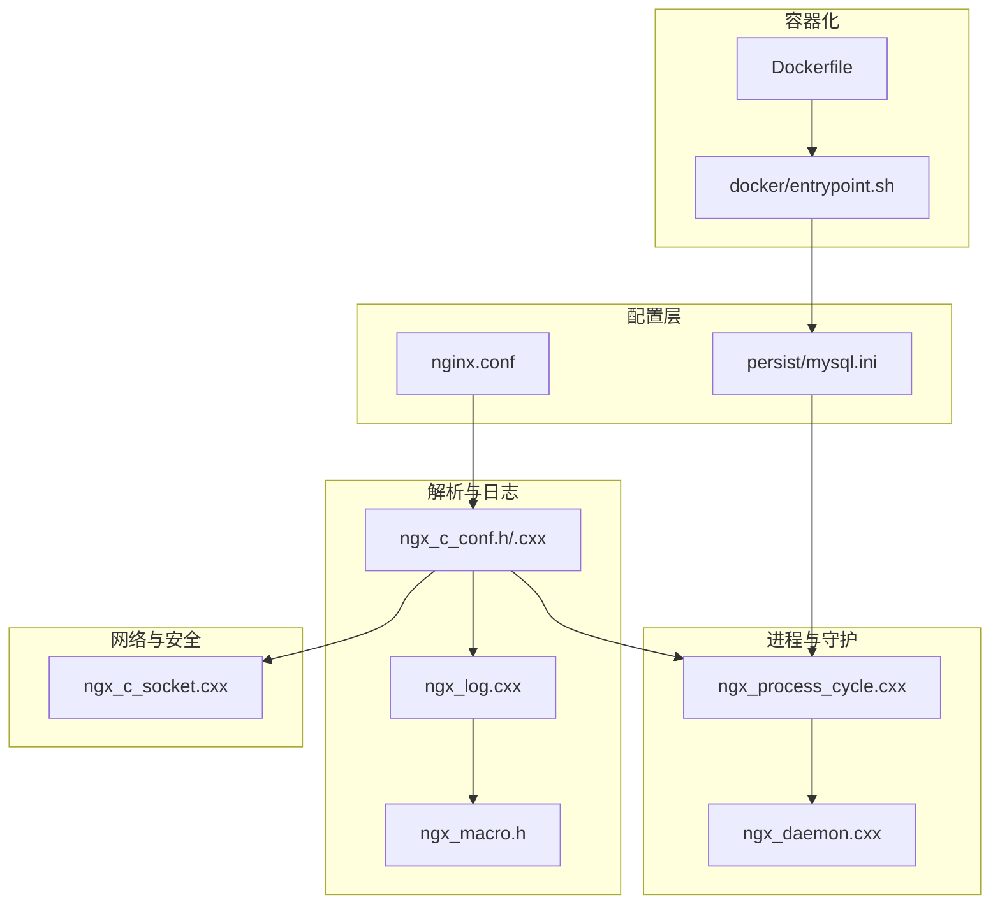
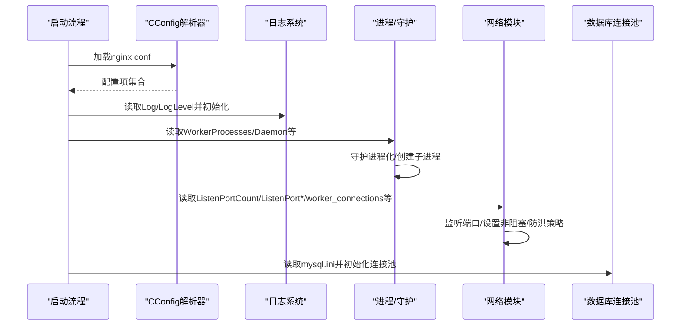
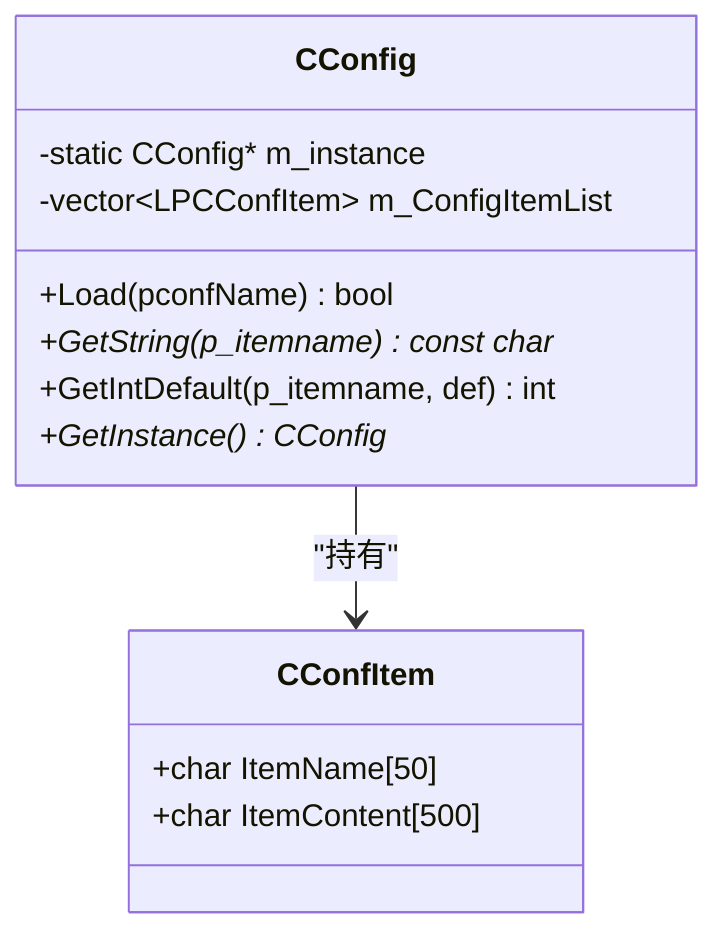
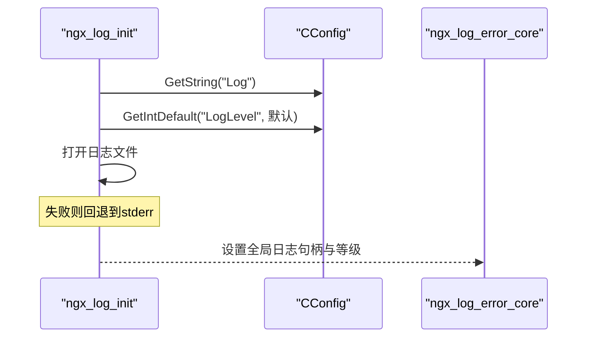
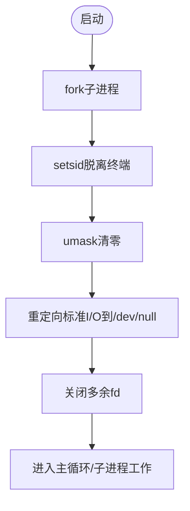
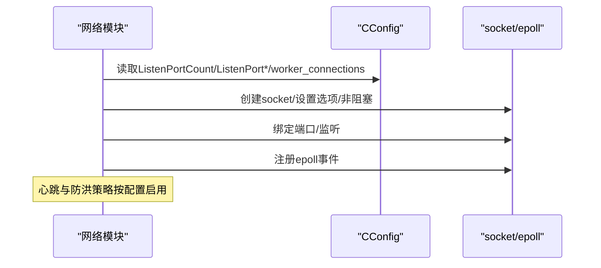
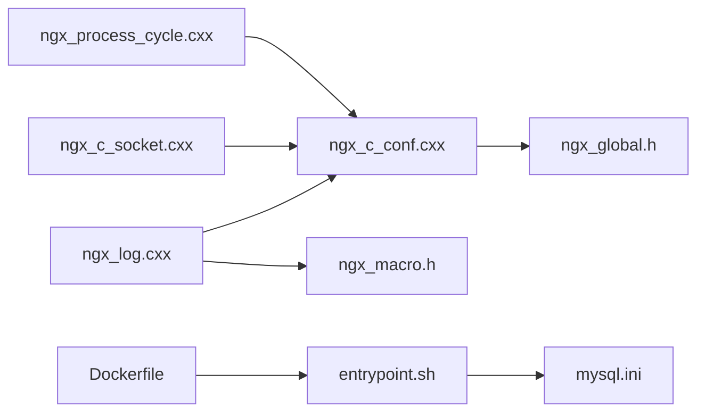

# 配置管理

<cite>
**本文引用的文件**
- [nginx.conf](file://nginx.conf)
- [mysql.ini](file://persist/mysql.ini)
- [Dockerfile](file://Dockerfile)
- [entrypoint.sh](file://docker/entrypoint.sh)
- [ngx_c_conf.h](file://include/ngx_c_conf.h)
- [ngx_c_conf.cxx](file://app/ngx_c_conf.cxx)
- [ngx_global.h](file://include/ngx_global.h)
- [ngx_macro.h](file://include/ngx_macro.h)
- [ngx_log.cxx](file://app/ngx_log.cxx)
- [ngx_daemon.cxx](file://proc/ngx_daemon.cxx)
- [ngx_process_cycle.cxx](file://proc/ngx_process_cycle.cxx)
- [ngx_c_socket.cxx](file://net/ngx_c_socket.cxx)
</cite>

## 目录
1. [简介](#简介)
2. [项目结构](#项目结构)
3. [核心组件](#核心组件)
4. [架构总览](#架构总览)
5. [详细组件分析](#详细组件分析)
6. [依赖分析](#依赖分析)
7. [性能考量](#性能考量)
8. [故障排查指南](#故障排查指南)
9. [结论](#结论)
10. [附录](#附录)

## 简介
本技术文档围绕配置管理系统展开，系统采用纯文本配置文件与轻量级配置解析器相结合的方式，支撑网络参数、日志系统、进程管理、数据库连接池等关键模块。配置文件采用“键=值”的等号语法，支持注释与分组注释行，解析器提供线程安全的单例访问、字符串与整型读取、默认值回退等能力。日志系统依据配置决定日志文件与日志等级；网络模块依据配置进行端口监听、连接回收与防洪检测；进程管理模块依据配置决定守护进程模式与工作进程数量；数据库连接池配置由独立INI文件提供。

## 项目结构
- 配置文件
  - nginx.conf：应用主配置，涵盖日志、进程、网络与网络安全参数
  - persist/mysql.ini：数据库连接池配置
- 配置解析与日志
  - include/ngx_c_conf.h, app/ngx_c_conf.cxx：配置解析类与解析逻辑
  - app/ngx_log.cxx：日志初始化与写入，读取日志配置
  - include/ngx_macro.h：日志等级宏定义
- 进程与守护进程
  - proc/ngx_daemon.cxx：守护进程化流程
  - proc/ngx_process_cycle.cxx：主进程与子进程生命周期、信号处理与队列监控
- 网络与安全
  - net/ngx_c_socket.cxx：网络初始化、端口监听、连接与防洪策略
- 容器化与环境注入
  - Dockerfile：构建镜像与预置配置
  - docker/entrypoint.sh：容器启动时生成mysql.ini与强制前台运行

**图表来源**
- [nginx.conf](file://nginx.conf#L1-L63)
- [mysql.ini](file://persist/mysql.ini#L1-L13)
- [ngx_c_conf.h](file://include/ngx_c_conf.h#L1-L56)
- [ngx_c_conf.cxx](file://app/ngx_c_conf.cxx#L1-L114)
- [ngx_macro.h](file://include/ngx_macro.h#L1-L40)
- [ngx_log.cxx](file://app/ngx_log.cxx#L1-L210)
- [ngx_daemon.cxx](file://proc/ngx_daemon.cxx#L1-L170)
- [ngx_process_cycle.cxx](file://proc/ngx_process_cycle.cxx#L1-L800)
- [ngx_c_socket.cxx](file://net/ngx_c_socket.cxx#L1-L800)
- [Dockerfile](file://Dockerfile#L1-L65)
- [entrypoint.sh](file://docker/entrypoint.sh#L1-L45)

**章节来源**
- [nginx.conf](file://nginx.conf#L1-L63)
- [mysql.ini](file://persist/mysql.ini#L1-L13)
- [Dockerfile](file://Dockerfile#L1-L65)
- [entrypoint.sh](file://docker/entrypoint.sh#L1-L45)

## 核心组件
- 配置解析器（CConfig）
  - 单例模式，线程安全的懒汉式初始化与析构回收
  - 提供Load、GetString、GetIntDefault等接口
  - 解析规则：忽略注释行（以分号、空格、井号、制表符、换行开头）、忽略分组标识行（以左方括号开头）、按等号分割键值
  - 数据结构：CConfItem（键名与内容），容器为std::vector<LPCConfItem>
- 日志系统
  - 从配置读取日志文件路径与日志等级，初始化日志文件描述符
  - 日志等级宏定义与写入流程，支持错误码格式化输出
- 进程与守护进程
  - 守护进程化流程：fork、setsid、umask、重定向标准输入输出、关闭多余fd
  - 主进程管理子进程、信号处理（优雅关闭、重新加载、中断等）
- 网络与安全
  - 端口监听：根据ListenPortCount与ListenPort0/1…等配置项动态监听
  - 连接回收与心跳超时：Sock_RecyConnectionWaitTime、Sock_WaitTimeEnable、Sock_MaxWaitTime、Sock_TimeOutKick
  - 防洪检测：Sock_FloodAttackKickEnable、Sock_FloodTimeInterval、Sock_FloodKickCounter
- 数据库连接池
  - 独立INI文件，包含ip/port/username/password/dbname/initSize/maxSize/maxIdleTime/connectionTimeOut等

**章节来源**
- [ngx_c_conf.h](file://include/ngx_c_conf.h#L1-L56)
- [ngx_c_conf.cxx](file://app/ngx_c_conf.cxx#L1-L114)
- [ngx_global.h](file://include/ngx_global.h#L1-L47)
- [ngx_macro.h](file://include/ngx_macro.h#L1-L40)
- [ngx_log.cxx](file://app/ngx_log.cxx#L1-L210)
- [ngx_daemon.cxx](file://proc/ngx_daemon.cxx#L1-L170)
- [ngx_process_cycle.cxx](file://proc/ngx_process_cycle.cxx#L1-L800)
- [ngx_c_socket.cxx](file://net/ngx_c_socket.cxx#L1-L800)
- [mysql.ini](file://persist/mysql.ini#L1-L13)

## 架构总览
配置系统贯穿应用启动与运行期，形成“配置文件—解析器—模块使用”的链路。主配置nginx.conf驱动日志、进程、网络与网络安全；mysql.ini驱动数据库连接池；Dockerfile与entrypoint.sh在容器环境中注入与修正配置。

**图表来源**
- [ngx_c_conf.cxx](file://app/ngx_c_conf.cxx#L29-L87)
- [ngx_log.cxx](file://app/ngx_log.cxx#L184-L209)
- [ngx_daemon.cxx](file://proc/ngx_daemon.cxx#L15-L125)
- [ngx_process_cycle.cxx](file://proc/ngx_process_cycle.cxx#L360-L399)
- [ngx_c_socket.cxx](file://net/ngx_c_socket.cxx#L227-L244)
- [mysql.ini](file://persist/mysql.ini#L1-L13)

## 详细组件分析

### 配置文件语法与参数说明
- 语法规范
  - 注释行：以分号、空格、井号、制表符、换行开头
  - 分组标识：以左方括号开头的行视为分组注释，不参与键值解析
  - 键值对：以等号分隔，键与值均去除首尾空白
  - 行长限制：解析器内部缓冲区长度限制，建议每行字符数不超过500
- 主配置项（nginx.conf）
  - 日志相关：Log（日志文件名或路径）、LogLevel（日志等级）
  - 进程相关：WorkerProcesses（工作进程数）、Daemon（是否守护进程）、ProcMsgRecvWorkThreadCount（消息接收线程数）
  - 网络相关：ListenPortCount（监听端口数量）、ListenPort0/1…（端口列表）、worker_connections（每个worker允许的连接数）、Sock_RecyConnectionWaitTime（连接回收等待时间）、Sock_WaitTimeEnable/Sock_MaxWaitTime/Sock_TimeOutKick（心跳超时与踢人）
  - 网络安全：Sock_FloodAttackKickEnable（防洪开关）、Sock_FloodTimeInterval（时间间隔）、Sock_FloodKickCounter（累计阈值）
- 数据库配置项（mysql.ini）
  - ip/port/username/password/dbname/initSize/maxSize/maxIdleTime/connectionTimeOut

**章节来源**
- [nginx.conf](file://nginx.conf#L1-L63)
- [mysql.ini](file://persist/mysql.ini#L1-L13)

### 配置解析器（CConfig）
- 设计要点
  - 单例：静态实例与析构回收器保证生命周期
  - 线程安全：懒加载时的双重检查与锁保护
  - 接口：Load（文件加载）、GetString（字符串读取）、GetIntDefault（整型读取与默认值）
- 解析流程
  - 打开文件→逐行读取→跳过注释与分组行→按等号拆分键值→去除空白→存入容器
- 数据结构
  - CConfItem：键名与内容，固定缓冲区大小
  - m_ConfigItemList：键值对容器

**图表来源**
- [ngx_c_conf.h](file://include/ngx_c_conf.h#L8-L53)
- [ngx_global.h](file://include/ngx_global.h#L12-L16)

**章节来源**
- [ngx_c_conf.h](file://include/ngx_c_conf.h#L1-L56)
- [ngx_c_conf.cxx](file://app/ngx_c_conf.cxx#L1-L114)
- [ngx_global.h](file://include/ngx_global.h#L1-L47)

### 日志系统配置与初始化
- 初始化流程
  - 从配置读取Log与LogLevel，若缺失使用默认路径与默认日志等级
  - 打开日志文件（追加、创建），失败则回退到标准错误
- 写入流程
  - 格式化时间戳、日志级别、进程ID与消息
  - 根据日志等级过滤输出
  - 写入失败处理：磁盘空间不足与其它错误分支

**图表来源**
- [ngx_log.cxx](file://app/ngx_log.cxx#L184-L209)
- [ngx_macro.h](file://include/ngx_macro.h#L18-L30)

**章节来源**
- [ngx_log.cxx](file://app/ngx_log.cxx#L1-L210)
- [ngx_macro.h](file://include/ngx_macro.h#L1-L40)

### 进程管理与守护进程配置
- 守护进程化
  - fork子进程、setsid脱离终端、umask清零、重定向标准I/O、关闭多余fd
- 主进程生命周期
  - 初始化信号屏蔽、设置进程标题、创建子进程、注册信号处理器
  - 主循环：收割子进程、重启异常退出的子进程、队列负载监控与动态休眠策略
- 配置项
  - WorkerProcesses：工作进程数量
  - Daemon：是否守护进程（容器内强制前台）

**图表来源**
- [ngx_daemon.cxx](file://proc/ngx_daemon.cxx#L15-L125)
- [ngx_process_cycle.cxx](file://proc/ngx_process_cycle.cxx#L360-L399)

**章节来源**
- [ngx_daemon.cxx](file://proc/ngx_daemon.cxx#L1-L170)
- [ngx_process_cycle.cxx](file://proc/ngx_process_cycle.cxx#L1-L800)

### 网络与网络安全配置
- 端口监听
  - 依据ListenPortCount与ListenPort0/1…等配置项动态监听
  - 设置SO_REUSEADDR与SO_REUSEPORT（内核支持时）
  - 非阻塞socket与epoll事件注册
- 连接与心跳
  - Sock_RecyConnectionWaitTime：连接关闭后资源回收等待时间
  - Sock_WaitTimeEnable/Sock_MaxWaitTime/Sock_TimeOutKick：心跳检测与踢人策略
- 防洪检测
  - Sock_FloodAttackKickEnable：开关
  - Sock_FloodTimeInterval：时间间隔
  - Sock_FloodKickCounter：累计阈值

**图表来源**
- [ngx_c_socket.cxx](file://net/ngx_c_socket.cxx#L227-L244)
- [ngx_c_socket.cxx](file://net/ngx_c_socket.cxx#L247-L331)

**章节来源**
- [ngx_c_socket.cxx](file://net/ngx_c_socket.cxx#L1-L800)

### 数据库连接池配置
- 配置项
  - ip/port/username/password/dbname/initSize/maxSize/maxIdleTime/connectionTimeOut
- 容器化注入
  - Dockerfile将mysql.ini复制到工作目录
  - entrypoint.sh根据环境变量生成mysql.ini并设置默认值

**章节来源**
- [mysql.ini](file://persist/mysql.ini#L1-L13)
- [Dockerfile](file://Dockerfile#L50-L51)
- [entrypoint.sh](file://docker/entrypoint.sh#L10-L33)

## 依赖分析
- 配置解析器依赖
  - ngx_global.h：CConfItem结构定义
  - ngx_c_conf.cxx：字符串处理函数（Rtrim/Ltrim）与文件IO
- 日志系统依赖
  - ngx_macro.h：日志等级宏
  - ngx_c_conf.h：读取日志配置
- 网络模块依赖
  - ngx_c_conf.h：读取网络配置
  - ngx_c_socket.cxx：网络初始化与事件处理
- 进程管理依赖
  - ngx_c_conf.h：读取进程配置
  - ngx_process_cycle.cxx：主循环与信号处理
- 容器化依赖
  - entrypoint.sh：生成mysql.ini与修正nginx.conf

**图表来源**
- [ngx_c_conf.cxx](file://app/ngx_c_conf.cxx#L1-L114)
- [ngx_global.h](file://include/ngx_global.h#L1-L47)
- [ngx_log.cxx](file://app/ngx_log.cxx#L1-L210)
- [ngx_macro.h](file://include/ngx_macro.h#L1-L40)
- [ngx_c_socket.cxx](file://net/ngx_c_socket.cxx#L1-L800)
- [ngx_process_cycle.cxx](file://proc/ngx_process_cycle.cxx#L1-L800)
- [Dockerfile](file://Dockerfile#L1-L65)
- [entrypoint.sh](file://docker/entrypoint.sh#L1-L45)

**章节来源**
- [ngx_c_conf.cxx](file://app/ngx_c_conf.cxx#L1-L114)
- [ngx_log.cxx](file://app/ngx_log.cxx#L1-L210)
- [ngx_c_socket.cxx](file://net/ngx_c_socket.cxx#L1-L800)
- [ngx_process_cycle.cxx](file://proc/ngx_process_cycle.cxx#L1-L800)
- [Dockerfile](file://Dockerfile#L1-L65)
- [entrypoint.sh](file://docker/entrypoint.sh#L1-L45)

## 性能考量
- 配置解析
  - 单次加载、线程安全的懒加载与析构回收，避免重复解析
  - 行缓冲限制与等号分割，保证解析效率与健壮性
- 日志
  - 日志等级过滤减少写入开销；磁盘空间不足时静默处理，避免阻塞
- 网络
  - 非阻塞socket与epoll事件模型提升并发处理能力
  - SO_REUSEADDR与SO_REUSEPORT降低端口占用与惊群问题
  - 队列负载监控与动态休眠策略在高/低负载下自适应调节
- 进程
  - 子进程收割与重启机制保障稳定性；信号屏蔽与处理减少竞争

[本节为通用性能讨论，无需列出具体文件来源]

## 故障排查指南
- 配置文件加载失败
  - 检查nginx.conf路径与权限；确认注释与分组行未误判为键值
  - 确认每行长度未超过解析器缓冲限制
- 日志文件无法打开
  - 检查Log路径是否存在与可写；LogLevel是否合理
  - 若打开失败，系统回退到标准错误输出
- 守护进程化失败
  - 关注fork、setsid、重定向与关闭fd各步骤的错误码
- 端口监听失败
  - 检查ListenPortCount与ListenPort0/1…配置；确认端口未被占用
  - 关注SO_REUSEADDR与SO_REUSEPORT设置
- 队列过载与性能抖动
  - 监控队列长度与负载模式；适当调整worker_connections与线程数
- 容器环境配置注入
  - 确认entrypoint.sh生成mysql.ini并设置默认值；容器内强制前台运行

**章节来源**
- [ngx_c_conf.cxx](file://app/ngx_c_conf.cxx#L29-L87)
- [ngx_log.cxx](file://app/ngx_log.cxx#L184-L209)
- [ngx_daemon.cxx](file://proc/ngx_daemon.cxx#L15-L125)
- [ngx_c_socket.cxx](file://net/ngx_c_socket.cxx#L247-L331)
- [ngx_process_cycle.cxx](file://proc/ngx_process_cycle.cxx#L401-L464)
- [entrypoint.sh](file://docker/entrypoint.sh#L10-L33)

## 结论
本配置管理系统以简洁的文本配置与轻量解析器为核心，配合日志、网络、进程与数据库模块，形成完整的运行期配置闭环。通过容器化注入与守护进程化流程，系统在开发与生产环境中均具备良好的可移植性与稳定性。建议在生产中结合日志等级与队列监控策略，持续优化网络与进程参数，确保系统在高并发场景下的性能与可靠性。

[本节为总结性内容，无需列出具体文件来源]

## 附录

### 配置参数最佳实践
- 日志
  - 生产环境建议LogLevel不低于警告级别，避免过多调试日志影响性能
  - 日志文件路径建议使用绝对路径或容器内固定目录
- 进程
  - WorkerProcesses与线程数应与CPU核心数匹配，避免过度并发导致上下文切换开销
  - Daemon在容器内建议关闭，使用entrypoint强制前台运行
- 网络
  - worker_connections应结合系统文件描述符限制与业务峰值流量评估
  - 心跳与踢人参数需结合业务特性调整，避免误杀正常用户
  - 防洪检测阈值应根据业务流量特征设定，兼顾安全与可用性
- 数据库连接池
  - initSize与maxSize应与数据库最大连接数匹配，避免连接池与数据库资源争抢
  - maxIdleTime与connectionTimeOut应结合业务请求周期与数据库性能调优

[本节为通用最佳实践建议，无需列出具体文件来源]