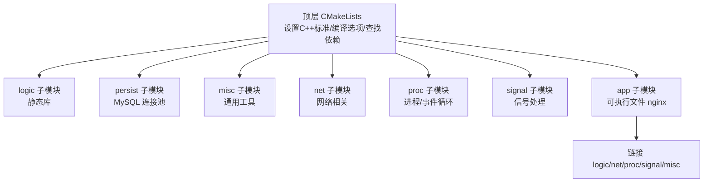
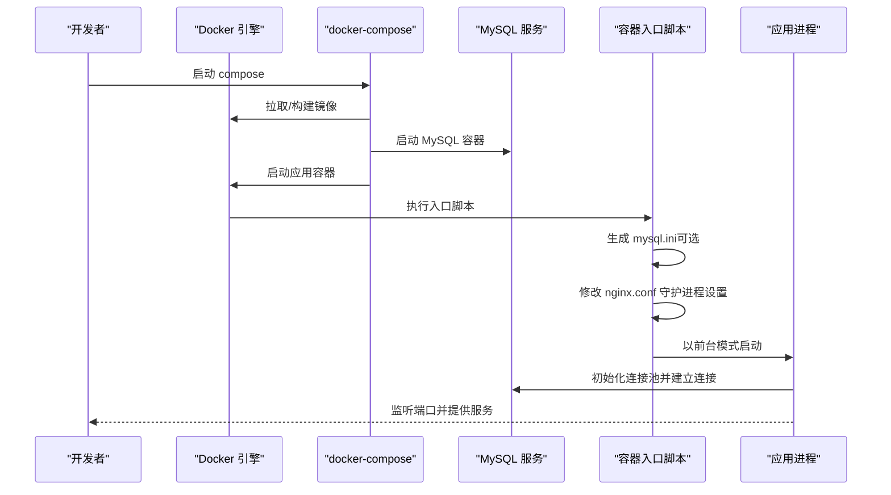
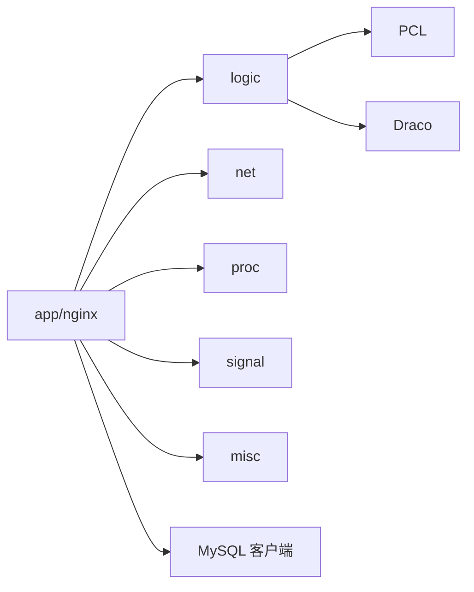

# 快速开始

<cite>
**本文引用的文件**
- [CMakeLists.txt](file://CMakeLists.txt)
- [Dockerfile](file://Dockerfile)
- [docker-compose.yml](file://docker-compose.yml)
- [nginx.conf](file://nginx.conf)
- [.dockerignore](file://.dockerignore)
- [docker/entrypoint.sh](file://docker/entrypoint.sh)
- [persist/mysql.ini](file://persist/mysql.ini)
- [app/CMakeLists.txt](file://app/CMakeLists.txt)
- [logic/CMakeLists.txt](file://logic/CMakeLists.txt)
- [include/ngx_macro.h](file://include/ngx_macro.h)
- [include/ngx_global.h](file://include/ngx_global.h)
- [include/ngx_comm.h](file://include/ngx_comm.h)
- [app/nginx.cxx](file://app/nginx.cxx)
</cite>

## 目录
1. [简介](#简介)
2. [项目结构](#项目结构)
3. [核心组件](#核心组件)
4. [架构总览](#架构总览)
5. [详细组件分析](#详细组件分析)
6. [依赖分析](#依赖分析)
7. [性能考虑](#性能考虑)
8. [故障排查指南](#故障排查指南)
9. [结论](#结论)
10. [附录](#附录)

## 简介
本指南面向初学者，帮助你在本地或容器环境中快速完成 PointServer 的安装、编译与部署，并提供单机与多服务编排两种部署方式。你将获得：
- 系统要求与依赖库安装指引
- 本地编译与构建流程
- Docker 单机部署与 docker-compose 多服务编排
- 关键配置文件说明与启动示例
- 常见问题排查与解决思路

## 项目结构
项目采用 CMake 分层模块化组织，核心模块包括逻辑处理、网络、进程、信号、持久化与应用层。顶层 CMakeLists 负责统一查找依赖、设置编译选项并将子模块按顺序加入构建。

图表来源
- [CMakeLists.txt](file://CMakeLists.txt#L1-L68)
- [app/CMakeLists.txt](file://app/CMakeLists.txt#L1-L29)
- [logic/CMakeLists.txt](file://logic/CMakeLists.txt#L1-L23)

章节来源
- [CMakeLists.txt](file://CMakeLists.txt#L1-L68)
- [app/CMakeLists.txt](file://app/CMakeLists.txt#L1-L29)
- [logic/CMakeLists.txt](file://logic/CMakeLists.txt#L1-L23)

## 核心组件
- 应用入口与主循环：应用层主程序负责加载配置、初始化日志、守护进程切换、进入 master-worker 循环。
- 配置系统：基于 ini 风格的配置文件，支持日志、进程、网络、安全等分组参数。
- MySQL 连接池：提供连接池初始化、最大连接数、空闲超时、连接超时等配置。
- Docker 容器化：通过 Dockerfile 构建镜像，entrypoint 脚本负责生成 mysql.ini、修正 nginx.conf 的守护进程设置并以前台模式启动。

章节来源
- [app/nginx.cxx](file://app/nginx.cxx#L44-L122)
- [nginx.conf](file://nginx.conf#L1-L63)
- [persist/mysql.ini](file://persist/mysql.ini#L1-L13)
- [Dockerfile](file://Dockerfile#L1-L65)
- [docker/entrypoint.sh](file://docker/entrypoint.sh#L1-L45)

## 架构总览
下图展示了从容器启动到服务运行的关键流程，以及配置注入与依赖关系。

图表来源
- [docker-compose.yml](file://docker-compose.yml#L1-L36)
- [Dockerfile](file://Dockerfile#L1-L65)
- [docker/entrypoint.sh](file://docker/entrypoint.sh#L1-L45)
- [persist/mysql.ini](file://persist/mysql.ini#L1-L13)
- [nginx.conf](file://nginx.conf#L1-L63)

## 详细组件分析

### 本地安装与编译
- 系统要求与依赖
  - CMake 版本：建议 3.12 及以上（容器中使用 3.22.6）
  - C++ 标准：C++11
  - 第三方库：PCL、Draco、MySQL 客户端、线程库 pthread
  - Ubuntu 16.04 示例基础依赖：build-essential、libpcl-dev、libeigen3-dev、libboost-all-dev、libflann-dev、libvtk6-dev、libmysqlclient-dev
- 构建步骤
  - 创建构建目录并配置：使用 Release 模式配置
  - 编译：根据 CPU 核心数并行编译
  - 产物：可执行文件位于构建目录下的 bin 目录
- 关键配置
  - 顶层 CMakeLists 统一设置编译选项与依赖查找
  - app 子模块显式列出源文件并链接逻辑/网络/进程/信号/杂项模块
  - logic 子模块编译为静态库并导出包含路径与第三方库

章节来源
- [CMakeLists.txt](file://CMakeLists.txt#L1-L68)
- [app/CMakeLists.txt](file://app/CMakeLists.txt#L1-L29)
- [logic/CMakeLists.txt](file://logic/CMakeLists.txt#L1-L23)

### Docker 单机部署
- 构建镜像
  - 使用 Dockerfile 构建，预置 CMake、Draco、PCL、MySQL 客户端等依赖
  - 将 persist/mysql.ini 复制为运行时配置
  - 在构建目录中执行 Release 构建
- 运行容器
  - 暴露端口 8080
  - 容器入口脚本负责：
    - 确保存储目录存在
    - 从环境变量生成 mysql.ini
    - 将 nginx.conf 中的守护进程设置强制为前台运行
    - 启动应用进程

章节来源
- [Dockerfile](file://Dockerfile#L1-L65)
- [docker/entrypoint.sh](file://docker/entrypoint.sh#L1-L45)

### docker-compose 多服务编排
- 服务编排
  - MySQL 服务：使用官方 5.7 镜像，设置 root 密码与数据库名称，持久化数据目录
  - 应用服务：基于当前目录构建镜像，依赖 MySQL，注入数据库连接环境变量
  - 端口映射：MySQL 3306 → 主机 3306；应用 8080 → 主机 8080
  - 数据卷：挂载点云数据目录到应用容器
- 自定义配置
  - 可挂载 nginx.conf 与 mysql.ini 到容器，实现运行时覆盖

章节来源
- [docker-compose.yml](file://docker-compose.yml#L1-L36)

### 配置文件说明
- nginx.conf（应用配置）
  - 日志：日志文件名与日志等级
  - 进程：工作进程数、消息接收线程数
  - 网络：监听端口、worker_connections、心跳与超时策略
  - 安全：防刷检测开关与阈值
- mysql.ini（数据库连接池）
  - 连接地址、端口、用户名、密码、数据库名
  - 连接池初始大小、最大大小、最大空闲时间、连接超时

章节来源
- [nginx.conf](file://nginx.conf#L1-L63)
- [persist/mysql.ini](file://persist/mysql.ini#L1-L13)

### 启动示例
- 本地启动
  - 在构建目录中运行可执行文件，应用将读取同目录下的 nginx.conf 并按配置启动
- Docker 单机启动
  - 构建镜像后运行容器，容器启动时会自动生成 mysql.ini 并以前台模式启动应用
- docker-compose 启动
  - 在项目根目录执行编排命令，等待 MySQL 与应用容器均就绪

章节来源
- [app/nginx.cxx](file://app/nginx.cxx#L74-L116)
- [docker/entrypoint.sh](file://docker/entrypoint.sh#L10-L39)
- [docker-compose.yml](file://docker-compose.yml#L15-L36)

## 依赖分析
- 顶层依赖查找
  - PCL、Draco、MySQL 客户端通过 CMake 查找并设置全局包含与链接
- 模块耦合
  - app 可执行文件依赖 logic、net、proc、signal、misc 模块
  - logic 模块依赖 PCL 与 Draco，并对外暴露公共包含路径
- 外部集成
  - MySQL 连接池在 persist 模块中实现，供应用层使用

图表来源
- [app/CMakeLists.txt](file://app/CMakeLists.txt#L14-L21)
- [logic/CMakeLists.txt](file://logic/CMakeLists.txt#L15-L20)
- [CMakeLists.txt](file://CMakeLists.txt#L40-L59)

章节来源
- [CMakeLists.txt](file://CMakeLists.txt#L15-L59)
- [app/CMakeLists.txt](file://app/CMakeLists.txt#L14-L21)
- [logic/CMakeLists.txt](file://logic/CMakeLists.txt#L15-L20)

## 性能考虑
- 线程与进程
  - 应用采用 master-worker 多进程模型，I/O 密集与计算密集任务分离，提升稳定性与并行度
- 网络与连接
  - worker_connections 控制每个 worker 的最大连接数，结合心跳与超时策略保障稳定性
- 构建优化
  - 使用 Release 模式构建，合理设置并行编译线程数以平衡构建速度与资源占用

章节来源
- [app/nginx.cxx](file://app/nginx.cxx#L139-L172)
- [nginx.conf](file://nginx.conf#L32-L50)
- [Dockerfile](file://Dockerfile#L3-L5)

## 故障排查指南
- 无法找到配置文件
  - 现象：启动时报错提示配置文件加载失败
  - 排查：确认 nginx.conf 是否存在于可执行文件同级目录
  - 参考
    - [app/nginx.cxx](file://app/nginx.cxx#L74-L82)
- 守护进程导致前台运行异常
  - 现象：容器内看不到日志或进程立即退出
  - 排查：入口脚本会强制将 nginx.conf 中的守护进程设置改为前台运行
  - 参考
    - [docker/entrypoint.sh](file://docker/entrypoint.sh#L35-L39)
- MySQL 连接失败
  - 现象：应用启动后无法连接数据库
  - 排查：检查环境变量是否正确传入，或手动挂载 mysql.ini；确认数据库服务可达
  - 参考
    - [docker/entrypoint.sh](file://docker/entrypoint.sh#L10-L33)
    - [persist/mysql.ini](file://persist/mysql.ini#L1-L13)
- 端口冲突
  - 现象：应用或 MySQL 端口占用
  - 排查：修改 docker-compose 映射端口或停止占用进程
  - 参考
    - [docker-compose.yml](file://docker-compose.yml#L12-L30)
- 构建失败
  - 现象：CMake 找不到依赖或编译报错
  - 排查：确认已安装 PCL、Draco、MySQL 客户端等依赖；必要时升级 CMake 版本
  - 参考
    - [CMakeLists.txt](file://CMakeLists.txt#L15-L59)
    - [Dockerfile](file://Dockerfile#L10-L17)

## 结论
通过本指南，你可以：
- 在本地完成依赖安装与编译构建
- 使用 Docker 单机快速运行
- 使用 docker-compose 实现数据库与应用的多服务编排
- 基于配置文件进行基础参数调整并进行基本功能验证

建议在完成初次部署后，逐步完善日志与监控配置，并根据业务负载调整网络与线程参数。

## 附录

### A. 从零开始的完整部署流程（初学者）
- 步骤 1：准备环境
  - 安装必要的系统依赖（参考 Dockerfile 中的基础依赖）
  - 安装 CMake（建议 3.12+）
- 步骤 2：克隆仓库并进入目录
- 步骤 3：本地编译
  - 创建构建目录并配置（Release 模式）
  - 执行编译
  - 运行可执行文件，观察日志输出
- 步骤 4：Docker 单机部署
  - 构建镜像
  - 运行容器，查看日志
- 步骤 5：docker-compose 多服务编排
  - 启动编排，等待服务就绪
  - 访问应用端口进行基本验证

章节来源
- [Dockerfile](file://Dockerfile#L10-L17)
- [CMakeLists.txt](file://CMakeLists.txt#L10-L13)
- [docker-compose.yml](file://docker-compose.yml#L15-L36)

### B. 关键数据结构与日志等级
- 日志等级
  - 应用定义了 0-8 的日志等级，便于分级输出与过滤
- 通信协议
  - 定义了包头结构与收包状态机，保证网络收发的完整性与一致性

章节来源
- [include/ngx_macro.h](file://include/ngx_macro.h#L18-L31)
- [include/ngx_comm.h](file://include/ngx_comm.h#L19-L25)