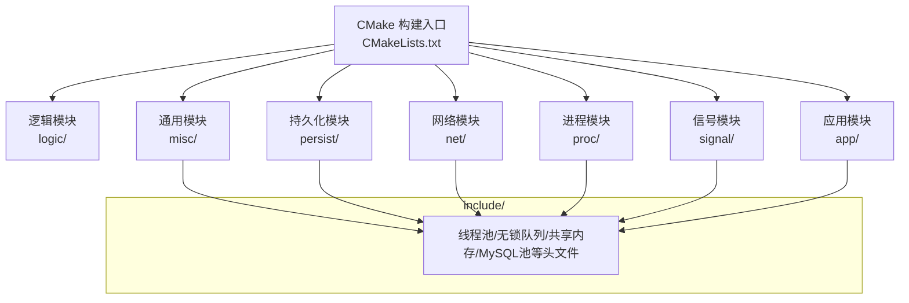
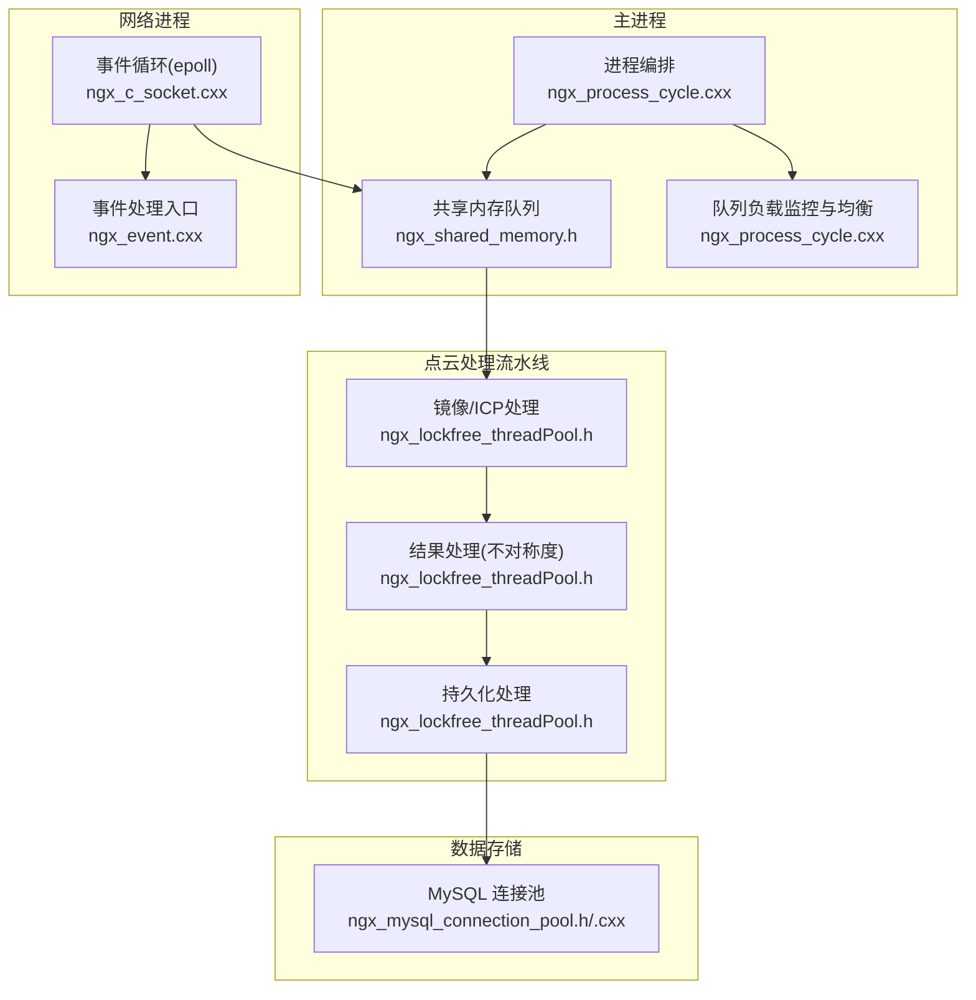
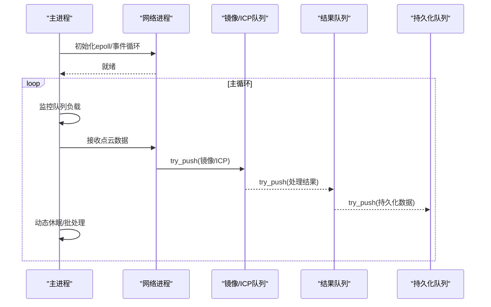
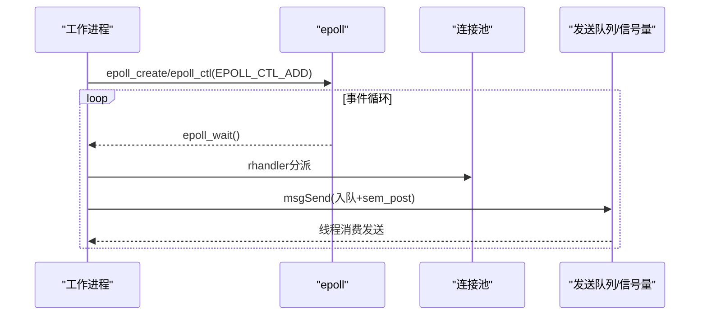
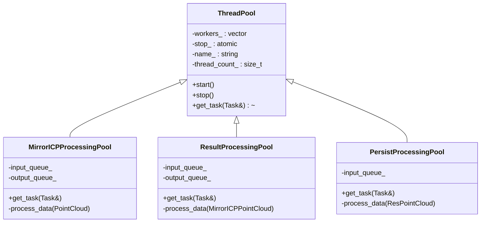
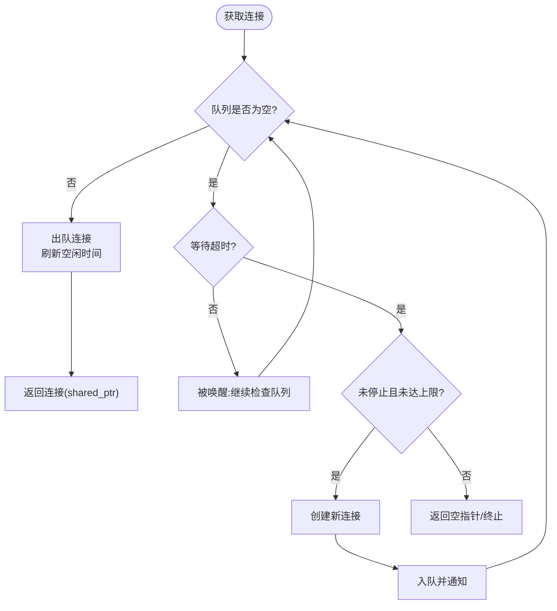
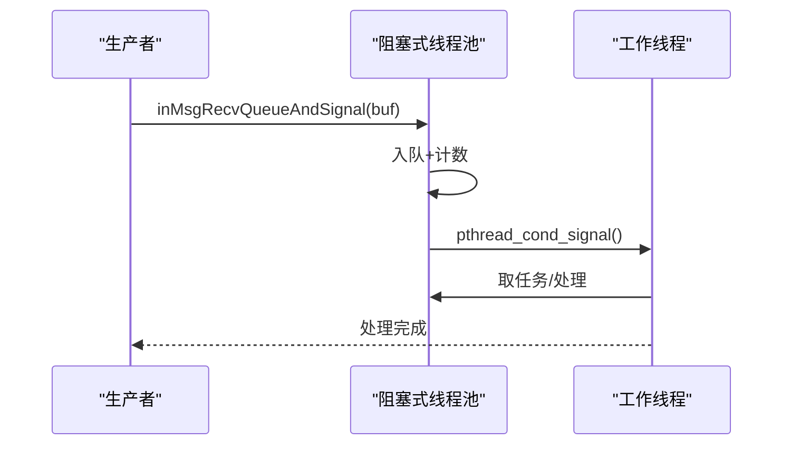
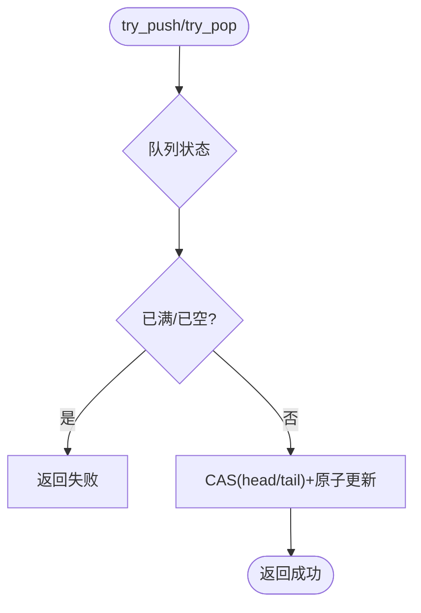
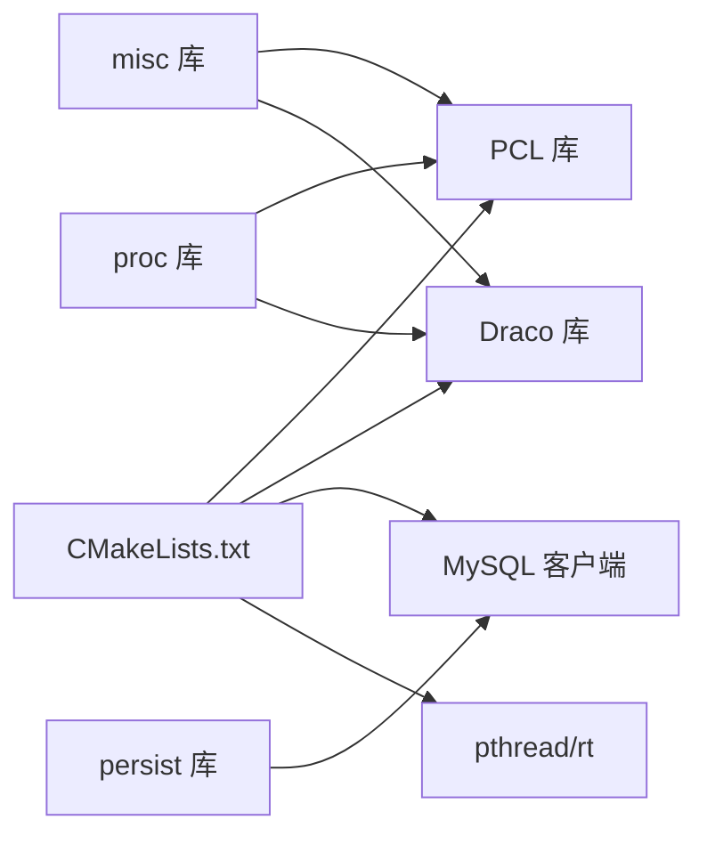

# 技术特色

<cite>
**本文档引用的文件**
- [CMakeLists.txt](file://CMakeLists.txt)
- [ngx_c_threadpool.h](file://include/ngx_c_threadpool.h)
- [ngx_lockfree_threadPool.h](file://include/ngx_lockfree_threadPool.h)
- [ngx_lockfree_threadPool.cxx](file://misc/ngx_lockfree_threadPool.cxx)
- [ngx_mysql_connection_pool.h](file://include/ngx_mysql_connection_pool.h)
- [ngx_mysql_connection_pool.cxx](file://persist/ngx_mysql_connection_pool.cxx)
- [ngx_process_cycle.cxx](file://proc/ngx_process_cycle.cxx)
- [ngx_shared_memory.h](file://include/ngx_shared_memory.h)
- [ngx_lockFreeQueue.h](file://include/ngx_lockFreeQueue.h)
- [ngx_c_socket.cxx](file://net/ngx_c_socket.cxx)
- [ngx_event.cxx](file://proc/ngx_event.cxx)
- [ngx_macro.h](file://include/ngx_macro.h)
</cite>

## 目录
1. [引言](#引言)
2. [项目结构](#项目结构)
3. [核心组件](#核心组件)
4. [架构总览](#架构总览)
5. [详细组件分析](#详细组件分析)
6. [依赖分析](#依赖分析)
7. [性能考量](#性能考量)
8. [故障排查指南](#故障排查指南)
9. [结论](#结论)

## 引言
本项目围绕 PointServer 的技术实现，系统梳理并阐述其六大技术特色：基于 C++11 的现代化 C++ 实现、多进程架构设计、事件驱动网络处理、高性能点云算法集成、MySQL 连接池优化、线程池异步处理。文档从架构设计、数据流、处理逻辑、集成点与错误处理等维度展开，辅以可视化图示，帮助开发者快速理解项目的技术价值与工程实践。

## 项目结构
项目采用模块化分层组织，结合 CMake 子目录构建，形成“逻辑-持久化-通用-网络-进程-信号-应用”的层次化布局。C++11 标准贯穿全局，确保现代语言特性与性能优化的统一。

图表来源
- [CMakeLists.txt](file://CMakeLists.txt#L62-L68)

章节来源
- [CMakeLists.txt](file://CMakeLists.txt#L1-L68)

## 核心组件
- 基于 C++11 的现代化 C++ 实现：统一 C++11 标准、原子操作、智能指针、线程库、内存模型与并发原语，确保跨平台与高性能。
- 多进程架构设计：主进程统一编排，子进程分工明确，共享内存队列解耦，具备进程级容错与弹性。
- 事件驱动网络处理：基于 epoll 的事件循环，非阻塞 I/O，水平触发模式，结合连接池与发送队列，实现高并发接入。
- 高性能点云算法集成：Draco 压缩/解压、PCL 点云处理，无锁队列与线程池并行化，支撑镜像/ICP、不对称度计算与持久化。
- MySQL 连接池优化：生产者-消费者模型、条件变量、空闲连接回收、超时控制与 RAII 生命周期管理。
- 线程池异步处理：阻塞式线程池与无锁线程池并存，分别服务于网络消息处理与点云计算，兼顾吞吐与延迟。

章节来源
- [CMakeLists.txt](file://CMakeLists.txt#L4-L7)
- [ngx_lockfree_threadPool.h](file://include/ngx_lockfree_threadPool.h#L17-L27)
- [ngx_process_cycle.cxx](file://proc/ngx_process_cycle.cxx#L103-L109)
- [ngx_c_socket.cxx](file://net/ngx_c_socket.cxx#L541-L587)
- [ngx_mysql_connection_pool.cxx](file://persist/ngx_mysql_connection_pool.cxx#L77-L162)
- [ngx_c_threadpool.h](file://include/ngx_c_threadpool.h#L9-L63)

## 架构总览
系统采用“主进程 + 多子进程 + 共享内存队列”的多进程架构。主进程负责进程编排、队列监控与负载均衡；网络进程负责接入与事件循环；镜像/ICP、结果处理、持久化分别由独立进程处理，通过无锁队列串联，实现高吞吐与低耦合。

图表来源
- [ngx_process_cycle.cxx](file://proc/ngx_process_cycle.cxx#L360-L398)
- [ngx_shared_memory.h](file://include/ngx_shared_memory.h#L87-L160)
- [ngx_c_socket.cxx](file://net/ngx_c_socket.cxx#L541-L587)
- [ngx_event.cxx](file://proc/ngx_event.cxx#L14-L22)
- [ngx_lockfree_threadPool.h](file://include/ngx_lockfree_threadPool.h#L80-L136)
- [ngx_mysql_connection_pool.h](file://include/ngx_mysql_connection_pool.h#L14-L55)

## 详细组件分析

### 组件A：多进程架构与进程编排
- 主进程职责：初始化信号屏蔽、设置进程标题、创建子进程、注册信号处理器、初始化共享内存队列、主循环与队列负载监控、数据转发与动态休眠策略。
- 子进程分工：网络进程、镜像/ICP处理进程、结果处理进程、持久化进程，各司其职并通过共享内存队列解耦。
- 负载均衡：基于队列长度的动态模式切换（正常/高负载/低负载），配合批处理与指数退避策略，平衡吞吐与延迟。

图表来源
- [ngx_process_cycle.cxx](file://proc/ngx_process_cycle.cxx#L401-L464)
- [ngx_process_cycle.cxx](file://proc/ngx_process_cycle.cxx#L717-L800)
- [ngx_shared_memory.h](file://include/ngx_shared_memory.h#L65-L73)

章节来源
- [ngx_process_cycle.cxx](file://proc/ngx_process_cycle.cxx#L360-L545)
- [ngx_shared_memory.h](file://include/ngx_shared_memory.h#L12-L22)

### 组件B：事件驱动网络处理
- epoll 初始化：创建 epoll 实例、注册监听 socket、设置事件回调与连接对象关联。
- 事件循环：epoll_wait 阻塞等待，遍历事件并分派到 rhandler，结合连接池与发送队列、信号量实现异步发送。
- 非阻塞 I/O：监听 socket 设置非阻塞，避免惊群问题，结合水平触发模式简化编程。

图表来源
- [ngx_c_socket.cxx](file://net/ngx_c_socket.cxx#L541-L587)
- [ngx_c_socket.cxx](file://net/ngx_c_socket.cxx#L757-L800)
- [ngx_c_socket.cxx](file://net/ngx_c_socket.cxx#L414-L456)

章节来源
- [ngx_c_socket.cxx](file://net/ngx_c_socket.cxx#L541-L735)
- [ngx_event.cxx](file://proc/ngx_event.cxx#L14-L22)

### 组件C：高性能点云算法与无锁线程池
- 算法集成：Draco 压缩/解压、PCL 点云处理（镜像、ICP、法向量、不对称度计算），通过无锁队列与线程池并行化。
- 线程池设计：基类 ThreadPool 提供通用任务模型与生命周期管理；子类分别面向镜像/ICP、结果处理、持久化，支持优雅停止与内存序语义。
- 无锁队列：环形缓冲、缓存行对齐、compare_exchange_weak 原子 CAS，避免伪共享，提供 acquire/release 内存序保证。

图表来源
- [ngx_lockfree_threadPool.h](file://include/ngx_lockfree_threadPool.h#L17-L77)
- [ngx_lockfree_threadPool.h](file://include/ngx_lockfree_threadPool.h#L80-L136)
- [ngx_lockfree_threadPool.cxx](file://misc/ngx_lockfree_threadPool.cxx#L1-L78)

章节来源
- [ngx_lockfree_threadPool.h](file://include/ngx_lockfree_threadPool.h#L17-L77)
- [ngx_lockfree_threadPool.h](file://include/ngx_lockfree_threadPool.h#L80-L136)
- [ngx_lockfree_threadPool.cxx](file://misc/ngx_lockfree_threadPool.cxx#L1-L78)

### 组件D：MySQL 连接池优化
- 单例模式：懒汉式单例，线程安全初始化。
- 生产者-消费者：独立线程负责生产连接与空闲扫描回收，消费者通过条件变量等待与超时控制。
- 生命周期管理：RAII 与共享指针析构器，自动刷新空闲时间与回收连接；优雅停止时等待队列清空。

图表来源
- [ngx_mysql_connection_pool.h](file://include/ngx_mysql_connection_pool.h#L14-L55)
- [ngx_mysql_connection_pool.cxx](file://persist/ngx_mysql_connection_pool.cxx#L208-L255)
- [ngx_mysql_connection_pool.cxx](file://persist/ngx_mysql_connection_pool.cxx#L173-L203)
- [ngx_mysql_connection_pool.cxx](file://persist/ngx_mysql_connection_pool.cxx#L281-L311)

章节来源
- [ngx_mysql_connection_pool.h](file://include/ngx_mysql_connection_pool.h#L14-L55)
- [ngx_mysql_connection_pool.cxx](file://persist/ngx_mysql_connection_pool.cxx#L77-L162)
- [ngx_mysql_connection_pool.cxx](file://persist/ngx_mysql_connection_pool.cxx#L208-L255)

### 组件E：线程池异步处理（阻塞式与无锁）
- 阻塞式线程池：pthread 互斥量与条件变量，消息队列入队后唤醒工作线程，支持线程不够用告警与优雅停止。
- 无锁线程池：C++11 线程与原子布尔，基类提供 get_task 抽象接口，子类实现具体任务；支持停止与 join。

图表来源
- [ngx_c_threadpool.h](file://include/ngx_c_threadpool.h#L19-L31)
- [ngx_c_threadpool.cxx](file://misc/ngx_c_threadpool.cxx#L269-L321)

章节来源
- [ngx_c_threadpool.h](file://include/ngx_c_threadpool.h#L9-L63)
- [ngx_c_threadpool.cxx](file://misc/ngx_c_threadpool.cxx#L67-L121)

### 组件F：无锁队列与内存序
- 环形缓冲、缓存行对齐（64 字节）避免伪共享；head/tail 使用原子变量，push/pop 使用 compare_exchange_weak，配合 acquire/release 内存序。
- 提供 size/capacity 查询，便于上层进行流量控制与退避策略。

图表来源
- [ngx_lockFreeQueue.h](file://include/ngx_lockFreeQueue.h#L50-L127)
- [ngx_lockFreeQueue.h](file://include/ngx_lockFreeQueue.h#L134-L149)

章节来源
- [ngx_lockFreeQueue.h](file://include/ngx_lockFreeQueue.h#L1-L430)

## 依赖分析
- 构建与第三方库：CMake 统一设置 C++11 标准，查找并链接 PCL、Draco、MySQL 客户端、pthread；全局库变量集中管理。
- 模块化链接：各子模块（logic/persist/misc/net/proc/signal/app）分别构建为静态库，按依赖顺序链接，include_directories 与 link_libraries 明确传递依赖。
- 运行时依赖：Draco 与 PCL 用于点云编解码与处理；MySQL 客户端用于持久化；epoll 与线程库用于网络与并发。

图表来源
- [CMakeLists.txt](file://CMakeLists.txt#L41-L59)

章节来源
- [CMakeLists.txt](file://CMakeLists.txt#L35-L59)

## 性能考量
- C++11 现代化：原子操作、内存序、线程库与智能指针降低锁竞争与资源泄漏风险，提升可维护性与性能。
- 无锁队列：避免互斥锁带来的上下文切换与死锁风险，配合缓存行对齐与 CAS，显著提升高并发吞吐。
- 事件驱动：epoll 水平触发 + 非阻塞 I/O，减少系统调用次数与阻塞等待，适合高并发接入场景。
- 线程池：阻塞式线程池用于网络消息处理，无锁线程池用于 CPU 密集型点云计算，二者互补，兼顾延迟与吞吐。
- 连接池：生产者-消费者 + 空闲回收 + 超时控制，避免频繁创建销毁连接带来的开销。
- 负载均衡：基于队列长度的动态模式切换与指数退避，平衡系统负载与响应时间。

## 故障排查指南
- 线程池告警：当空闲线程为 0 且达到告警间隔，主进程会记录线程池压力日志，建议扩容线程数或优化任务粒度。
- 队列过载：主进程监控队列长度，超过阈值时采取回推或降级策略，建议检查下游处理能力或增加处理进程。
- epoll 错误：epoll_wait 返回 EINTR 通常由信号引起，属预期行为；若持续失败，检查信号处理与内核参数。
- MySQL 连接超时：getConnection 超时返回空指针，检查连接池配置（初始大小、最大大小、空闲时间、超时）与数据库负载。
- 日志等级：通过日志宏定义控制输出级别，便于定位问题与性能分析。

章节来源
- [ngx_c_threadpool.cxx](file://misc/ngx_c_threadpool.cxx#L310-L318)
- [ngx_process_cycle.cxx](file://proc/ngx_process_cycle.cxx#L401-L464)
- [ngx_c_socket.cxx](file://net/ngx_c_socket.cxx#L757-L778)
- [ngx_mysql_connection_pool.cxx](file://persist/ngx_mysql_connection_pool.cxx#L214-L235)
- [ngx_macro.h](file://include/ngx_macro.h#L18-L28)

## 结论
本项目以 C++11 为基石，融合多进程、事件驱动、无锁队列与线程池等现代并发技术，构建了高吞吐、低耦合、可扩展的点云处理平台。通过共享内存队列与模块化设计，系统在保证稳定性的同时实现了卓越的性能表现；通过 MySQL 连接池与点云算法集成，满足了工业级应用对实时性与精度的双重需求。上述技术特色共同构成了项目的核心竞争力，为后续扩展与演进提供了坚实基础。