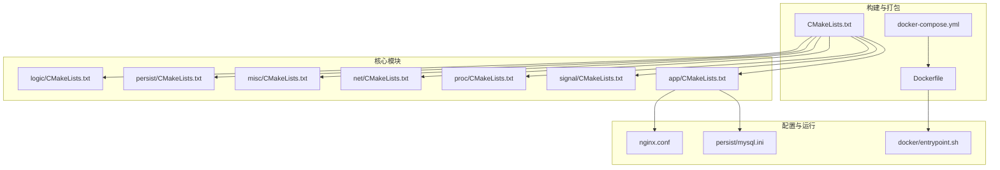
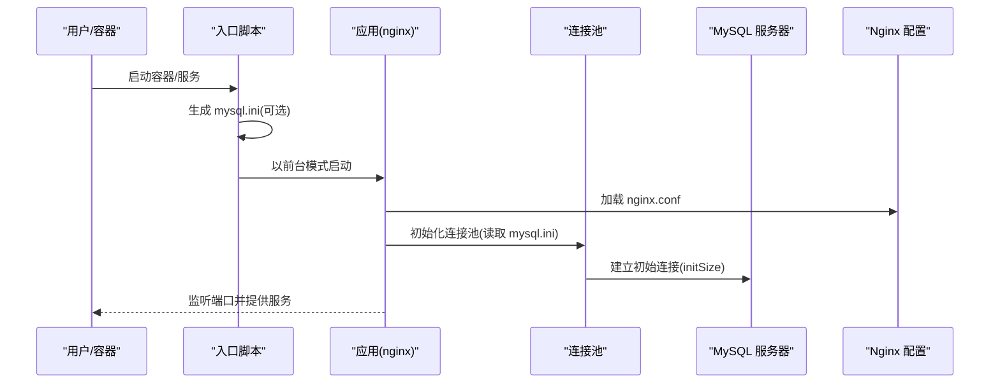
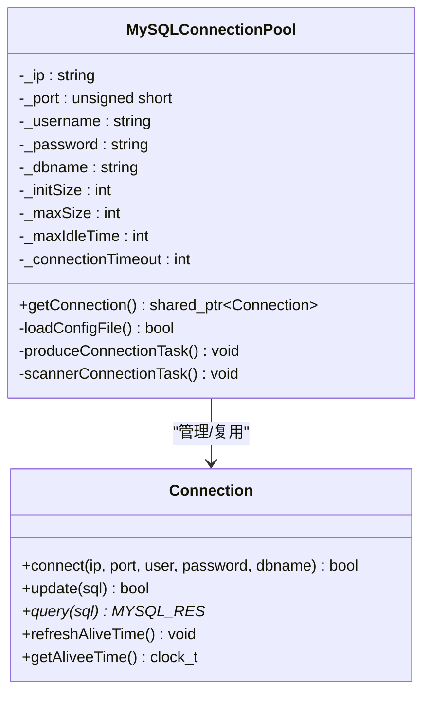
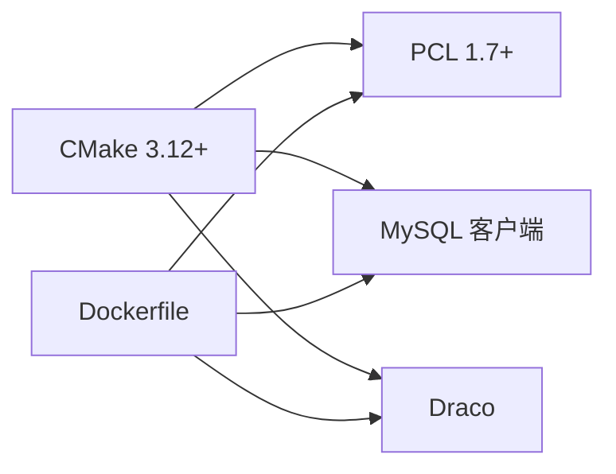

# 系统要求

<cite>
**本文引用的文件列表**
- [CMakeLists.txt](file://CMakeLists.txt)
- [Dockerfile](file://Dockerfile)
- [docker-compose.yml](file://docker-compose.yml)
- [nginx.conf](file://nginx.conf)
- [persist/mysql.ini](file://persist/mysql.ini)
- [docker/entrypoint.sh](file://docker/entrypoint.sh)
- [include/ngx_mysql_connection.h](file://include/ngx_mysql_connection.h)
- [include/ngx_mysql_connection_pool.h](file://include/ngx_mysql_connection_pool.h)
- [app/CMakeLists.txt](file://app/CMakeLists.txt)
- [proc/CMakeLists.txt](file://proc/CMakeLists.txt)
- [misc/CMakeLists.txt](file://misc/CMakeLists.txt)
- [logic/CMakeLists.txt](file://logic/CMakeLists.txt)
</cite>

## 目录
1. [简介](#简介)
2. [项目结构](#项目结构)
3. [核心组件](#核心组件)
4. [架构概览](#架构概览)
5. [详细组件分析](#详细组件分析)
6. [依赖分析](#依赖分析)
7. [性能考虑](#性能考虑)
8. [故障排查指南](#故障排查指南)
9. [结论](#结论)
10. [附录](#附录)

## 简介
本文件面向 PointServer 项目的部署与运维人员，提供系统要求与部署指南。内容涵盖：
- 操作系统与硬件建议
- 软件依赖版本与安装方法
- 不同部署环境（本地/容器）的配置差异与注意事项
- 性能基准与资源消耗估算

## 项目结构
PointServer 采用模块化 CMake 工程，包含逻辑、持久化、网络、进程控制、信号与应用层等模块，并通过可执行文件聚合各模块。项目同时提供 Docker 化部署方案与本地编译方案。

图表来源
- [CMakeLists.txt](file://CMakeLists.txt#L61-L68)
- [app/CMakeLists.txt](file://app/CMakeLists.txt#L11-L21)
- [Dockerfile](file://Dockerfile#L1-L65)
- [docker-compose.yml](file://docker-compose.yml#L1-L36)

章节来源
- [CMakeLists.txt](file://CMakeLists.txt#L1-L68)
- [app/CMakeLists.txt](file://app/CMakeLists.txt#L1-L29)
- [Dockerfile](file://Dockerfile#L1-L65)
- [docker-compose.yml](file://docker-compose.yml#L1-L36)

## 核心组件
- 应用入口与配置系统：应用层负责读取配置、初始化日志与进程标题，并作为主程序启动。
- 数据库连接池：提供连接池生命周期管理、空闲连接回收与超时控制。
- 线程池与任务分发：处理消息接收与异步任务，支持动态告警与扩展。
- 网络与事件循环：基于 epoll 的高并发网络模型，支持连接上限与心跳检测。
- 持久化与队列：点云数据的持久化处理与跨进程队列。

章节来源
- [include/ngx_mysql_connection.h](file://include/ngx_mysql_connection.h#L9-L35)
- [include/ngx_mysql_connection_pool.h](file://include/ngx_mysql_connection_pool.h#L14-L55)
- [nginx.conf](file://nginx.conf#L21-L60)

## 架构概览
下图展示应用层如何加载配置、建立数据库连接池、启动网络服务与线程池，以及容器化部署的关键流程。

图表来源
- [docker/entrypoint.sh](file://docker/entrypoint.sh#L10-L33)
- [app/CMakeLists.txt](file://app/CMakeLists.txt#L11-L21)
- [include/ngx_mysql_connection_pool.h](file://include/ngx_mysql_connection_pool.h#L18-L22)
- [persist/mysql.ini](file://persist/mysql.ini#L1-L13)
- [nginx.conf](file://nginx.conf#L1-L63)

## 详细组件分析

### 数据库连接池
- 功能要点
  - 单例连接池，提供获取连接接口
  - 支持初始连接数、最大连接数、最大空闲时间、连接超时等配置
  - 空闲连接扫描与回收
- 关键配置项
  - ip/port/username/password/dbname：连接目标
  - initSize/maxSize：连接池规模
  - maxIdleTime/connectionTimeOut：空闲回收与获取超时
- 使用场景
  - 在应用启动阶段加载配置文件并初始化连接池
  - 业务线程从池中获取连接执行 SQL

图表来源
- [include/ngx_mysql_connection.h](file://include/ngx_mysql_connection.h#L9-L35)
- [include/ngx_mysql_connection_pool.h](file://include/ngx_mysql_connection_pool.h#L14-L55)

章节来源
- [include/ngx_mysql_connection.h](file://include/ngx_mysql_connection.h#L1-L35)
- [include/ngx_mysql_connection_pool.h](file://include/ngx_mysql_connection_pool.h#L1-L55)
- [persist/mysql.ini](file://persist/mysql.ini#L1-L13)

### 网络与并发配置
- 关键配置项
  - WorkerProcesses：工作进程数
  - ProcMsgRecvWorkThreadCount：消息接收线程池大小
  - ListenPort0：监听端口
  - worker_connections：每个 worker 的 epoll 最大连接数
  - Sock_WaitTimeEnable/Sock_MaxWaitTime：心跳检测与踢人策略
  - Sock_FloodAttackKickEnable/Sock_FloodTimeInterval/Sock_FloodKickCounter：防刷策略
- 影响范围
  - 连接上限受 worker_connections 限制
  - 线程池大小影响消息处理吞吐
  - 心跳与防刷策略影响稳定性与抗压能力

章节来源
- [nginx.conf](file://nginx.conf#L21-L60)

### 容器化入口与配置注入
- 入口脚本职责
  - 创建点云持久化目录
  - 从环境变量生成 mysql.ini（如提供）
  - 将 nginx.conf 中 Daemon 设为前台运行
  - 启动可执行文件
- 环境变量映射
  - MYSQL_HOST/MYSQL_PORT/MYSQL_USER/MYSQL_PASSWORD/MYSQL_DBNAME
  - MYSQL_INIT_SIZE/MYSQL_MAX_SIZE/MYSQL_MAX_IDLE_TIME/MYSQL_CONN_TIMEOUT_MS

章节来源
- [docker/entrypoint.sh](file://docker/entrypoint.sh#L1-L45)
- [docker-compose.yml](file://docker-compose.yml#L21-L28)

## 依赖分析
- 构建系统与编译器
  - CMake 版本：至少 3.12（工程要求）
  - C++ 标准：C++11
  - 默认构建类型：Debug（可覆盖）
- 第三方库
  - PCL：1.7+，启用 common/kdtree/search/registration/io/features 组件
  - MySQL 客户端：mysqlclient 或 libmysql
  - Draco：Google Draco 点云压缩库
- 平台特定依赖
  - Ubuntu 16.04 基础镜像，预装 PCL/Eigen/Boost/FLANN/VTK 与 MySQL 客户端开发包
  - 自行编译安装较新版本 CMake（3.22.6）
  - 通过源码编译安装 Draco 并注册为 CMake 包

图表来源
- [CMakeLists.txt](file://CMakeLists.txt#L41-L44)
- [Dockerfile](file://Dockerfile#L10-L17)
- [Dockerfile](file://Dockerfile#L37-L43)

章节来源
- [CMakeLists.txt](file://CMakeLists.txt#L1-L68)
- [Dockerfile](file://Dockerfile#L1-L65)

## 性能考虑
- 线程与连接
  - 线程池大小直接影响消息处理并发度，建议根据 CPU 核心数与业务负载调整
  - worker_connections 决定每个 worker 的连接上限，结合 WorkerProcesses 可估算总并发
- 队列与负载均衡
  - 进程间队列存在高/低负载阈值，可根据队列长度动态调整处理策略
- I/O 与存储
  - 点云数据持久化目录需具备足够磁盘空间与写入性能
  - 连接池规模与超时设置需平衡延迟与资源占用
- 容器资源
  - 构建时可通过 MAKE_JOBS 控制并行编译线程数，避免低内存环境 OOM
  - 生产运行建议为容器设置 CPU/内存限制，防止资源争用

章节来源
- [nginx.conf](file://nginx.conf#L21-L60)
- [proc/CMakeLists.txt](file://proc/CMakeLists.txt#L16-L21)
- [misc/CMakeLists.txt](file://misc/CMakeLists.txt#L20-L26)
- [Dockerfile](file://Dockerfile#L3-L5)

## 故障排查指南
- 启动失败（容器）
  - 检查入口脚本是否正确生成 mysql.ini（环境变量是否完整）
  - 确认 nginx.conf 中 Daemon 已被强制设为前台运行
- 数据库连接问题
  - 核对 mysql.ini 中的 ip/port/username/password/dbname
  - 检查 initSize/maxSize 是否合理，避免连接池耗尽
- 网络连接异常
  - 检查 worker_connections 与实际并发是否匹配
  - 开启心跳检测与防刷策略，观察日志告警
- 构建失败
  - 确认已安装 PCL、MySQL 客户端与 Draco 开发包
  - 若系统 CMake 版本过低，参考 Dockerfile 中安装方式升级

章节来源
- [docker/entrypoint.sh](file://docker/entrypoint.sh#L10-L39)
- [persist/mysql.ini](file://persist/mysql.ini#L1-L13)
- [nginx.conf](file://nginx.conf#L21-L60)
- [Dockerfile](file://Dockerfile#L10-L17)
- [Dockerfile](file://Dockerfile#L37-L43)

## 结论
- PointServer 对第三方库有明确版本要求，且通过 CMake 与 Dockerfile 提供了清晰的安装与集成路径
- 通过 nginx.conf 与 mysql.ini 可灵活配置并发、连接池与网络策略
- 建议在生产环境中结合硬件资源与业务负载，对线程池、连接上限与队列阈值进行调优

## 附录

### 操作系统与硬件建议
- 操作系统
  - Linux：推荐 Ubuntu 16.04 及以上版本
  - macOS：通过 Homebrew 安装依赖（见“软件依赖安装”）
  - Windows：WSL 环境下可参考 Linux 步骤安装依赖
- 硬件配置建议
  - CPU：多核处理器，建议至少 4 核以支撑线程池与网络并发
  - 内存：建议 4GB+，容器构建与运行期间可能占用更高内存
  - 磁盘：点云数据持久化目录需预留充足空间，建议 SSD 提升 I/O

### 软件依赖版本与安装方法
- CMake
  - 版本：3.12+
  - 容器内通过下载二进制包安装 3.22.6
- PCL
  - 版本：1.7+
  - 容器内通过 apt 安装开发包
- MySQL 客户端
  - 容器内通过 apt 安装开发包
- Draco
  - 方式：源码编译安装并注册为 CMake 包

章节来源
- [CMakeLists.txt](file://CMakeLists.txt#L15-L33)
- [Dockerfile](file://Dockerfile#L10-L17)
- [Dockerfile](file://Dockerfile#L37-L43)

### 不同部署环境下的配置差异与注意事项
- 本地部署
  - 使用 CMake 生成构建系统，手动安装依赖后编译
  - 通过 nginx.conf 与 mysql.ini 进行配置
- 容器部署
  - 使用 docker-compose 启动 MySQL 与应用容器
  - 通过环境变量注入数据库配置，入口脚本自动生成 mysql.ini
  - 端口映射与持久化目录挂载需按需调整

章节来源
- [docker-compose.yml](file://docker-compose.yml#L1-L36)
- [docker/entrypoint.sh](file://docker/entrypoint.sh#L10-L33)

### 性能基准与资源消耗估算
- 并发连接
  - 总连接上限 ≈ WorkerProcesses × worker_connections
  - 建议根据峰值在线人数与业务 QPS 估算
- 线程池
  - ProcMsgRecvWorkThreadCount 建议与 CPU 核心数匹配或略高
- 连接池
  - initSize 与 maxSize 需结合数据库最大连接数与业务峰值
- I/O
  - 点云写入与查询的 I/O 延迟直接影响整体吞吐，建议使用高性能存储
- 容器资源
  - 构建阶段 MAKE_JOBS 控制并行度，运行阶段建议设置 CPU/内存限制

章节来源
- [nginx.conf](file://nginx.conf#L21-L60)
- [persist/mysql.ini](file://persist/mysql.ini#L7-L12)
- [Dockerfile](file://Dockerfile#L3-L5)