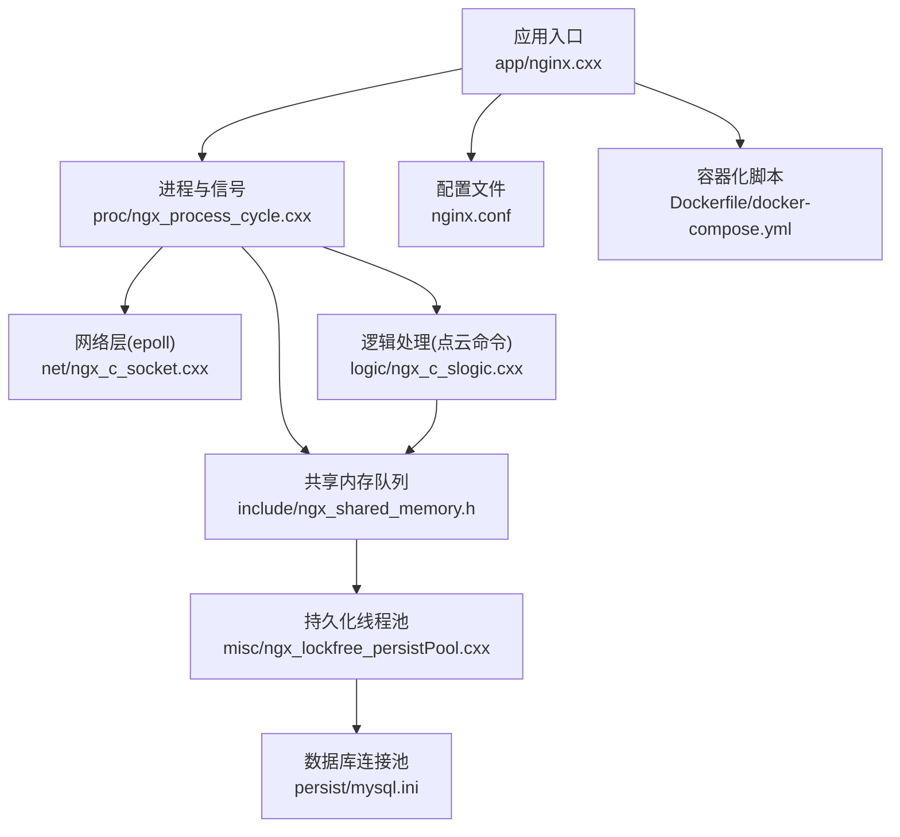
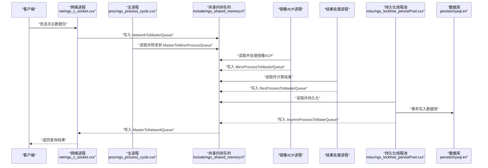
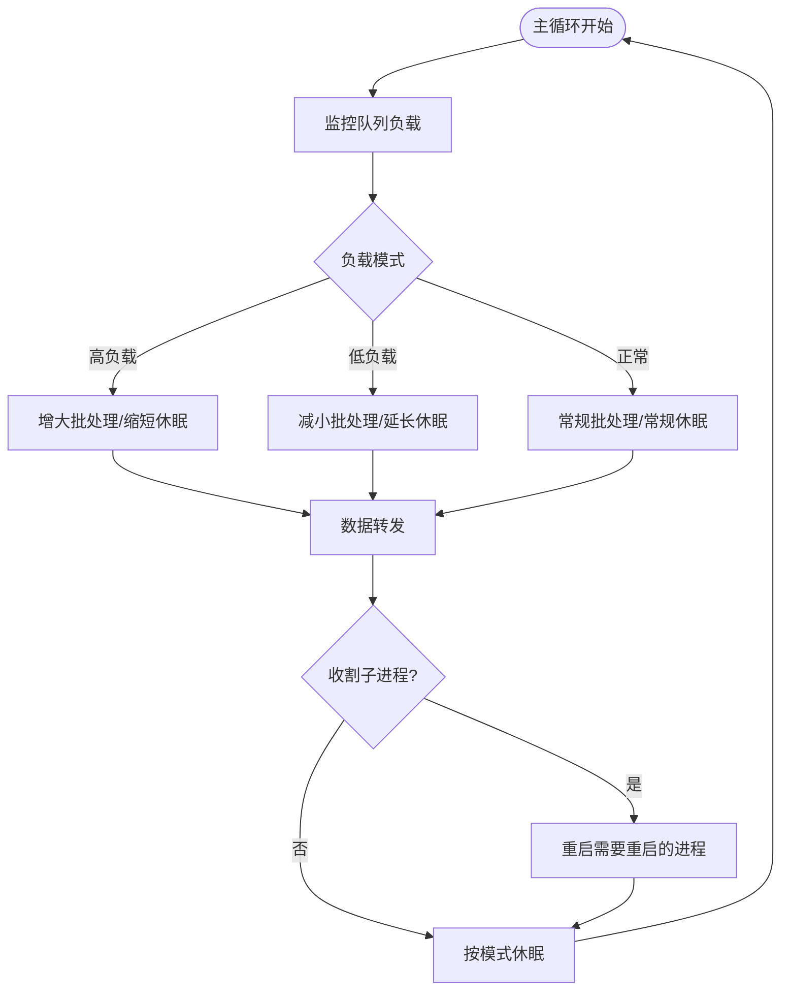
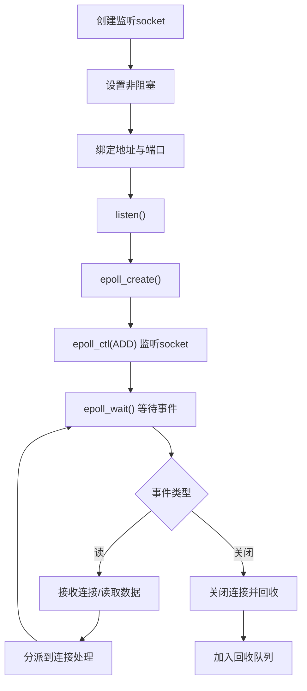
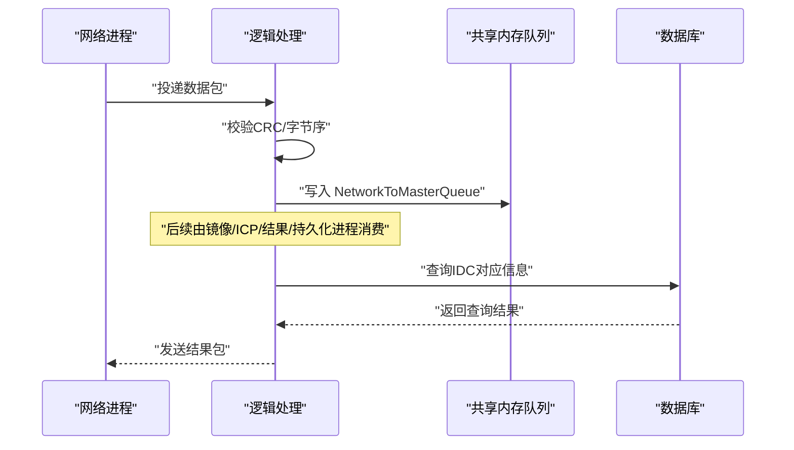
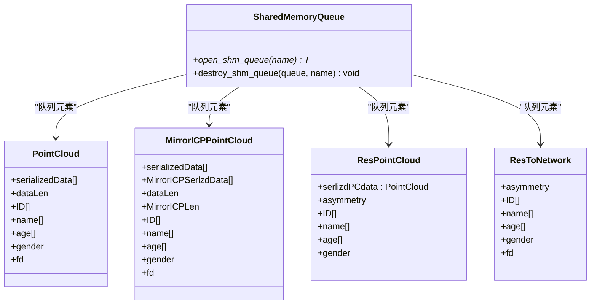
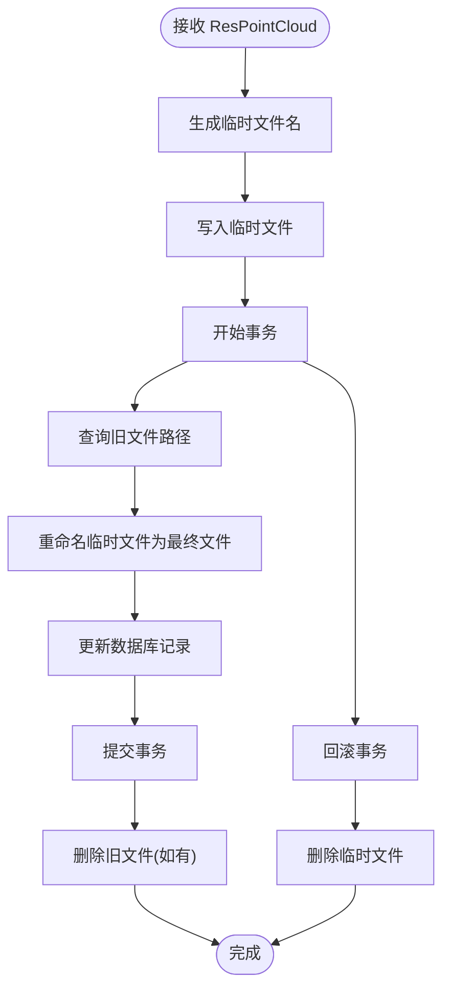
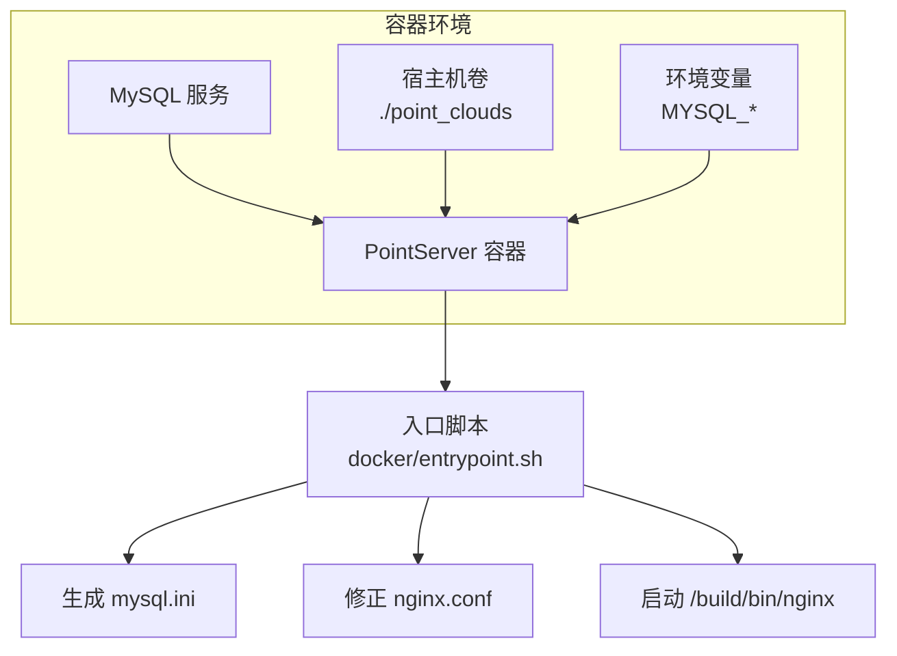
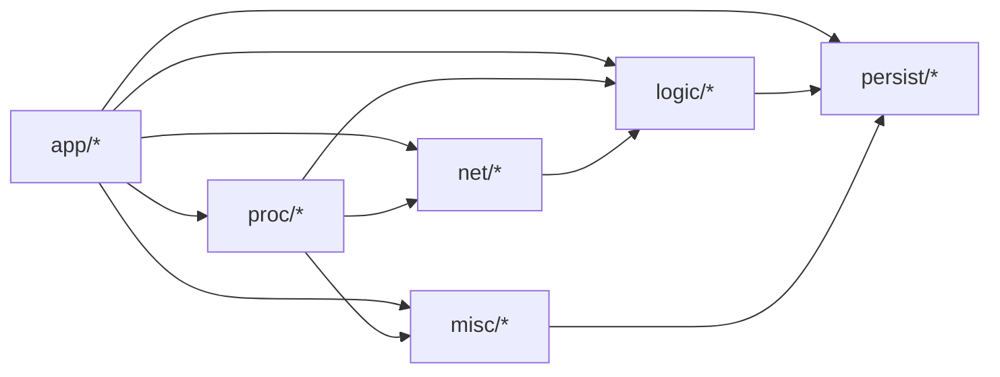

# 项目介绍

<cite>
**本文档引用的文件**
- [CMakeLists.txt](file://CMakeLists.txt)
- [nginx.conf](file://nginx.conf)
- [Dockerfile](file://Dockerfile)
- [docker-compose.yml](file://docker-compose.yml)
- [app/nginx.cxx](file://app/nginx.cxx)
- [include/ngx_macro.h](file://include/ngx_macro.h)
- [include/ngx_global.h](file://include/ngx_global.h)
- [proc/ngx_process_cycle.cxx](file://proc/ngx_process_cycle.cxx)
- [net/ngx_c_socket.cxx](file://net/ngx_c_socket.cxx)
- [logic/ngx_c_slogic.cxx](file://logic/ngx_c_slogic.cxx)
- [include/ngx_shared_memory.h](file://include/ngx_shared_memory.h)
- [misc/ngx_lockfree_persistPool.cxx](file://misc/ngx_lockfree_persistPool.cxx)
- [persist/mysql.ini](file://persist/mysql.ini)
- [docker/entrypoint.sh](file://docker/entrypoint.sh)
</cite>

## 目录
1. [引言](#引言)
2. [项目结构](#项目结构)
3. [核心组件](#核心组件)
4. [架构总览](#架构总览)
5. [详细组件分析](#详细组件分析)
6. [依赖关系分析](#依赖关系分析)
7. [性能考量](#性能考量)
8. [故障排查指南](#故障排查指南)
9. [结论](#结论)

## 引言
PointServer 是一个基于 C++11 开发的高性能点云数据处理服务器，专注于实时接收、计算与存储点云数据。项目采用多进程架构，结合基于 epoll 的事件驱动网络处理、无锁队列共享内存、PCL（Point Cloud Library）与 Draco 的深度集成，以及 MySQL 连接池与容器化部署，形成一套面向高并发、低延迟的点云数据流水线。

与传统 Nginx 类似的方面在于：均采用 master-worker 多进程模型、基于 epoll 的事件驱动网络处理、以及通过配置文件集中管理运行参数。与 Nginx 的差异在于：PointServer 的“worker”被细分为网络、镜像/ICP、结果处理、持久化等多个专用进程，配合共享内存队列实现跨进程的高性能数据流转；同时引入点云处理算法与数据库持久化，使其成为面向点云业务的专用高性能服务器。

## 项目结构
项目采用模块化分层组织，核心模块包括应用入口、网络层、逻辑层、进程与信号管理、共享内存与队列、持久化与数据库、以及容器化部署脚本。

图表来源
- [app/nginx.cxx](file://app/nginx.cxx#L44-L122)
- [proc/ngx_process_cycle.cxx](file://proc/ngx_process_cycle.cxx#L360-L399)
- [net/ngx_c_socket.cxx](file://net/ngx_c_socket.cxx#L541-L587)
- [logic/ngx_c_slogic.cxx](file://logic/ngx_c_slogic.cxx#L68-L74)
- [include/ngx_shared_memory.h](file://include/ngx_shared_memory.h#L87-L160)
- [misc/ngx_lockfree_persistPool.cxx](file://misc/ngx_lockfree_persistPool.cxx#L12-L31)
- [persist/mysql.ini](file://persist/mysql.ini#L1-L13)
- [nginx.conf](file://nginx.conf#L1-L63)
- [Dockerfile](file://Dockerfile#L1-L65)
- [docker-compose.yml](file://docker-compose.yml#L1-L36)

章节来源
- [CMakeLists.txt](file://CMakeLists.txt#L1-L68)
- [nginx.conf](file://nginx.conf#L1-L63)
- [Dockerfile](file://Dockerfile#L1-L65)
- [docker-compose.yml](file://docker-compose.yml#L1-L36)

## 核心组件
- 多进程管理与主循环
  - master 进程负责创建与监控子进程、初始化共享内存队列、进行队列负载监控与数据转发、处理信号。
  - 子进程分别承担网络监听、点云镜像/ICP、结果处理、持久化等职责。
- 事件驱动网络层
  - 基于 epoll 的事件循环，非阻塞 socket，支持心跳检测、防洪攻击、连接回收等。
- 点云处理与命令路由
  - 通过消息码路由到具体处理函数，支持点云接收与查询返回。
- 共享内存与无锁队列
  - 使用 POSIX 共享内存与无锁队列实现跨进程高效数据传递，降低锁竞争与上下文切换。
- 持久化与数据库
  - 线程池异步写入，事务保障一致性，Draco 压缩格式持久化，MySQL 连接池管理。
- 容器化部署
  - Dockerfile 与 docker-compose 提供一键构建与运行，自动注入数据库配置与前台运行。

章节来源
- [app/nginx.cxx](file://app/nginx.cxx#L44-L122)
- [proc/ngx_process_cycle.cxx](file://proc/ngx_process_cycle.cxx#L360-L399)
- [net/ngx_c_socket.cxx](file://net/ngx_c_socket.cxx#L541-L587)
- [logic/ngx_c_slogic.cxx](file://logic/ngx_c_slogic.cxx#L68-L74)
- [include/ngx_shared_memory.h](file://include/ngx_shared_memory.h#L87-L160)
- [misc/ngx_lockfree_persistPool.cxx](file://misc/ngx_lockfree_persistPool.cxx#L12-L31)
- [persist/mysql.ini](file://persist/mysql.ini#L1-L13)
- [Dockerfile](file://Dockerfile#L1-L65)
- [docker-compose.yml](file://docker-compose.yml#L1-L36)

## 架构总览
PointServer 的整体数据流从网络层接收点云数据，经过共享内存队列分发到镜像/ICP处理、结果计算与持久化线程池，最终写入数据库与文件系统。master 进程负责进程生命周期与队列负载均衡，网络层负责高并发连接与事件处理。

图表来源
- [proc/ngx_process_cycle.cxx](file://proc/ngx_process_cycle.cxx#L360-L399)
- [include/ngx_shared_memory.h](file://include/ngx_shared_memory.h#L87-L160)
- [misc/ngx_lockfree_persistPool.cxx](file://misc/ngx_lockfree_persistPool.cxx#L12-L31)
- [persist/mysql.ini](file://persist/mysql.ini#L1-L13)

## 详细组件分析

### 多进程与主循环
- master 进程职责
  - 初始化信号屏蔽与进程标题、创建子进程、注册信号处理器、初始化共享内存队列、主循环进行队列负载监控与数据转发、收割退出子进程。
- 子进程类型
  - 网络进程：负责监听端口、epoll 事件循环、连接管理。
  - 镜像/ICP 进程：执行点云配准与处理。
  - 结果处理进程：计算并聚合结果。
  - 持久化进程：异步写入数据库与文件系统。
- 负载均衡与动态休眠
  - 基于队列长度的负载模式（正常/高负载/低负载），动态调整批处理大小与休眠时间，提升吞吐与节能。

图表来源
- [proc/ngx_process_cycle.cxx](file://proc/ngx_process_cycle.cxx#L401-L464)
- [proc/ngx_process_cycle.cxx](file://proc/ngx_process_cycle.cxx#L466-L545)

章节来源
- [app/nginx.cxx](file://app/nginx.cxx#L44-L122)
- [proc/ngx_process_cycle.cxx](file://proc/ngx_process_cycle.cxx#L360-L399)
- [proc/ngx_process_cycle.cxx](file://proc/ngx_process_cycle.cxx#L401-L464)
- [proc/ngx_process_cycle.cxx](file://proc/ngx_process_cycle.cxx#L466-L545)

### 事件驱动网络层（epoll）
- 监听端口与非阻塞 socket
  - 支持端口复用与地址复用，避免惊群与 TIME_WAIT 冲突。
- epoll 初始化与事件处理
  - 将监听 socket 加入 epoll，注册读事件与连接关闭事件，事件循环中按连接对象分派处理。
- 连接管理与安全
  - 心跳检测、超时踢人、防洪攻击检测、连接回收队列、发送队列上限与丢弃策略。

图表来源
- [net/ngx_c_socket.cxx](file://net/ngx_c_socket.cxx#L247-L331)
- [net/ngx_c_socket.cxx](file://net/ngx_c_socket.cxx#L541-L587)
- [net/ngx_c_socket.cxx](file://net/ngx_c_socket.cxx#L757-L790)

章节来源
- [net/ngx_c_socket.cxx](file://net/ngx_c_socket.cxx#L247-L331)
- [net/ngx_c_socket.cxx](file://net/ngx_c_socket.cxx#L541-L587)
- [net/ngx_c_socket.cxx](file://net/ngx_c_socket.cxx#L757-L790)

### 点云处理与命令路由
- 命令路由
  - 通过消息码映射到处理函数，支持心跳、点云接收、查询返回等。
- 点云接收
  - 校验 CRC、转换字节序、写入共享内存队列，记录连接映射。
- 查询返回
  - 从数据库查询并返回结果，计算 CRC，发送给客户端。

图表来源
- [logic/ngx_c_slogic.cxx](file://logic/ngx_c_slogic.cxx#L77-L129)
- [logic/ngx_c_slogic.cxx](file://logic/ngx_c_slogic.cxx#L190-L243)
- [logic/ngx_c_slogic.cxx](file://logic/ngx_c_slogic.cxx#L275-L340)
- [include/ngx_shared_memory.h](file://include/ngx_shared_memory.h#L87-L160)

章节来源
- [logic/ngx_c_slogic.cxx](file://logic/ngx_c_slogic.cxx#L77-L129)
- [logic/ngx_c_slogic.cxx](file://logic/ngx_c_slogic.cxx#L190-L243)
- [logic/ngx_c_slogic.cxx](file://logic/ngx_c_slogic.cxx#L275-L340)
- [include/ngx_shared_memory.h](file://include/ngx_shared_memory.h#L87-L160)

### 共享内存与无锁队列
- 共享内存队列
  - 定义多种跨进程队列类型，使用 POSIX 共享内存与内存映射，通过模板封装无锁队列。
- 队列命名与初始化
  - 通过 open_shm_queue 创建/打开共享内存并初始化队列对象，destroy_shm_queue 负责析构与清理。
- 数据结构
  - 定义点云、镜像/ICP结果、处理后结果、返回网络等结构体，保证序列化与跨进程传输。

图表来源
- [include/ngx_shared_memory.h](file://include/ngx_shared_memory.h#L87-L160)
- [include/ngx_shared_memory.h](file://include/ngx_shared_memory.h#L25-L62)

章节来源
- [include/ngx_shared_memory.h](file://include/ngx_shared_memory.h#L87-L160)
- [include/ngx_shared_memory.h](file://include/ngx_shared_memory.h#L25-L62)

### 持久化与数据库
- 持久化流程
  - 生成临时文件名与最终文件名，写入临时文件，开启事务，查询旧文件路径，重命名临时文件为最终文件，更新数据库记录，提交事务，成功后删除旧文件。
- 数据库连接池
  - 通过配置文件设置连接池初始大小、最大大小、最大空闲时间与连接超时，保障高并发下的连接复用与稳定性。
- 事务与异常处理
  - 采用 try-catch 与事务回滚，确保数据一致性；文件清理在异常时执行。

图表来源
- [misc/ngx_lockfree_persistPool.cxx](file://misc/ngx_lockfree_persistPool.cxx#L52-L146)
- [persist/mysql.ini](file://persist/mysql.ini#L1-L13)

章节来源
- [misc/ngx_lockfree_persistPool.cxx](file://misc/ngx_lockfree_persistPool.cxx#L52-L146)
- [persist/mysql.ini](file://persist/mysql.ini#L1-L13)

### 容器化部署
- Dockerfile
  - 安装依赖（PCL、Draco、MySQL 客户端等），构建 CMake Release，暴露端口，设置入口脚本。
- docker-compose
  - 启动 MySQL 服务与 PointServer 容器，注入数据库环境变量，挂载点云持久化目录。
- 入口脚本
  - 自动生成 mysql.ini，修正 nginx.conf 为前台运行，创建持久化目录，启动二进制。

图表来源
- [Dockerfile](file://Dockerfile#L1-L65)
- [docker-compose.yml](file://docker-compose.yml#L1-L36)
- [docker/entrypoint.sh](file://docker/entrypoint.sh#L1-L45)

章节来源
- [Dockerfile](file://Dockerfile#L1-L65)
- [docker-compose.yml](file://docker-compose.yml#L1-L36)
- [docker/entrypoint.sh](file://docker/entrypoint.sh#L1-L45)

## 依赖关系分析
- 构建与运行时依赖
  - CMake 设置 C++11 标准与 Debug/Release 构建选项，查找 PCL、Draco、MySQL 客户端库并配置包含路径与链接库。
- 模块依赖
  - app 依赖配置、日志、socket、线程池、CRC、逻辑模块。
  - proc 依赖共享内存队列、MySQL 连接、全局变量与信号处理。
  - net 依赖 socket、内存、锁、共享内存。
  - logic 依赖 socket、内存、CRC、共享内存、MySQL 连接池。
  - misc/persist 依赖共享内存队列、MySQL 连接池、文件系统。
  - persist 依赖 mysql.ini 配置。

图表来源
- [CMakeLists.txt](file://CMakeLists.txt#L35-L68)
- [app/nginx.cxx](file://app/nginx.cxx#L10-L17)
- [proc/ngx_process_cycle.cxx](file://proc/ngx_process_cycle.cxx#L11-L20)
- [net/ngx_c_socket.cxx](file://net/ngx_c_socket.cxx#L14-L23)
- [logic/ngx_c_slogic.cxx](file://logic/ngx_c_slogic.cxx#L16-L31)
- [misc/ngx_lockfree_persistPool.cxx](file://misc/ngx_lockfree_persistPool.cxx#L1-L4)

章节来源
- [CMakeLists.txt](file://CMakeLists.txt#L35-L68)

## 性能考量
- 多进程隔离与并行
  - 网络、镜像/ICP、结果、持久化进程分离，避免线程同步开销，提升 CPU 利用率与稳定性。
- 事件驱动与非阻塞 I/O
  - epoll 高效处理大量并发连接，非阻塞 socket 与信号量机制降低阻塞等待。
- 无锁队列与共享内存
  - 减少锁竞争与上下文切换，提升跨进程数据吞吐。
- 动态负载均衡
  - 基于队列长度的负载模式切换与指数退避策略，平衡延迟与资源占用。
- 数据库与文件系统
  - 连接池与事务保障一致性，临时文件与重命名策略减少写放大与竞态。

## 故障排查指南
- 进程与信号
  - SIGTERM/SIGQUIT/SIGINT：优雅关闭，主进程会向子进程发送终止信号并等待退出。
  - SIGCHLD：收割退出子进程，检查退出状态与是否需要重启。
- 网络与连接
  - epoll_wait 返回错误：关注 EINTR 与 errno，确认信号中断与事件处理。
  - 防洪攻击与心跳超时：检查配置项与日志，必要时调整阈值。
- 队列与数据
  - 队列满或过载：查看负载模式与批处理大小，调整 worker_connections 与线程池规模。
  - 共享内存初始化失败：确认共享内存名称与权限，检查 mmap/ftruncate。
- 持久化与数据库
  - 事务回滚：检查 SQL 语句与连接池状态，确认临时文件与最终文件清理。
  - 文件重命名失败：检查权限与磁盘空间，确认旧文件路径有效性。

章节来源
- [proc/ngx_process_cycle.cxx](file://proc/ngx_process_cycle.cxx#L648-L714)
- [net/ngx_c_socket.cxx](file://net/ngx_c_socket.cxx#L757-L790)
- [include/ngx_shared_memory.h](file://include/ngx_shared_memory.h#L87-L160)
- [misc/ngx_lockfree_persistPool.cxx](file://misc/ngx_lockfree_persistPool.cxx#L136-L146)

## 结论
PointServer 通过多进程架构、epoll 事件驱动、共享内存无锁队列、PCL/Draco 算法与 MySQL 连接池的组合，构建了面向点云数据的高性能处理流水线。其 master-worker 模型与 Nginx 类似，但在点云处理与持久化方面进行了深度定制，适合在高并发、低延迟的场景中稳定运行。配合容器化部署，可快速在生产环境中上线与扩展。