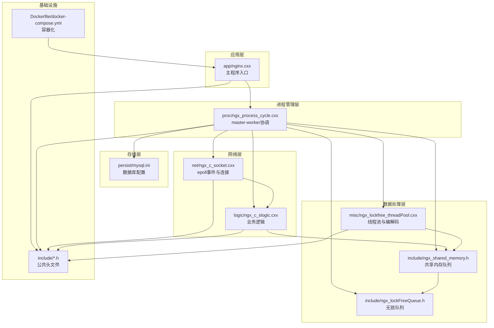
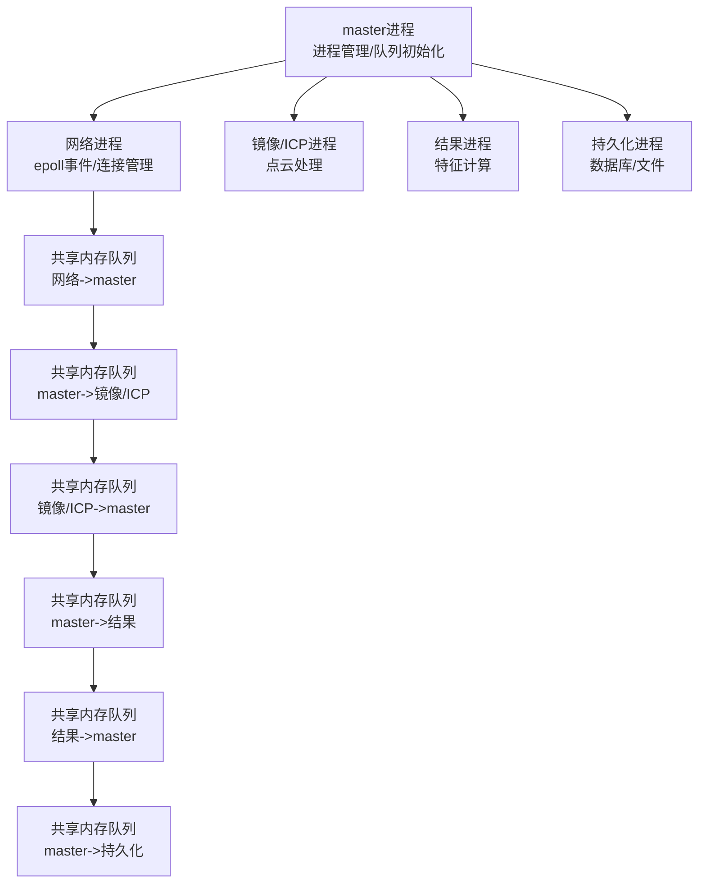
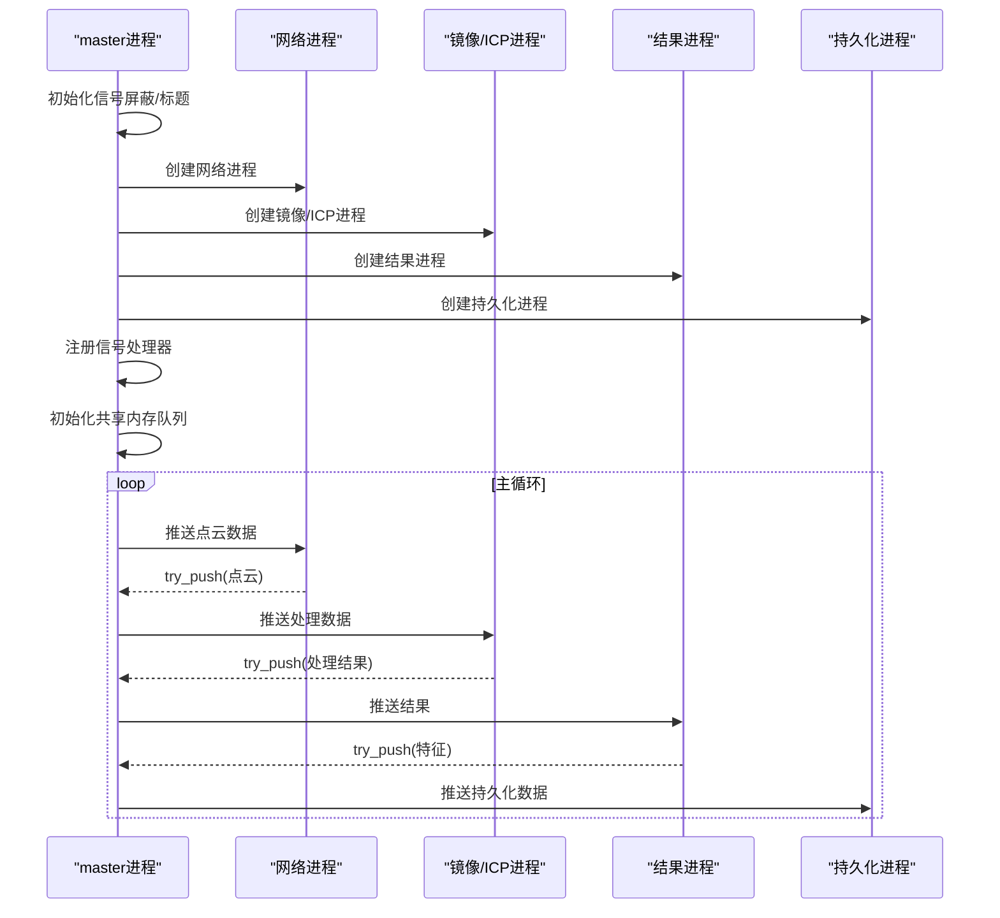
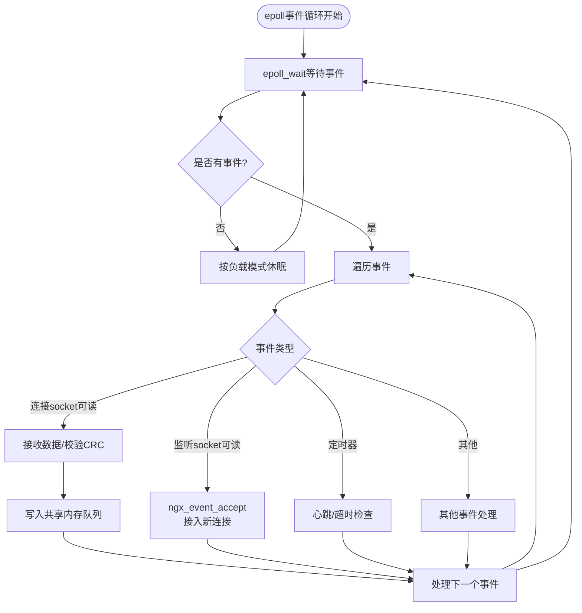
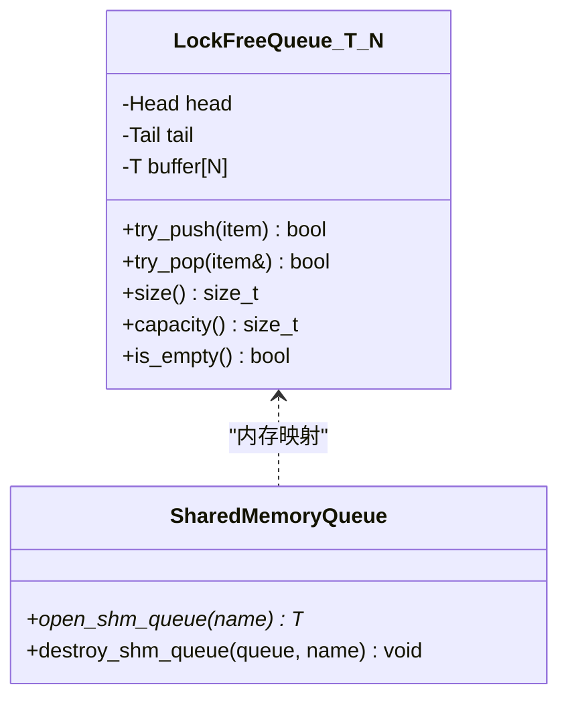
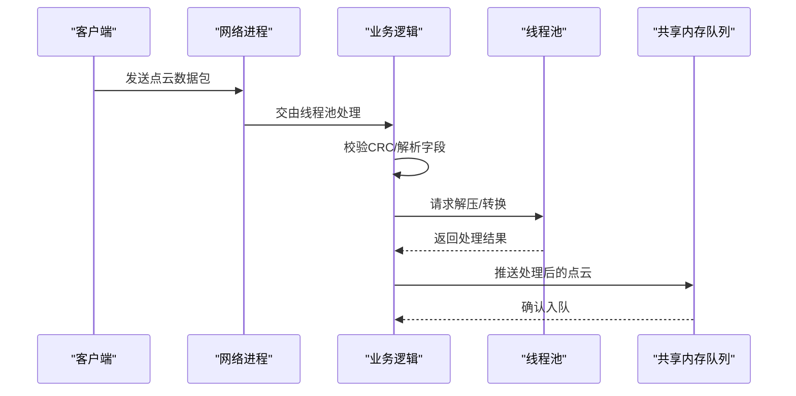
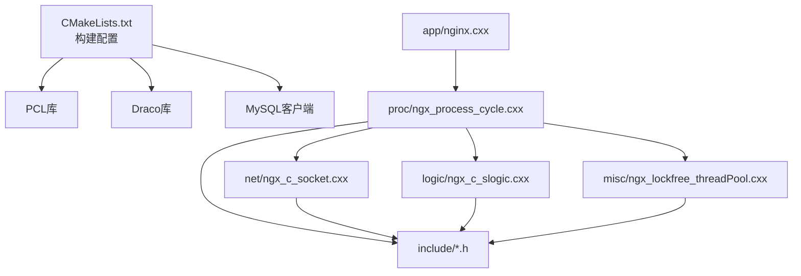

# 项目概述

<cite>
**本文档引用的文件**
- [CMakeLists.txt](file://CMakeLists.txt)
- [nginx.conf](file://nginx.conf)
- [Dockerfile](file://Dockerfile)
- [docker-compose.yml](file://docker-compose.yml)
- [app/nginx.cxx](file://app/nginx.cxx)
- [proc/ngx_process_cycle.cxx](file://proc/ngx_process_cycle.cxx)
- [net/ngx_c_socket.cxx](file://net/ngx_c_socket.cxx)
- [logic/ngx_c_slogic.cxx](file://logic/ngx_c_slogic.cxx)
- [include/ngx_macro.h](file://include/ngx_macro.h)
- [include/ngx_global.h](file://include/ngx_global.h)
- [include/ngx_shared_memory.h](file://include/ngx_shared_memory.h)
- [include/ngx_lockFreeQueue.h](file://include/ngx_lockFreeQueue.h)
- [misc/ngx_lockfree_threadPool.cxx](file://misc/ngx_lockfree_threadPool.cxx)
- [persist/mysql.ini](file://persist/mysql.ini)
- [docker/entrypoint.sh](file://docker/entrypoint.sh)
</cite>

## 目录
1. [引言](#引言)
2. [项目结构](#项目结构)
3. [核心组件](#核心组件)
4. [架构总览](#架构总览)
5. [详细组件分析](#详细组件分析)
6. [依赖关系分析](#依赖关系分析)
7. [性能考量](#性能考量)
8. [故障排查指南](#故障排查指南)
9. [结论](#结论)
10. [附录](#附录)

## 引言
PointServer 是一个基于 C++11 开发的高性能点云数据处理服务器，采用多进程架构设计，专注于点云数据的接收、计算与存储。项目借鉴了 Nginx 的 master-worker 多进程模型，结合基于 epoll 的事件驱动网络处理与共享内存无锁队列，构建了高吞吐、低延迟的点云数据流水线。项目与传统 Nginx 的相似之处体现在进程模型与事件驱动架构，独特之处在于深度集成了 PCL（Point Cloud Library）与 Draco 压缩库，专门服务于点云数据的解压、转换与计算。

## 项目结构
项目采用模块化的目录组织方式，按功能域划分模块：
- app：主程序入口与全局初始化
- proc：进程生命周期管理与 master-worker 协调
- net：网络 I/O、epoll 事件处理与连接管理
- logic：业务逻辑处理（点云接收、查询等）
- persist：数据库连接池与持久化
- misc：线程池与点云编解码（Draco/PCL）
- include：公共头文件与宏定义
- docker：容器化构建与运行脚本

**图表来源**
- [app/nginx.cxx](file://app/nginx.cxx#L44-L122)
- [proc/ngx_process_cycle.cxx](file://proc/ngx_process_cycle.cxx#L360-L399)
- [net/ngx_c_socket.cxx](file://net/ngx_c_socket.cxx#L541-L587)
- [logic/ngx_c_slogic.cxx](file://logic/ngx_c_slogic.cxx#L76-L129)
- [include/ngx_shared_memory.h](file://include/ngx_shared_memory.h#L86-L160)
- [include/ngx_lockFreeQueue.h](file://include/ngx_lockFreeQueue.h#L4-L150)
- [persist/mysql.ini](file://persist/mysql.ini#L1-L13)
- [Dockerfile](file://Dockerfile#L1-L65)
- [docker-compose.yml](file://docker-compose.yml#L1-L36)

**章节来源**
- [CMakeLists.txt](file://CMakeLists.txt#L1-L68)
- [Dockerfile](file://Dockerfile#L1-L65)
- [docker-compose.yml](file://docker-compose.yml#L1-L36)

## 核心组件
- 多进程 master-worker 架构：master 负责进程生命周期与队列管理，worker 负责网络与业务处理。
- 基于 epoll 的事件驱动网络：非阻塞 I/O 与事件循环，支持高并发连接。
- 共享内存无锁队列：跨进程高效传递点云数据，降低锁竞争与上下文切换。
- 点云编解码与计算：Draco 压缩/解压与 PCL 点云处理，支持点云格式转换与特征计算。
- 数据库连接池：MySQL 连接池，支持高并发查询与持久化。

**章节来源**
- [app/nginx.cxx](file://app/nginx.cxx#L139-L172)
- [proc/ngx_process_cycle.cxx](file://proc/ngx_process_cycle.cxx#L360-L399)
- [net/ngx_c_socket.cxx](file://net/ngx_c_socket.cxx#L541-L587)
- [include/ngx_shared_memory.h](file://include/ngx_shared_memory.h#L86-L160)
- [include/ngx_lockFreeQueue.h](file://include/ngx_lockFreeQueue.h#L4-L150)
- [misc/ngx_lockfree_threadPool.cxx](file://misc/ngx_lockfree_threadPool.cxx#L1-L78)
- [persist/mysql.ini](file://persist/mysql.ini#L1-L13)

## 架构总览
PointServer 的整体架构围绕 master-worker 模型展开，master 负责创建与管理各类专用进程（网络、镜像/ICP、结果、持久化），并通过共享内存队列实现进程间数据传递。网络层基于 epoll 实现高效的事件驱动 I/O，业务层负责点云数据的接收、解析与查询，计算层通过线程池与 PCL/Draco 完成点云处理，存储层通过连接池与数据库交互。

**图表来源**
- [proc/ngx_process_cycle.cxx](file://proc/ngx_process_cycle.cxx#L102-L121)
- [proc/ngx_process_cycle.cxx](file://proc/ngx_process_cycle.cxx#L333-L358)
- [include/ngx_shared_memory.h](file://include/ngx_shared_memory.h#L12-L21)

**章节来源**
- [proc/ngx_process_cycle.cxx](file://proc/ngx_process_cycle.cxx#L360-L399)

## 详细组件分析

### 进程管理与 master-worker 协调
- master 进程负责初始化信号屏蔽、设置进程标题、创建子进程、注册信号处理器、初始化共享内存队列，并在主循环中监控队列负载与子进程状态。
- 子进程类型包括网络进程、镜像/ICP处理进程、结果处理进程与持久化进程，分别承担不同阶段的点云处理任务。
- 信号处理支持优雅关闭与配置重载，确保在收到终止信号时能够有序关闭所有子进程。

**图表来源**
- [proc/ngx_process_cycle.cxx](file://proc/ngx_process_cycle.cxx#L360-L399)
- [proc/ngx_process_cycle.cxx](file://proc/ngx_process_cycle.cxx#L467-L545)
- [proc/ngx_process_cycle.cxx](file://proc/ngx_process_cycle.cxx#L717-L800)

**章节来源**
- [proc/ngx_process_cycle.cxx](file://proc/ngx_process_cycle.cxx#L123-L155)
- [proc/ngx_process_cycle.cxx](file://proc/ngx_process_cycle.cxx#L178-L208)
- [proc/ngx_process_cycle.cxx](file://proc/ngx_process_cycle.cxx#L332-L358)
- [proc/ngx_process_cycle.cxx](file://proc/ngx_process_cycle.cxx#L467-L545)

### 网络 I/O 与 epoll 事件处理
- 网络进程负责监听端口、设置非阻塞 I/O、创建 epoll 实例、注册监听事件与连接事件处理函数。
- 通过 epoll_wait 获取事件，根据事件类型调用相应的处理函数（如连接接入、数据读取、定时器检查等）。
- 支持防洪攻击检测、心跳超时踢人、连接回收等安全与稳定性机制。

**图表来源**
- [net/ngx_c_socket.cxx](file://net/ngx_c_socket.cxx#L757-L790)
- [net/ngx_c_socket.cxx](file://net/ngx_c_socket.cxx#L541-L587)
- [logic/ngx_c_slogic.cxx](file://logic/ngx_c_slogic.cxx#L190-L243)

**章节来源**
- [net/ngx_c_socket.cxx](file://net/ngx_c_socket.cxx#L247-L331)
- [net/ngx_c_socket.cxx](file://net/ngx_c_socket.cxx#L541-L587)
- [net/ngx_c_socket.cxx](file://net/ngx_c_socket.cxx#L757-L790)
- [logic/ngx_c_slogic.cxx](file://logic/ngx_c_slogic.cxx#L190-L243)

### 共享内存与无锁队列
- 通过 POSIX 共享内存接口创建命名共享内存区域，并使用内存映射实现跨进程访问。
- 无锁队列采用环形缓冲区与原子操作，配合缓存行对齐避免伪共享，支持高性能的生产者-消费者模式。
- 定义了多组队列：网络到 master、master 到镜像/ICP、镜像/ICP 到 master、master 到结果、结果到 master、master 到持久化等。

**图表来源**
- [include/ngx_lockFreeQueue.h](file://include/ngx_lockFreeQueue.h#L4-L150)
- [include/ngx_shared_memory.h](file://include/ngx_shared_memory.h#L86-L160)

**章节来源**
- [include/ngx_shared_memory.h](file://include/ngx_shared_memory.h#L86-L160)
- [include/ngx_lockFreeQueue.h](file://include/ngx_lockFreeQueue.h#L4-L150)

### 点云编解码与计算
- 线程池封装了 Draco 的点云解压与 PCL 的点云转换，支持将压缩的点云解压为 PCL 格式，或将 PCL 点云压缩为 Draco 格式。
- 业务逻辑中对接收到的点云数据进行 CRC 校验、序列化字段转换与队列推送，确保数据完整性与一致性。

**图表来源**
- [logic/ngx_c_slogic.cxx](file://logic/ngx_c_slogic.cxx#L190-L243)
- [misc/ngx_lockfree_threadPool.cxx](file://misc/ngx_lockfree_threadPool.cxx#L1-L78)
- [include/ngx_shared_memory.h](file://include/ngx_shared_memory.h#L65-L84)

**章节来源**
- [misc/ngx_lockfree_threadPool.cxx](file://misc/ngx_lockfree_threadPool.cxx#L1-L78)
- [logic/ngx_c_slogic.cxx](file://logic/ngx_c_slogic.cxx#L190-L243)

### 数据库连接池与持久化
- 通过配置文件提供数据库连接参数，支持初始化连接数与最大连接数配置。
- 业务逻辑中提供点云查询接口，从数据库读取点云特征并返回给网络层。

**章节来源**
- [persist/mysql.ini](file://persist/mysql.ini#L1-L13)
- [logic/ngx_c_slogic.cxx](file://logic/ngx_c_slogic.cxx#L245-L274)
- [logic/ngx_c_slogic.cxx](file://logic/ngx_c_slogic.cxx#L275-L340)

## 依赖关系分析
- 构建系统使用 CMake，要求 C++11 标准，集成 PCL、Draco 与 MySQL 客户端库。
- 项目结构按模块组织，主程序 app 依赖进程管理 proc、网络 net、逻辑 logic、线程池 misc 与共享内存 include。
- Dockerfile 与 docker-compose.yml 提供容器化部署，自动拉取依赖并构建镜像。

**图表来源**
- [CMakeLists.txt](file://CMakeLists.txt#L41-L59)
- [Dockerfile](file://Dockerfile#L10-L17)
- [Dockerfile](file://Dockerfile#L37-L43)

**章节来源**
- [CMakeLists.txt](file://CMakeLists.txt#L1-L68)
- [Dockerfile](file://Dockerfile#L1-L65)

## 性能考量
- 多进程模型：进程级隔离提升稳定性与资源管理灵活性，避免线程同步复杂性，更好地利用多核 CPU。
- 事件驱动与无锁队列：epoll 高效处理大量并发连接，无锁队列降低锁竞争与上下文切换开销。
- 负载均衡与动态休眠：master 根据队列负载动态调整处理批次与休眠时间，平衡吞吐与 CPU 占用。
- 字节序与内存对齐：网络字节序转换与缓存行对齐优化，减少数据处理与内存访问开销。

**章节来源**
- [app/nginx.cxx](file://app/nginx.cxx#L139-L172)
- [proc/ngx_process_cycle.cxx](file://proc/ngx_process_cycle.cxx#L401-L464)
- [proc/ngx_process_cycle.cxx](file://proc/ngx_process_cycle.cxx#L522-L543)
- [logic/ngx_c_slogic.cxx](file://logic/ngx_c_slogic.cxx#L202-L230)
- [include/ngx_lockFreeQueue.h](file://include/ngx_lockFreeQueue.h#L7-L44)

## 故障排查指南
- 日志配置：通过配置文件设置日志等级与输出路径，便于定位问题。
- 信号处理：优雅关闭与终止信号处理，确保子进程有序退出，避免僵尸进程。
- 队列监控：监控共享内存队列长度，识别潜在的背压与处理瓶颈。
- 网络安全：启用防洪攻击检测与心跳超时机制，及时剔除恶意或异常客户端。

**章节来源**
- [nginx.conf](file://nginx.conf#L11-L18)
- [proc/ngx_process_cycle.cxx](file://proc/ngx_process_cycle.cxx#L648-L714)
- [proc/ngx_process_cycle.cxx](file://proc/ngx_process_cycle.cxx#L401-L464)
- [net/ngx_c_socket.cxx](file://net/ngx_c_socket.cxx#L479-L509)

## 结论
PointServer 通过借鉴 Nginx 的 master-worker 模型与 epoll 事件驱动架构，结合共享内存无锁队列与 PCL/Draco 的点云处理能力，构建了高性能、可扩展的点云数据处理平台。其模块化设计与容器化部署降低了运维复杂度，适合在高并发与大规模点云数据场景中使用。

## 附录

### 快速开始
- 安装依赖：确保系统具备构建工具、PCL、Draco、MySQL 客户端与 CMake。
- 构建项目：使用 CMake 生成构建系统并编译。
- 配置服务：准备 nginx.conf 与 mysql.ini，设置监听端口、进程数与数据库连接参数。
- 启动服务：在容器环境中可通过 docker-compose 启动，或直接运行编译产物。
- 示例：客户端发送点云数据包，服务端接收、解压、处理并返回查询结果。

**章节来源**
- [CMakeLists.txt](file://CMakeLists.txt#L10-L13)
- [nginx.conf](file://nginx.conf#L20-L50)
- [persist/mysql.ini](file://persist/mysql.ini#L1-L13)
- [docker-compose.yml](file://docker-compose.yml#L15-L36)
- [docker/entrypoint.sh](file://docker/entrypoint.sh#L10-L45)