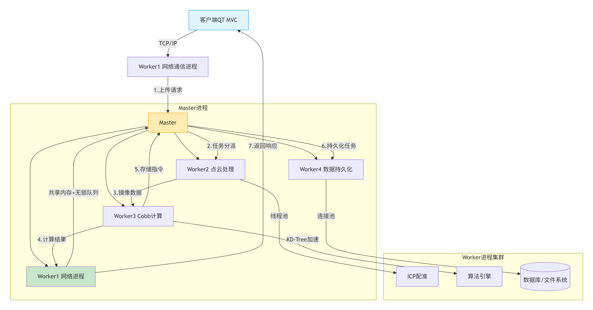

# 基于点云的脊柱侧弯筛查系统

## 1. 项目的整体架构与思路

### 1.1 项目描述

​	设计并实现基于分布式架构的脊柱侧弯筛查系统，整合高性能服务器框架与三维点云处理技术。客户端通过QT实现点云预处理与可视化，服务端采用多进程模型处理点云分析、Cobb角计算及数据持久化，为医疗机构提供自动化病情评估服务。

### 1.2 核心架构

​	**核心架构**：

- **客户端（QT MVC）**：

  - 模型层：封装点云数据（PCL滤波/降噪/裁剪）及网络通信模块。
  - 视图层：集成VTK可视化处理前后的点云模型及历史记录。
  - 控制层：支持点云上传、实时计算请求、历史数据增删改查。

- **服务端（多进程分布式架构）**：

  ```plaintext
  Master进程
  ├── Worker1: 网络信息收发进程 (处理客户端请求)
  ├── Worker2: 点云镜像与ICP配准处理进程 (多线程)
  ├── Worker3: 模拟Cobb角计算进程 (多线程)
  └── Worker4: 数据持久化进程 (数据库连接池)
  ```




### 1.3 关键技术

1. **高性能通信及点云处理架构**
   - 设计多进程模型：实现Master-Worker多进程模型，Master进程通过**共享内存+无锁队列**调度任务，Worker进程独立处理网络I/O、点云计算与持久化。
   - 实现高并发网络层：基于**Epoll(LT)+非阻塞I/O**处理客户端请求，结合线程池技术，通过包头包体协议解决粘包问题。
   - 连接池与延迟回收：实现了**网络层连接池**设计，结合延迟回收技术，避免了频繁创建和销毁连接的性能开销，提升了服务器的稳定。
   - 优化IPC效率：使用**Draco技术压缩算法**传输点云数据。
2. **点云处理与病情分析**
   - 开发点云处理流水线：利用PCL库实现客户端的**PCA主成分分析、滤波、裁剪**，以及服务端的点云**ICP配准算法**计算原始/镜像点云的不对称度。
   - 设计Cobb角预测模型：基于配准结果构建**回归算法**，输出脊柱侧弯评估指标，替代传统人工测量，降低X光照射而对人体产生的辐射。
   - 加速查询：为高维点云数据实现**KD-Tree索引**，最近邻搜索复杂度从O(n)降至O(log n)。
   - 加速计算：使用Eigen库加速点云的处理运算。
3. **数据持久化与系统扩展**
   - 实现数据库事务管理：Worker4通过**连接池**操作MySQL，原子化存储点云路径、不对称度、Cobb角。
   - 历史记录管理：支持查询/删除/修改操作，级联清理文件系统点云数据（.drc格式）。
   - 资源复用：**数据持久化层连接池**复用数据库连接，降低资源开销。

## 2. Master进程（管理模块）	

### 2.1 程序入口以及必要的初始化

```plaintext
pointServer\app\nginx.cxx   //main函数
```

- **在main函数中首先读取配置文件**：

  ```c++
  CConfig *p_config = CConfig::GetInstance(); //单例类
  ```

- **这里实现的单例模式的核心机制为双重检查锁定模式（Double-Checked Locking Pattern）。以读取配置文件的单例类为例说明**：

  m_instance同样也为静态成员，确保整个系统从同一份配置数据读取，避免不同模块加载不一致的配置。GetInstance() 方法也为静态，为类的方法。内存分配单例和crc校验单例与读取配置文件单例类似。

  ```c++
  static CConfig* GetInstance() 
  	{	
  		if(m_instance == NULL)
  		{
  			//锁
  			if(m_instance == NULL)
  			{					
  				m_instance = new CConfig();
  				static CGarhuishou cl; 
  			}
  			//放锁		
  		}
  		return m_instance;
  	}	
  ```

- **socket套接字初始化**

  - 函数调用关系如下：
  
  ```plaintext
  CLogicSocket::Initialize() -> CSocekt::Initialize() -> CSocekt::ngx_open_listening_sockets()
  ```
  
  ```c++
  bool CSocekt::ngx_open_listening_sockets()
  {    
      int                isock;                //socket
      struct sockaddr_in serv_addr;            //服务器的地址结构体
      int                iport;                //端口
      char               strinfo[100];         //临时字符串 
     
      //初始化相关
      memset(&serv_addr,0,sizeof(serv_addr));  //先初始化一下
      serv_addr.sin_family = AF_INET;                //选择协议族为IPV4
      serv_addr.sin_addr.s_addr = htonl(INADDR_ANY); //监听本地所有的IP地址；INADDR_ANY表示的是一个服务器上所有的网卡（服务器可能不止一个网卡）多个本地ip地址都进行绑定端口号，进行侦听。
  
      //中途用到一些配置信息
      CConfig *p_config = CConfig::GetInstance();
      for(int i = 0; i < m_ListenPortCount; i++) //要监听这么多个端口
      {        
        
          isock = socket(AF_INET,SOCK_STREAM,0); //系统函数，成功返回非负描述符，出错返回-1
          if(isock == -1)
          {
              ngx_log_stderr(errno,"CSocekt::Initialize()中socket()失败,i=%d.",i);
              //其实这里直接退出，那如果以往有成功创建的socket呢？就没得到释放吧，当然走到这里表示程序不正常，应该整个退出，也没必要释放了 
              return false;
          }
  
    
          int reuseaddr = 1;  //1:打开对应的设置项
          if(setsockopt(isock,SOL_SOCKET, SO_REUSEADDR,(const void *) &reuseaddr, sizeof(reuseaddr)) == -1)
          {
              ngx_log_stderr(errno,"CSocekt::Initialize()中setsockopt(SO_REUSEADDR)失败,i=%d.",i);
              close(isock); //无需理会是否正常执行了                                                  
              return false;
          }
  
          //为处理惊群问题使用reuseport
          
          int reuseport = 1;
          if (setsockopt(isock, SOL_SOCKET, SO_REUSEPORT,(const void *) &reuseport, sizeof(int))== -1) //端口复用需要内核支持
          {
              //失败就失败吧，失败顶多是惊群，但程序依旧可以正常运行，所以仅仅提示一下即可
              ngx_log_stderr(errno,"CSocekt::Initialize()中setsockopt(SO_REUSEPORT)失败",i);
          }
  
          //设置该socket为非阻塞
          if(setnonblocking(isock) == false)
          {                
              ngx_log_stderr(errno,"CSocekt::Initialize()中setnonblocking()失败,i=%d.",i);
              close(isock);
              return false;
          }
  
          //设置本服务器要监听的地址和端口，这样客户端才能连接到该地址和端口并发送数据        
          strinfo[0] = 0;
          sprintf(strinfo,"ListenPort%d",i);
          iport = p_config->GetIntDefault(strinfo,10000);
          serv_addr.sin_port = htons((in_port_t)iport);   //in_port_t其实就是uint16_t
  
          //绑定服务器地址结构体
          if(bind(isock, (struct sockaddr*)&serv_addr, sizeof(serv_addr)) == -1)
          {
              ngx_log_stderr(errno,"CSocekt::Initialize()中bind()失败,i=%d.",i);
              close(isock);
              return false;
          }
          
          //开始监听
          if(listen(isock,NGX_LISTEN_BACKLOG) == -1)
          {
              ngx_log_stderr(errno,"CSocekt::Initialize()中listen()失败,i=%d.",i);
              close(isock);
              return false;
          }
  
          //可以，放到列表里来
          lpngx_listening_t p_listensocketitem = new ngx_listening_t; //千万不要写错，注意前边类型是指针，后边类型是一个结构体
          memset(p_listensocketitem,0,sizeof(ngx_listening_t));      //注意后边用的是 ngx_listening_t而不是lpngx_listening_t
          p_listensocketitem->port = iport;                          //记录下所监听的端口号
          p_listensocketitem->fd   = isock;                          //套接字木柄保存下来   
          ngx_log_error_core(NGX_LOG_INFO,0,"监听%d端口成功!",iport); //显示一些信息到日志中
          m_ListenSocketList.push_back(p_listensocketitem);          //加入到队列中
      } //end for(int i = 0; i < m_ListenPortCount; i++)    
      if(m_ListenSocketList.size() <= 0)  //不可能一个端口都不监听吧
          return false;
      return true;
  }
  ```
  
  - 服务器监听套接字初始化的步骤：
  
  ```plaintext
  开始
    │
    ↓
  准备变量和地址结构						 serv_addr.sin_family = AF_INET; serv_addr.sin_addr.s_addr = htonl(INADDR_ANY);
    |                                     AF_INET:选择协议为IPv4;
    |										INADDR_ANY:一个特殊的IPv4地址常量，值为 0 (即 0.0.0.0),表示所有可用的网络接口；
    │										htonl()：host to network long，将32为整数从主机序转换成网络序。
    ↓
  循环每个监听端口
    │
    ├─▶ 创建TCP套接字						isock = socket(AF_INET,SOCK_STREAM,0);
    │      │
    │      ↓
    ├─▶ 设置套接字选项(重用地址/端口)		  setsockopt()设置套接字选项 地址重用：SO_REUSEADDR 端口重用：SO_REUSEPORT
    │      
    │      ↓
    ├─▶ 设置非阻塞模式					   setnonblocking(isock)
    │      │
    │      ↓
    ├─▶ 绑定地址和端口					   bind(isock, (struct sockaddr*)&serv_addr, sizeof(serv_addr))
    │      │
    │      ↓
    ├─▶ 开始监听							 listen(isock,NGX_LISTEN_BACKLOG)
    │      │
    │      ↓
    └─▶ 保存套接字信息
    │
    ↓
  检查是否至少有一个监听套接字
    │
    ↓
  返回初始化结果
  ```
  
  - `listen(isock,NGX_LISTEN_BACKLOG)` 函数解释：
  
    第一个参数为监听套接字，第二个参数为指定全连接队列的大小。
  
    **关键过程说明**：
  
    1. **队列创建**：`listen()` 触发内核创建两个队列：
       - 半连接队列（SYN队列）：存储 SYN_RCVD 状态的请求。
       - 全连接队列（Accept队列）：存储 ESTABLISHED 状态的连接。
    2. **三次握手**：
       - 客户端SYN → 半连接队列+1。
       - 服务端SYN+ACK → 客户端ACK → 连接移入全连接队列。
    3. **backlog参数**：决定全连接队列的最大长度（实际值可能为`backlog+1`）。
    4. **accept()**：从全连接队列头部取出连接，队列长度减1。
  
    

- **创建守护进程**

  - 函数调用：

  ```C++
  int cdaemonresult = ngx_daemon();
  ```

  ```c++
  int ngx_daemon()
  {
      //(1)创建守护进程的第一步，fork()一个子进程出来
      switch (fork())  //fork()出来这个子进程才会成为咱们这里讲解的master进程；
      {
      case -1:
          //创建子进程失败
          ngx_log_error_core(NGX_LOG_EMERG,errno, "ngx_daemon()中fork()失败!");
          return -1;
      case 0:
          //子进程，走到这里直接break;
          break;
      default:
          //父进程以往 直接退出exit(0);现在希望回到主流程去释放一些资源
          return 1;  //父进程直接返回1；
      } //end switch
  
      ngx_parent = ngx_pid;     //ngx_pid是原来父进程的id，因为这里是子进程，所以子进程的ngx_parent设置为原来父进程的pid
      ngx_pid = getpid();       //当前子进程的id要重新取得
      
      //(2)脱离终端，终端关闭，将跟此子进程无关
      if (setsid() == -1)  
      {
          ngx_log_error_core(NGX_LOG_EMERG, errno,"ngx_daemon()中setsid()失败!");
          return -1;
      }
  
      //(3)设置为0，不要让它来限制文件权限，以免引起混乱
      umask(0); 
  
      //(4)打开黑洞设备，以读写方式打开
      int fd = open("/dev/null", O_RDWR);
      if (fd == -1) 
      {
          ngx_log_error_core(NGX_LOG_EMERG,errno,"ngx_daemon()中open(\"/dev/null\")失败!");        
          return -1;
      }
      if (dup2(fd, STDIN_FILENO) == -1) //先关闭STDIN_FILENO[这是规矩，已经打开的描述符，动他之前，先close]，类似于指针指向null，让/dev/null成为标准输入；
      {
          ngx_log_error_core(NGX_LOG_EMERG,errno,"ngx_daemon()中dup2(STDIN)失败!");        
          return -1;
      }
      if (dup2(fd, STDOUT_FILENO) == -1) //再关闭STDIN_FILENO，类似于指针指向null，让/dev/null成为标准输出；
      {
          ngx_log_error_core(NGX_LOG_EMERG,errno,"ngx_daemon()中dup2(STDOUT)失败!");
          return -1;
      }
      if (fd > STDERR_FILENO)  //fd应该是3，这个应该成立
       {
          if (close(fd) == -1)  //释放资源这样这个文件描述符就可以被复用；不然这个数字【文件描述符】会被一直占着；
          {
              ngx_log_error_core(NGX_LOG_EMERG,errno, "ngx_daemon()中close(fd)失败!");
              return -1;
          }
      }
      return 0; //子进程返回0
  }
  ```

  - fork() 函数工作机制详解

    1. 基本定义：`fork()` 是 Unix/Linux 系统创建新进程的系统调用，通过**进程复制**生成子进程。

    2. 核心行为

       - **复制对象**：
         ✅ 代码段(text)  
         ✅ 数据段(data)  
         ✅ 堆(heap)  
         ✅ 栈(stack)  
         ✅ 文件描述符表  
         ✅ 环境变量  
         ✅ 信号处理方式

       - **独立属性**：
         🔹 PID（子进程获得新ID）  
         🔹 PPID（子进程PPID=父进程PID）  
         🔹 资源统计信息（CPU时间等）
       - **写时复制(COW)特性**：
         - 初始共享所有内存页
         - 仅当修改时才触发页复制
         - 显著减少内存拷贝开销
       - **文件描述的处理**：
         - 子进程继承所有打开的文件描述符
         - 共享文件偏移指针

    | 场景     | 返回值         | 说明             |
    | -------- | -------------- | ---------------- |
    | 父进程   | >0 (子进程PID) | 可获取子进程标识 |
    | 子进程   | 0              | 标识自身为子进程 |
    | 调用失败 | -1             | 通常因进程数超限 |

  - 守护进程创建的过程：

    1. **创建子进程**：父进程退出后，子进程由 `init` 进程（PID=1）接管，成为独立进程。避免终端关闭时收到 `SIGHUP` 信号而被终止。

       ```C++
       switch (fork()) {
           case -1: 
               // fork失败，记录错误并退出
               return -1;  
           case 0:  
               // 子进程继续执行后续步骤
               break;      
           default: 
               // 父进程直接退出（或返回主流程释放资源）
               return 1;   
       }
       ```

       

    2. **创建新会话（脱离终端控制）**：子进程成为新会话的**会话首进程（Session Leader）**，脱离原终端的控制。确保进程不再与任何终端关联（即使终端关闭，进程仍存活）。

       ```c++
       if (setsid() == -1) {
           // 失败处理
       }
       ```

    3. **重置文件权限掩码**：将文件权限掩码设为 `0`，避免继承父进程的 `umask` 设置。确保后续创建的文件权限不受限制（如日志文件）。

       ```
       umask(0);
       ```

    4.  **重定向标准输入/输出到 `/dev/null`**：**`/dev/null`** 是一个黑洞设备，丢弃所有写入数据。避免进程因读写标准输入/输出（如 `printf`）而意外阻塞或报错。防止占用终端资源（如后台进程打印日志污染终端）。

       

  - 守护进程创建完成后，原始父进程释放所有资源后，退出。

    ```C++
    if(p_config->GetIntDefault("Daemon",0) == 1) //读配置文件，拿到配置文件中是否按守护进程方式启动的选项
        {
            //1：按守护进程方式运行
            int cdaemonresult = ngx_daemon();
            if(cdaemonresult == -1) //fork()失败
            {
                exitcode = 1;    //标记失败
                goto lblexit;
            }
            if(cdaemonresult == 1)
            {
                //这是原始的父进程
                freeresource();   //只有进程退出了才goto到 lblexit，用于提醒用户进程退出了
                                  //而我现在这个情况属于正常fork()守护进程后的正常退出，不应该跑到lblexit()去执行，因为那里有一条打印语句标记整个进程的退出，这里不该限制该条打印语句；
                exitcode = 0;
                return exitcode;  //整个进程直接在这里退出
            }
            g_daemonized = 1;    //守护进程标记，标记是否启用了守护进程模式，0：未启用，1：启用了
        }
    ```

    ```c++
    void freeresource()
    {
        //(1)对于因为设置可执行程序标题导致的环境变量分配的内存，我们应该释放
        if(gp_envmem)
        {
            delete []gp_envmem;
            gp_envmem = NULL;
        }
    
        //(2)关闭日志文件
        if(ngx_log.fd != STDERR_FILENO && ngx_log.fd != -1)  
        {        
            close(ngx_log.fd); //不用判断结果了
            ngx_log.fd = -1; //标记下，防止被再次close吧        
        }
    }
    ```

    